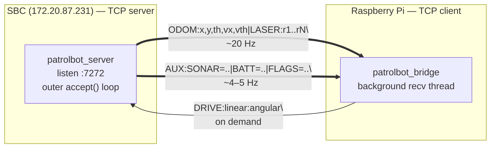
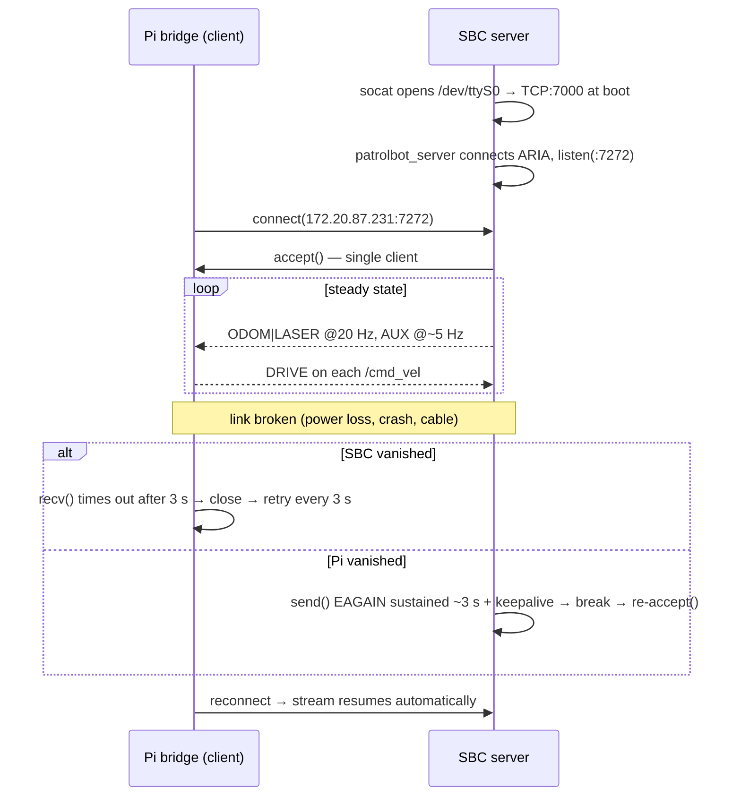

# Communication Architecture — the SBC ↔ Pi seam

This is the most important integration point in PatrolBot. The two machines do **not** share a
ROS 2 graph and do **not** use DDS to talk to each other. They meet at exactly one place: a
**single TCP socket** on which the SBC streams plain-text telemetry and the Pi sends back
plain-text drive commands.

If you understand this page, you understand how the robot is wired together.



## Why a TCP text protocol (and not a ROS 2 bridge)?

!!! abstract "Design intent and tradeoffs"
    **Intent:** keep the SBC a dumb, ROS-free data source so the legacy ARIA toolchain and the
    modern ROS 2 stack never have to coexist on one machine or agree on a DDS version.

    **Why text, not binary or DDS:** the protocol is trivially debuggable (`nc 172.20.87.231 7272`
    prints readable lines), has zero schema-compiler/versioning burden, and survives partial
    corruption gracefully (a bad line is just skipped). The cost — a few extra bytes and float
    parsing at 20 Hz — is negligible on this hardware.

    **Why TCP, not UDP:** odometry is integrated state; dropping frames silently would accumulate
    pose error. TCP's in-order, reliable delivery matches that. The price is head-of-line blocking,
    which is mitigated by the read timeout described below.

## The wire protocol

The SBC server emits **two independent line types**, both newline-terminated, multiplexed on the
same socket. The Pi splits the byte stream on `\n` and dispatches each line by prefix.

### 1. Navigation line (`ODOM | LASER`) — ~20 Hz

```
ODOM:x,y,th,vx,vth|LASER:r1,r2,...,rN\n
```

| Field | Meaning | Units |
|---|---|---|
| `x, y` | Base pose in the `odom` frame | meters |
| `th` | Heading | radians |
| `vx` | Forward velocity | m/s |
| `vth` | Yaw rate | rad/s |
| `r1..rN` | Laser ranges, left-to-right across the 180° fan | meters |

ARIA works in mm/deg internally; the SBC converts to m/rad **before** sending. The Pi maps this
line to:

- `/odom` (`nav_msgs/Odometry`) — pose + twist, stamped with the Pi's clock.
- `/scan` (`sensor_msgs/LaserScan`) — `angle_min=-π/2`, `angle_max=+π/2`, `range_min=0.25`,
  `range_max=8.0`. Returns below 0.25 m are forced to `+inf` (footprint-clearance filter; do not
  raise this much higher because real close obstacles can appear at 0.25-0.40 m).
- TF `odom→base_link` — published at **50 Hz** by a timer, *decoupled* from scan arrival so a TF
  entry is always in the buffer before any scan reaches a costmap message filter.

### 2. Auxiliary line (`AUX`) — ~4–5 Hz

```
AUX:SONAR=x,y;x,y;...|BATT=volt,soc,chargeState,temp|FLAGS=flags,faultFlags,stallValue,motorsEnabled\n
```

Emitted on every 5th nav frame and **deliberately decoupled** from the navigation line. The Pi
parses each `AUX` section in isolation, so a malformed or missing section only skips its own topic
and can never disturb the navigation-critical `/odom` and `/scan` path.

| Section | Source (ARIA) | Pi topic |
|---|---|---|
| `SONAR` | per-reading local X/Y of each sonar return | `/sonar` (`sensor_msgs/PointCloud2`, `base_link`) |
| `BATT` | voltage, state-of-charge (`-1` if unavailable), charge state, temperature | `/battery` (`sensor_msgs/BatteryState`) |
| `FLAGS` | flags, fault flags, stall value, motors-enabled | `/diagnostics` (`diagnostic_msgs/DiagnosticArray`) |

This base has no real state-of-charge sensor, so `/battery.percentage` is `NaN`; only `voltage`
is meaningful. Stall parsing: the high byte of `stallValue` is the left wheel, the low byte the
right; bit 0 of each is a reliable motor stall, and only fault flags + motor stalls drive the
diagnostic level. See [Devices → Controllers](../devices/controllers.md) for the bit layout.

### 3. Drive command (`DRIVE`) — on demand

```
DRIVE:linear:angular\n
```

Sent by the Pi bridge whenever it receives a `/cmd_vel` message. `linear` is m/s, `angular` is
rad/s. The SBC reads these non-blocking and forwards them to the base via ARIA.

## Connection lifecycle



The SBC server is **single-client**: an outer `while(robot.isRunning())` loop wraps `accept()`,
so each Pi disconnect is followed by a fresh `accept()` for the next one.

## Self-healing — hardened on both ends

The seam is the system's single fragile point, so both ends detect a silently-dead peer and
recover without operator action. This logic exists because an abrupt power-off sends **no TCP
FIN/RST**, so a naive blocking socket would hang forever.

| End | Mechanism | Why |
|---|---|---|
| **Pi (client)** | `recv()` read timeout = **3.0 s** + `SO_KEEPALIVE`; reconnect loop sleeps 3 s | The SBC streams at 20 Hz, so 3 s of silence ⇒ dead link ⇒ `socket.timeout` ⇒ break ⇒ reconnect. A blocking `recv()` would otherwise hang forever on an abrupt SBC power-off. |
| **SBC (server)** | consecutive-`EAGAIN` guard (~3 s) → break & re-`accept()`; `SO_KEEPALIVE` + `TCP_USER_TIMEOUT=5000ms` | A gone Pi left the server looping on a full send buffer for minutes; the guard breaks out and re-accepts promptly. |

Because the `AUX` line rides the **same** TCP stream, it inherits this self-healing — `/sonar`,
`/battery`, and `/diagnostics` resume automatically after an SBC freeze/restart, with no separate
reconnect logic.

!!! danger "The reconnect TF skew that crashed Nav2"
    On reconnect, a scan can arrive stamped *just before* the rebuilt TF cache. `collision_monitor`
    with `base_shift_correction: True` did a timestamped `laser_frame→odom` lookup with no message
    filter and threw an uncaught `tf2::BackwardExtrapolationException` → SIGABRT → and because Nav2
    is composed in **one** container, every Nav2 node died at once. The fix is
    `base_shift_correction: False` (use the latest transform; fine at 0.26 m/s ≈ 1 cm/scan). This is
    why the seam's failure handling and the [composition decision](software-architecture.md#crash-handling-tear-down-dont-respawn)
    are coupled.

## What the seam is *not*

- **Not a shared ROS domain.** The SBC runs no ROS 2; there are no cross-machine topics. Anyone
  expecting to `ros2 topic echo` an SBC topic will find nothing — the SBC's data only becomes ROS
  topics *after* the bridge republishes it on the Pi.
- **Not multi-client.** One Pi at a time.
- **Not encrypted or authenticated.** It is a LAN-local plaintext socket; deployment assumes a
  trusted robot network (see [Network Setup](../deployment/network-setup.md)).

## Scalability considerations

The point-to-point, single-client TCP design is right for one robot but is the first thing that
would need to change for a fleet. Options, in rough order of effort: a fan-out broker in front of
the SBC server; moving the SBC onto the ROS 2 graph (a `micro-ROS`/`rclcpp` node) so DDS handles
discovery and multiplexing; or replacing the text protocol with a typed transport. None are
needed today, and each trades the current debuggability and isolation for reach.
