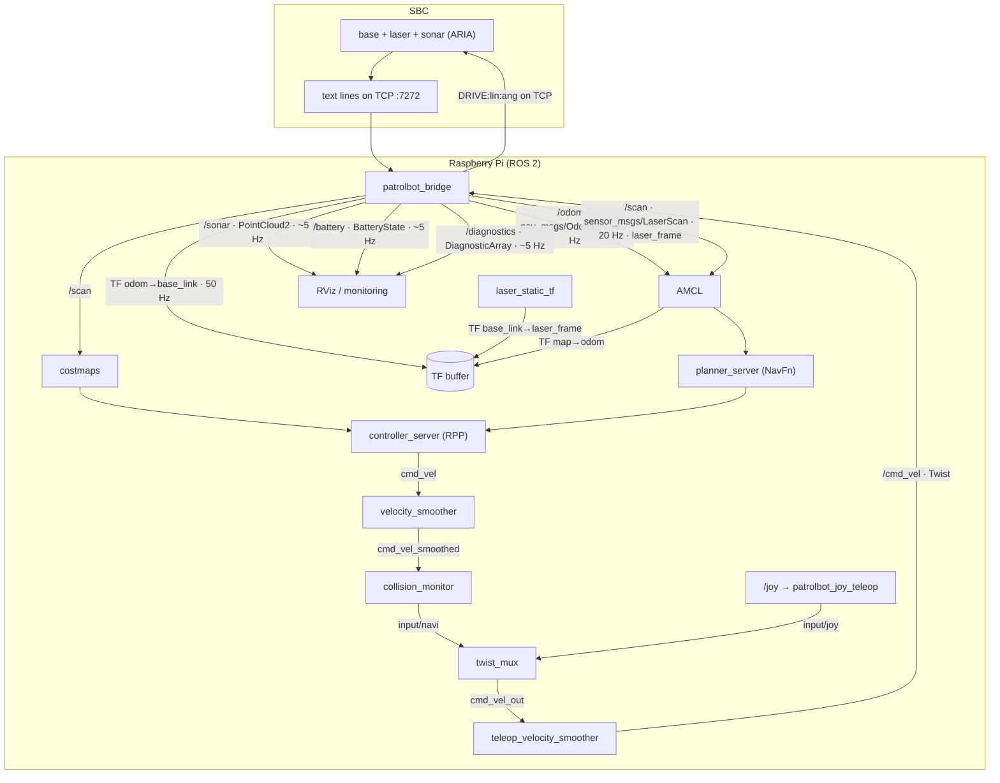
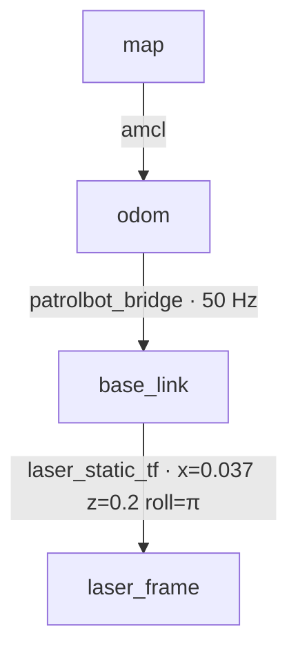
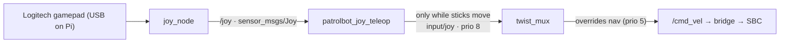

# Data Flow

This page traces **data**, not processes. It follows a laser return from the SBC into Nav2 and a
goal from the operator back out to the wheels, naming the message type, frame, and rate at each
hop. For the timing/ordering view see [Execution Flow](execution-flow.md); for the wire format see
[Communication Architecture](communication-architecture.md).

## End-to-end data path

## Inbound: sensor data → ROS topics

| Source line | Bridge output | Type | Frame | Rate | Consumers |
|---|---|---|---|---|---|
| `ODOM:` | `/odom` | `nav_msgs/Odometry` | `odom`→`base_link` | ~20 Hz | AMCL, bt_navigator, controller_server |
| `ODOM:` | TF `odom→base_link` | `tf2` | — | **50 Hz** | whole TF tree |
| `LASER:` | `/scan` | `sensor_msgs/LaserScan` | `laser_frame` | ~20 Hz | AMCL, costmaps, collision_monitor |
| `AUX:SONAR` | `/sonar` | `sensor_msgs/PointCloud2` | `base_link` | ~5 Hz | RViz / obstacle viz |
| `AUX:BATT` | `/battery` | `sensor_msgs/BatteryState` | — | ~5 Hz | monitoring |
| `AUX:FLAGS` | `/diagnostics` | `diagnostic_msgs/DiagnosticArray` | — | ~5 Hz | `rqt_robot_monitor` |

Two details that matter downstream:

- **TF is decoupled from scans.** The bridge publishes `odom→base_link` on its own 50 Hz timer,
  not when a scan arrives. This guarantees a TF entry is always buffered *before* any scan reaches
  a costmap message filter, avoiding "dropping message — queue full" churn.
- **The scan is pre-filtered.** Returns below 0.25 m are forced to `+inf` (`SCAN_RANGE_MIN = 0.25`
  in `bridge_node.py` — 0.22 m footprint + 0.03 m margin for the 0.037 m laser mount offset) so
  the laser grazing the robot's own body cannot paint a phantom obstacle inside the footprint.

## The TF tree

| Transform | Publisher | Notes |
|---|---|---|
| `map → odom` | `amcl` | Requires `/scan` flowing + an initial pose; this is what "Frame map does not exist" means is missing |
| `odom → base_link` | `patrolbot_bridge` | 50 Hz, from `ODOM:` |
| `base_link → laser_frame` | `laser_static_tf` | Static; `roll=π` un-mirrors the flipped SICK scan. Confirmed from live TF 2026-06-29. |

## Outbound: operator goal → motor command

A goal set in RViz (in the `map` frame) flows down the [`cmd_vel` arbitration
chain](software-architecture.md#the-cmd_vel-arbitration-chain):

1. `bt_navigator` runs the behavior tree; `planner_server` (NavFn) computes a global path in `map`.
2. `controller_server` (RPP) produces `cmd_vel` at 5 Hz, sampling trajectories against the local
   costmap.
3. The Nav2 `velocity_smoother` shapes it to `cmd_vel_smoothed`.
4. `collision_monitor` applies the 0.6×0.6 m stop-box and emits `input/navi` (priority 5).
5. `twist_mux` picks the winner (joystick on `input/joy`, priority 8, overrides navigation).
6. `teleop_velocity_smoother` re-shapes the winner and publishes `/cmd_vel`.
7. `patrolbot_bridge` serializes `/cmd_vel` to `DRIVE:linear:angular` and sends it to the SBC,
   which drives the base via ARIA.

## Manual override path

The teleop node publishes a `Twist` **only while** a stick is past the deadzone *and* the deadman
button (RB) is held; on release it sends one explicit zero, then goes silent so twist_mux times the
joy input out (1 s) and navigation resumes. This is why an idle, connected controller never blocks
autonomy.

## Data integrity and failure behavior

- **Per-line isolation.** Nav (`ODOM|LASER`) and aux (`AUX`) are separate lines parsed
  independently. A malformed aux section drops only its own topic; navigation data is never
  affected. Every parse path swallows exceptions rather than crashing the bridge.
- **Stamping.** The bridge stamps `/odom` and `/scan` with the **Pi's** current clock at parse
  time, not an SBC timestamp — the two machines are not time-synchronized, so using the Pi clock
  keeps TF lookups self-consistent.
- **Loss of stream.** If data stops for 3 s the bridge declares the link dead and reconnects;
  topics resume automatically on reconnect (see
  [Communication Architecture](communication-architecture.md#self-healing-hardened-on-both-ends)).
- **No back-pressure to the base.** `DRIVE` is best-effort: if the socket send fails, the command
  is dropped silently rather than queued, and the base's own command watchdog stops it if commands
  stop arriving.
