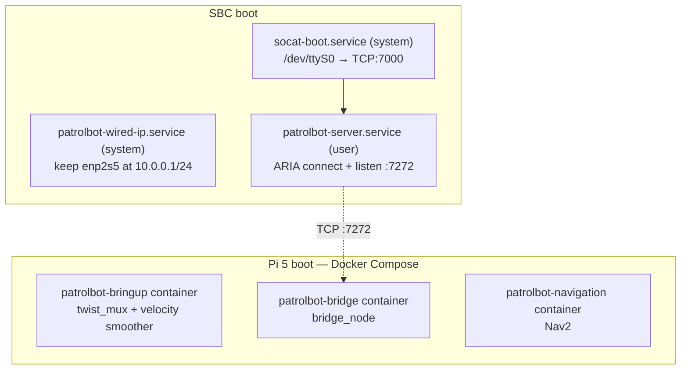
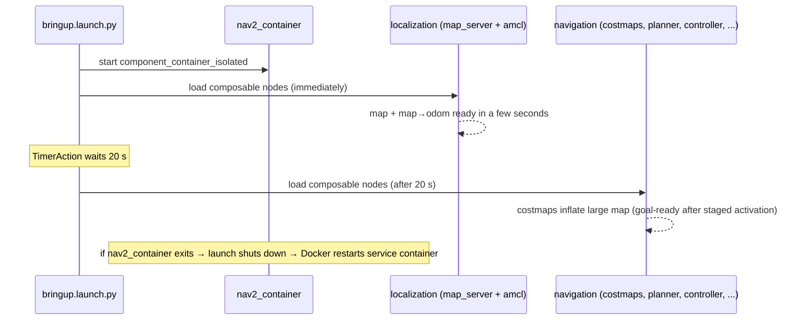
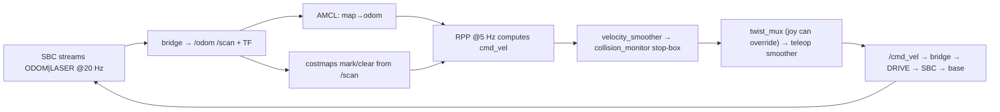

# Execution Flow

This page describes the system's behavior over **time**: which processes start, in what order,
and how control settles into steady state. The byte-level data view is on
[Data Flow](data-flow.md); a finer-grained boot timeline with timings is on
[Startup Sequence](../internals/startup-sequence.md).

## Boot — the SBC and Pi 5 autostart

Neither runtime needs an operator to launch its software. The SBC uses systemd
(with user-service **linger**), while Docker restores the Pi 5 Compose containers.



### SBC services

| Service | Type | Starts | Purpose |
|---|---|---|---|
| `patrolbot-wired-ip.service` | system | at boot | Keeps `10.0.0.1/24` applied to `enp2s5`, including after carrier loss |
| `socat-boot.service` | system | at boot | Holds `/dev/ttyS0` open and bridges it to TCP:7000 so ARIA reaches the base over a socket |
| `patrolbot-server.service` | user (linger) | at boot | Runs `patrolbot_server -rh 127.0.0.1 -rrtp 7000` — ARIA connects to base (via socat) + laser, serves :7272 |

The `-rh 127.0.0.1 -rrtp 7000` flags route ARIA through the socat bridge, which is what resolves
the otherwise-fatal serial conflict (two processes wanting `/dev/ttyS0`). See
[`patrolbot_hw_server`](../packages/patrolbot_hw_server.md).

### Pi 5 containers

Three Compose services share one immutable image and use `restart: unless-stopped`:

| Container | Command | Restart policy |
|---|---|---|
| `patrolbot-bringup` | `ros2 launch patrolbot-launch bringup.xml` | `unless-stopped` |
| `patrolbot-bridge` | `ros2 run patrolbot_bridge bridge_node` | `unless-stopped` |
| `patrolbot-navigation` | `ros2 launch patrolbot_navigation bringup.launch.py` | `unless-stopped` |

!!! success "Mobile-base launch target"
    The Pi 5 bringup container launches the installed package by name. The old
    `~/build_backup/patrolbot-launch/` target was removed.

!!! info "Current runtime"
    The main Pi 5 runtime is Docker Compose. The manual commands below still work
    for development.

## Manual equivalent

If running by hand (e.g., during development), the three services map to:

```bash
# 1. Mobile base — twist_mux + velocity smoother
ros2 launch patrolbot-launch bringup.xml

# 2. TCP bridge to the SBC
ros2 run patrolbot_bridge bridge_node

# 3. Nav2 full stack
ros2 launch patrolbot_navigation bringup.launch.py
```

## Nav2 staged activation

`bringup.launch.py` does not bring the whole stack up at once; it stages activation:



The staging matters operationally:

- **Localization is usable in seconds.** Map display and *2D Pose Estimate* work almost
  immediately, because `map_server` + `amcl` load first.
- **Navigation lags by design.** The heavy half is delayed 20 s so costmap inflation does not
  starve localization during the container's sequential node loading. After the boot-time
  network-wait fix, goal readiness is expected around ~70 s from power-on; older cold-boot
  measurements were around ~3 min.
- **Setting a Nav2 *Goal* requires navigation active**; the map and pose estimate do not.

The detailed timeline is on [Startup Sequence](../internals/startup-sequence.md); the lifecycle
state machine is on [State Machines](../internals/state-machines.md).

## Steady-state control loop

Once everything is active, the system runs a continuous loop:



Loop rates worth knowing: RPP controller **5 Hz**, `local_costmap` update **5 Hz** (raised from
1 Hz to match the controller — a mismatch previously caused "Costmap timed out" goal aborts), velocity
smoothers **20 Hz**, bridge TF **50 Hz**.

## Restart and recovery flows

| Event | What happens |
|---|---|
| Bridge process crashes | The `patrolbot-bridge` container exits/restarts and reconnects to :7272 |
| A Nav2 node or `nav2_container` dies | `OnProcessExit` → launch `Shutdown` → Docker restarts `patrolbot-navigation` → fresh launch |
| SBC link drops and returns | Bridge reconnects every 3 s; Nav2 stays active (`bond_timeout: 0.0`); data resumes automatically |
| **Physical SBC reboot** | ARIA odometry resets to 0,0,0; AMCL pose is now wrong → operator must re-set with *2D Pose Estimate* |
| Pi 5 reboot | Docker restarts all three Compose containers (`unless-stopped`) |

See [Debugging](../development/debugging.md) for Pi 5 status and container-log commands.
