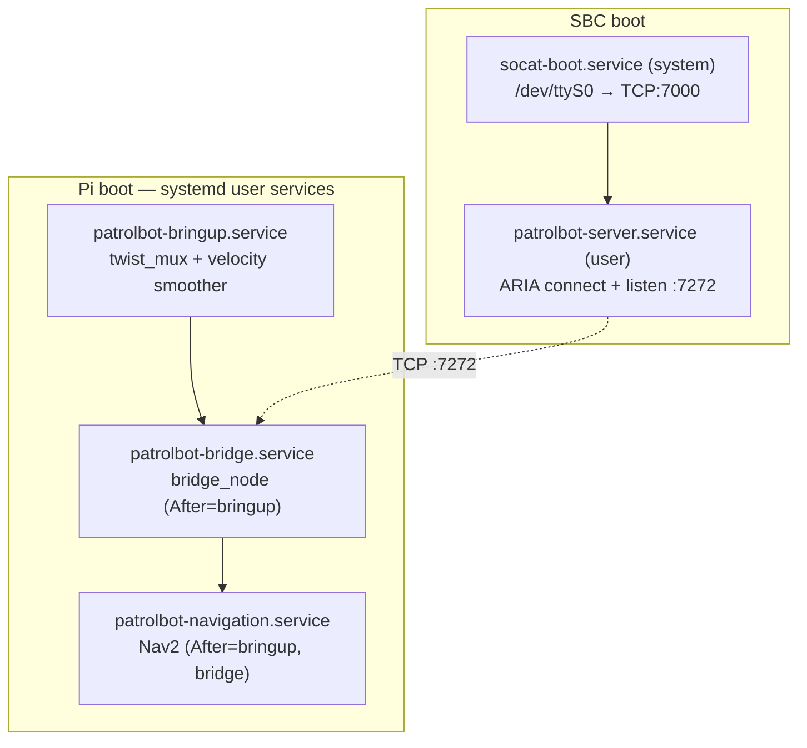
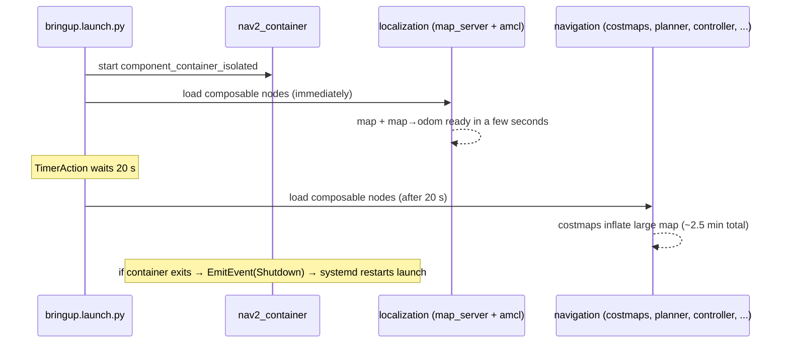
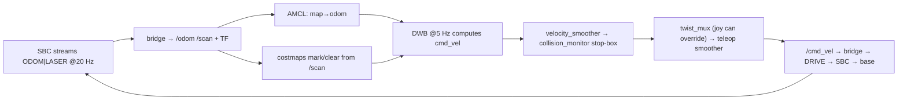

# Execution Flow

This page describes the system's behavior over **time**: which processes start, in what order,
and how control settles into steady state. The byte-level data view is on
[Data Flow](data-flow.md); a finer-grained boot timeline with timings is on
[Startup Sequence](../internals/startup-sequence.md).

## Boot — both machines autostart

Neither machine needs an operator to start the robot. Both bring themselves up at boot via
systemd, with user-service **linger** enabled so the services start without an interactive login.



### SBC services

| Service | Type | Starts | Purpose |
|---|---|---|---|
| `socat-boot.service` | system | at boot | Holds `/dev/ttyS0` open and bridges it to TCP:7000 so ARIA reaches the base over a socket |
| `patrolbot-server.service` | user (linger) | at boot | Runs `patrolbot_server -rh 127.0.0.1 -rrtp 7000` — ARIA connects to base (via socat) + laser, serves :7272 |

The `-rh 127.0.0.1 -rrtp 7000` flags route ARIA through the socat bridge, which is what resolves
the otherwise-fatal serial conflict (two processes wanting `/dev/ttyS0`). See
[`patrolbot_hw_server`](../packages/patrolbot_hw_server.md).

### Pi services

Three ordered systemd **user** services (`~/.config/systemd/user/`), each `Restart=always`:

| Service | `After` / `Wants` | `ExecStart` (sourced under `ros2_ws/install/setup.bash`) | RestartSec |
|---|---|---|---|
| `patrolbot-bringup.service` | `network-online.target` | `ros2 launch .../build_backup/patrolbot-launch/launch/bringup.xml` | 5 |
| `patrolbot-bridge.service` | After/Wants bringup | `ros2 run patrolbot_bridge bridge_node` | 3 |
| `patrolbot-navigation.service` | After bringup + bridge | `ros2 launch patrolbot_navigation bringup.launch.py` | 5 |

!!! note "The installed launch lives in `build_backup/`"
    `patrolbot-bringup.service` runs the mobile-base launch from
    `~/build_backup/patrolbot-launch/launch/bringup.xml`, **not** from `ros2_ws/src`. The `src`
    copy is the source of truth; the `build_backup` copy is what actually runs. Editing `src`
    without re-installing changes nothing at runtime. See
    [Repository Structure](../internals/repository-structure.md).

!!! info "This supersedes older 'manual launch' notes"
    Earlier written notes describe the Pi stack as started by hand after SSH. The live system uses
    the three autostarting user services above; the manual commands still work and are the documented
    fallback. Tracked in [Known Gaps](../known-gaps.md).

## Manual equivalent

If running by hand (e.g., during development), the three services map to:

```bash
# 1. Mobile base — twist_mux + velocity smoother
cd ~/build_backup/patrolbot-launch/launch && ros2 launch bringup.xml

# 2. TCP bridge to the SBC
ros2 run patrolbot_bridge bridge_node

# 3. Nav2 full stack
ros2 launch patrolbot_navigation bringup.launch.py
```

## Nav2 staged activation

`patrolbot-navigation.service` does not bring the whole stack up at once. The launch stages it:



The staging matters operationally:

- **Localization is usable in seconds.** Map display and *2D Pose Estimate* work almost
  immediately, because `map_server` + `amcl` load first.
- **Navigation lags by design.** The heavy half is delayed 20 s so costmap inflation does not
  starve localization during the container's sequential node loading; full activation takes
  **~2.5 min** (down from ~8 min before the map was downsampled).
- **Setting a Nav2 *Goal* requires navigation active**; the map and pose estimate do not.

The detailed timeline is on [Startup Sequence](../internals/startup-sequence.md); the lifecycle
state machine is on [State Machines](../internals/state-machines.md).

## Steady-state control loop

Once everything is active, the system runs a continuous loop:



Loop rates worth knowing: DWB controller **5 Hz**, `local_costmap` update **5 Hz** (raised from
1 Hz to match DWB — a mismatch previously caused "Costmap timed out" goal aborts), velocity
smoothers **20 Hz**, bridge TF **50 Hz**.

## Restart and recovery flows

| Event | What happens |
|---|---|
| Bridge crashes | `patrolbot-bridge.service` restarts it (RestartSec 3); it reconnects to :7272 |
| A Nav2 node or the container dies | `OnProcessExit` → launch `Shutdown` → `patrolbot-navigation.service` restarts the whole launch → localization back in ~4 s |
| SBC drops off and returns | Bridge reconnects every 3 s; Nav2 stays active (`bond_timeout: 0.0`); data resumes automatically |
| **Physical SBC reboot** | ARIA odometry resets to 0,0,0; AMCL pose is now wrong → operator must re-set with *2D Pose Estimate* |
| Pi reboot | All three user services autostart (linger enabled) |

See [Debugging](../development/debugging.md) for how to observe each of these with
`patrolbot-logs.sh`.
