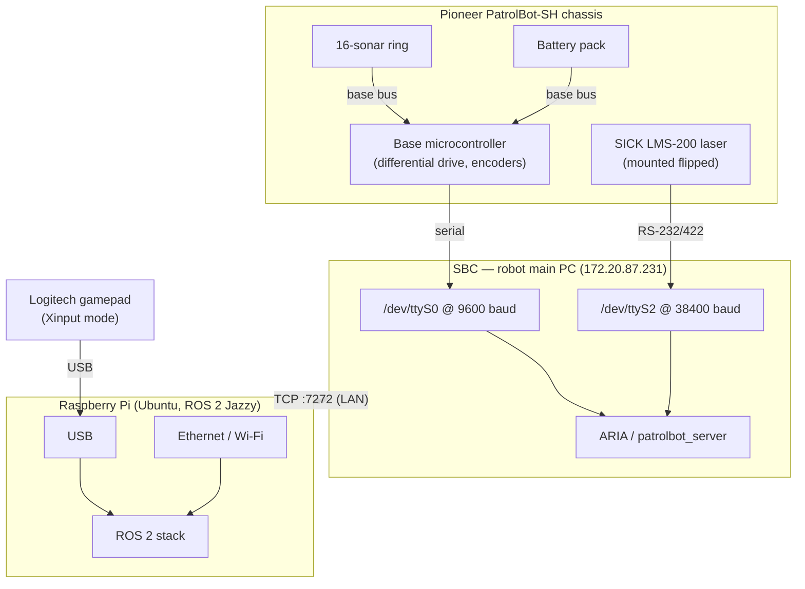

# Hardware Architecture

PatrolBot has **two compute units** and a set of peripherals split deliberately between them.
This page documents the physical topology: what is plugged into what, on which port, at which
rate. The logical/software view is in [Software Architecture](software-architecture.md); the
protocol on the wire between the machines is in
[Communication Architecture](communication-architecture.md).

!!! warning "SBC details are a snapshot"
    The SBC was not reachable when this was written. Port assignments, baud rates, and the wiring
    below come from the last knowledge sync (2026-06-24) and the ARIA parameter file
    `patrolbot-sh.p`, not a live probe. See [Known Gaps](../known-gaps.md).

## Hardware topology

## Ownership: what is attached to which machine

The guiding principle: **heavy sensing and the base live on the SBC; compute lives on the Pi.**

| Peripheral | Physically attached to | Port / link | Rate | Reaches ROS via |
|---|---|---|---|---|
| Pioneer base (drive + encoders) | **SBC** | `/dev/ttyS0` @ 9600 (through a boot-time `socat` → TCP:7000 shim) | 20 Hz odom | bridge → `/odom`, TF `odom→base_link` |
| SICK LMS-200 laser | **SBC** | `/dev/ttyS2` @ 38400 | ~20 Hz | bridge → `/scan` |
| 16-sonar ring | **SBC** (via base) | base bus, read by ARIA | ~4–5 Hz | bridge → `/sonar` |
| Battery / charge state | **SBC** (via base) | base bus, read by ARIA | ~4–5 Hz | bridge → `/battery` |
| Base flags / faults / stall | **SBC** (via base) | base bus, read by ARIA | ~4–5 Hz | bridge → `/diagnostics` |
| Logitech gamepad | **Pi** | USB | event-driven | `joy_node` → `/joy` |
| PTZ VCC4 camera | (in `patrolbot-sh.p`) | — | — | **Not integrated** (config-only) |

Key consequence: **the Pi never talks to the laser or the base directly.** It receives all
sensor data over the single TCP stream from the SBC and emits all motion as `DRIVE` commands
back to the SBC. The only peripheral wired to the Pi is the gamepad.

## The Pioneer PatrolBot-SH base

A differential-drive research platform configured by the ARIA parameter file `patrolbot-sh.p`:

- **Footprint:** ~425 mm wide; modeled in Nav2 as a `robot_radius` of **0.22 m**.
- **Drive:** two driven wheels + casters, controlled by the base microcontroller. Top speed is
  capped in software to **0.26 m/s** linear (DWB `max_vel_x`) for indoor patrol.
- **Sonar:** a 16-transducer ring around the body; ARIA reports each return in robot-frame
  coordinates, which the bridge republishes as a `/sonar` point cloud in `base_link`.
- **Sensing for safety:** stall and fault flags from the base feed `/diagnostics`. Note that the
  bumper bit-fields are reported **raw, for reference only** — on this PatrolBot-SH a reserved bit
  reads high even when idle, so bumpers do not drive the alarm level (only fault flags and motor
  stalls do). See [Devices → Controllers](../devices/controllers.md).

Full device pages: [Actuators](../devices/actuators.md) (base drive),
[Sensors](../devices/sensors.md) (laser, sonar, battery).

## The SICK LMS-200 laser

- **Attached to the SBC** on `/dev/ttyS2` at 38400 baud, read by ARIA's `ArLaserConnector`.
- The bridge publishes the scan as `/scan` with a **180° forward** field of view
  (`angle_min = -π/2`, `angle_max = +π/2`), `range_min` 0.2 m, `range_max` 8.0 m.
- **Mounting:** the SICK is mounted **flipped** (`LaserFlipped=true` in `patrolbot-sh.p`), and
  ARIA returns its readings in flipped order, so the scan arrives mirrored left↔right. The fix is
  a static transform that **rolls `laser_frame` 180° about the forward axis** (`roll = π`),
  re-correcting left/right while keeping front as front.

!!! danger "Laser orientation is unverified"
    The live launch applies **`roll = π`** at `x=0.037, z=0.2` (an un-mirror correction). Older
    written notes describe this as `yaw = π` ("sensor facing rearward"), which is a different
    rotation. The live source is authoritative, but the *correct* orientation is still pending a
    visual RViz check (scan dots aligned to real walls). Tracked in
    [Known Gaps](../known-gaps.md#laser-transform-orientation). See also
    [Devices → Sensors](../devices/sensors.md#sick-lms-200-laser).

## The two compute units

### SBC (main PC)

The robot's original onboard PC. It is the **only** machine that can run ARIA and the only one
wired to the base and laser. It runs no ROS 2 — just the `socat` serial shim and the
`patrolbot_server` C++ binary. Reachable on the LAN at **172.20.87.231**, serving TCP port
**7272**. Details: [`patrolbot_hw_server`](../packages/patrolbot_hw_server.md).

### Raspberry Pi

An Ubuntu Raspberry Pi running ROS 2 Jazzy as user `ubuntu` (home `/home/ubuntu`). It hosts the
entire autonomy stack. Its relevant resource constraints shape the software:

- **`ulimit -n = 1024`** — forces Nav2 composition into one container (see
  [Software Architecture](software-architecture.md#the-composed-nav2_container-and-why-composition-is-mandatory)).
- **Limited RAM** — forces single-threaded map decode (`MAGICK_THREAD_LIMIT=1`,
  `OMP_NUM_THREADS=1`) and motivated the map downsample.

## Network and power

- **SBC ↔ Pi:** Ethernet/Wi-Fi LAN, TCP only. On the same subnet, ROS 2 DDS multicast discovery
  works for tools like RViz; across a VPN it does not (see
  [Remote Operation](../deployment/remote-operation.md)).
- **Gamepad:** USB on the Pi, in **Xinput** mode (the X/D switch must be on X).
- **Power:** the base battery powers the chassis and onboard electronics. A **physical SBC reboot
  resets wheel odometry to zero** — an operational caveat, not a fault; the operator re-localizes
  with *2D Pose Estimate* afterward.
