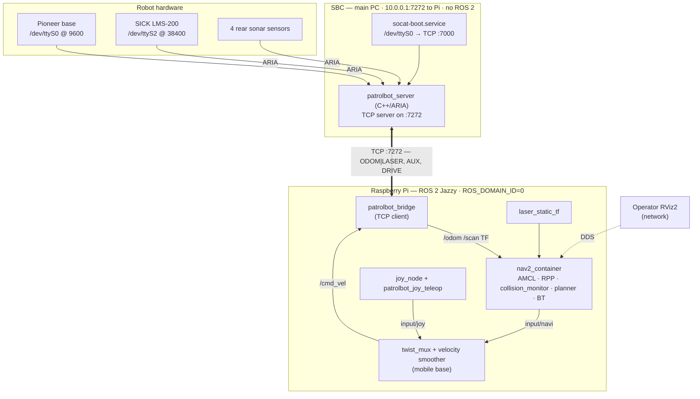
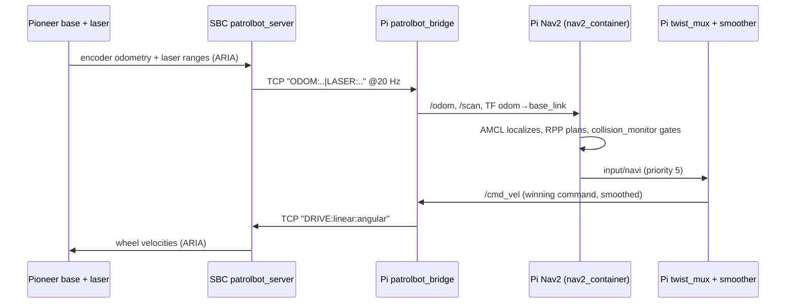

# Architecture Overview

This page is the map of the system. It explains *what* the major pieces are, *why* the
system is split across two computers, and *where* to read more. Every detail here is
expanded elsewhere; start here and follow the links.

## Design philosophy

PatrolBot is built on a Pioneer **PatrolBot-SH** — a robust but old differential-drive base
whose only supported software interface is the **ARIA / AriaCoda** C++ library. Modern Nav2
runs on ROS 2 Jazzy. Rather than force both worlds onto one machine, PatrolBot draws a hard
line between them:

- **The SBC owns the hardware.** It is the only machine that runs ARIA and the only machine
  wired to the base and the laser. Its entire job is to read telemetry and accept drive
  commands. It runs **no ROS 2**.
- **The Pi owns the autonomy.** It runs the complete ROS 2 Jazzy stack — localization, planning,
  control, obstacle avoidance, teleop — and never touches a serial port.

The two are joined by **one TCP socket** carrying a deliberately simple plain-text protocol.

This is the central engineering decision, and the rest of the architecture follows from it.

!!! abstract "Why split the machines at all?"
    **Intent:** isolate the legacy hardware toolchain (ARIA, old serial drivers) from the modern
    autonomy stack so each can evolve independently.

    **Tradeoffs:** a network hop and a custom protocol are added complexity versus running
    everything in one ROS graph. In exchange you get: (1) the Pi never depends on ARIA building
    or the base's serial quirks; (2) the SBC can be a black box that "just streams data"; (3) a
    DDS-vs-ARIA version mismatch is impossible because the SBC speaks no DDS. For a single robot
    this trade is clearly worth it — see the [failure-mode analysis](#failure-modes-at-a-glance)
    for how the seam is hardened.

## The two compute units

### SBC (robot main PC)

Verified live 2026-06-29 via SSH.

- Runs one C++ program, [`patrolbot_server`](../packages/patrolbot_hw_server.md), linked against
  ARIA. It connects to the Pioneer base and the SICK laser, enables motors and sonar, and serves
  a TCP socket on port **7272**.
- A boot-time `socat` service bridges the base's serial port `/dev/ttyS0` to `TCP:7000` so the
  ARIA server reaches it over a socket rather than holding the serial device directly.
- Streams two independent text lines: a ~20 Hz **`ODOM|LASER`** navigation line and a ~4–5 Hz
  **`AUX`** line (sonar, battery, base flags). Accepts **`DRIVE:linear:angular`** back.

### Raspberry Pi (navigation computer)

Verified directly against live source. Four ROS 2 packages, three of them active:

| Package | Role | Status |
|---|---|---|
| [`patrolbot_bridge`](../packages/patrolbot_bridge.md) | TCP↔ROS 2 translation; the SBC's only ROS-side presence | **Active** |
| [`patrolbot_navigation`](../packages/patrolbot_navigation.md) | Nav2 bringup, maps, params, joystick teleop, laser TF | **Active** |
| [`patrolbot-launch`](../packages/patrolbot-launch.md) | Mobile base: `twist_mux` arbitration + velocity smoother | **Active** |
| [`rosaria2`](../packages/rosaria2.md) | Legacy direct-ARIA driver, superseded by the bridge | **Legacy / not launched** |

## How a command flows end to end

The corresponding data structures and rates are on the [Data Flow](data-flow.md) page; the
process/startup ordering is on [Execution Flow](execution-flow.md).

## Failure modes at a glance

The seam between the machines is the riskiest part of the design, so it is hardened on both
ends. Each row is detailed on [Communication Architecture](communication-architecture.md).

| Failure | Detection | Recovery |
|---|---|---|
| SBC powers off abruptly (no TCP FIN) | Pi bridge `recv()` times out after 3 s | Bridge reconnects every 3 s; Nav2 stays up (`bond_timeout: 0.0`) |
| Pi vanishes | SBC `send()` hits sustained `EAGAIN` (~3 s) + TCP keepalive | SBC breaks and re-`accept()`s |
| Nav2 node/container crash | systemd / launch event handler | Whole launch torn down → systemd restart → fresh stack in ~4 s |
| Reconnect TF skew | (was) `collision_monitor` extrapolation throw | Fixed with `base_shift_correction: False` (no longer crashes) |
| Physical SBC reboot | odometry resets to 0,0,0 | **Manual:** operator re-sets pose with *2D Pose Estimate* |

## Scalability notes

- **Single robot, single map.** The architecture targets one robot on one floor. The map is the
  main scaling pressure on the Pi: the current operator-confirmed `second_map` is
  `3192×2205 @ 0.075 m`. Nav2 keeps the global costmap coarser at `0.2 m` and the local costmap at
  `0.1 m`, with single-threaded image decoding to avoid OOM. See
  [Software Architecture](software-architecture.md#the-large-map-problem).
- **The TCP protocol is point-to-point and single-client.** The SBC server re-accepts one Pi at
  a time. Fleet scaling would require either a broker or moving the SBC onto the ROS 2 graph.
- **The Pi is resource-constrained.** Composition into a single `nav2_container` is mandatory
  because separate processes exhaust FastDDS shared-memory port locks at `ulimit -n = 1024`.

## Where this is expanded

- [Software Architecture](software-architecture.md) — the ROS 2 graph, node responsibilities,
  the `cmd_vel` arbitration chain, and the large-map decisions.
- [Hardware Architecture](hardware-architecture.md) — both machines as physical compute nodes and
  what is wired to each.
- [Communication (SBC ↔ Pi)](communication-architecture.md) — the wire protocol and the seam.
- [Execution Flow](execution-flow.md) and [Data Flow](data-flow.md) — runtime ordering and data.
