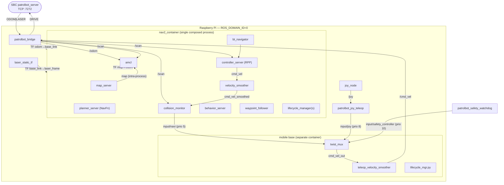
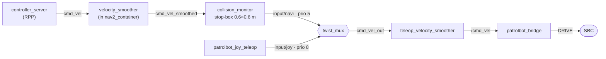

# Software Architecture

All of PatrolBot's software autonomy lives on the **Raspberry Pi**. The SBC runs a single
C++ program and no ROS 2 (see [Hardware Architecture](hardware-architecture.md) and
[`patrolbot_hw_server`](../packages/patrolbot_hw_server.md)). This page describes the Pi's
ROS 2 graph: which nodes exist, how data and commands move between them, and *why* the graph
is shaped the way it is.

## The ROS 2 graph

The full node-by-node reference is in [ROS 2 → Nodes](../ros2/nodes.md); topic and parameter
tables are in [Topics](../ros2/topics.md) and [Parameters](../ros2/parameters.md).

## Layers of responsibility

The software falls into four layers, each a clean boundary:

1. **Transport layer — [`patrolbot_bridge`](../packages/patrolbot_bridge.md).** The only code that
   knows the SBC exists. Converts the TCP text stream into `/odom`, `/scan`, `/sonar`, `/battery`,
   `/diagnostics`, and the `odom→base_link` transform; converts `/cmd_vel` into `DRIVE` commands.
   Everything above it is pure ROS 2 and hardware-agnostic.
2. **Autonomy layer — Nav2 (`nav2_container`).** Localization (AMCL), global planning (NavFn),
   local control (RPP), behaviors (spin/back-up/wait), and collision gating. All composed into one
   process.
3. **Arbitration layer — mobile base ([`patrolbot-launch`](../packages/patrolbot-launch.md)).** A
   `twist_mux` decides whose velocity command wins (joystick vs. navigation) and a velocity
   smoother shapes the result before it reaches the bridge.
4. **Teleop layer — joystick.** `joy_node` + [`patrolbot_joy_teleop`](../ros2/nodes.md#patrolbot_joy_teleop)
   inject a high-priority manual command that overrides autonomy on demand.

## The `cmd_vel` arbitration chain

This is the most intricate part of the graph and the easiest to get wrong, because two
different velocity smoothers and several `input/*` topics are involved. The chain has a single
arbiter — `twist_mux` — and a single final output topic, `/cmd_vel`, which only the bridge
consumes.

Reading it carefully:

- Inside `nav2_container`, RPP publishes `cmd_vel`; the Nav2 `velocity_smoother` republishes
  `cmd_vel_smoothed`; `collision_monitor` reads `cmd_vel_smoothed`, applies its stop-box, and
  emits the result on **`input/navi`** at twist_mux priority **5**.
- `patrolbot_joy_teleop` emits on **`input/joy`** at priority **8** — *higher* than navigation.
  While RB is held it publishes the ramped command at 30 Hz. On RB release or
  0.4 s of `/joy` loss it ramps to zero, publishes one final zero, then goes silent;
  twist_mux times the input out after 1 s and navigation resumes.
- `twist_mux` publishes the winner on `cmd_vel_out`. A *second*, separate
  `teleop_velocity_smoother` (the `nav2_velocity_smoother` executable started by the mobile-base
  launch) re-shapes it and republishes **`/cmd_vel`**, which the bridge forwards to the SBC.

!!! note "Two smoothers, similar names"
    There are two velocity smoothers with overlapping topic names. The one *inside* `nav2_container`
    smooths RPP output to `cmd_vel_smoothed`. The one in the mobile-base launch
    (`teleop_velocity_smoother`) remaps `/cmd_vel → /cmd_vel_out` (input) and `cmd_vel_smoothed →
    cmd_vel` (output), so its final output is the real `/cmd_vel`. The remaps are why the names look
    circular. See [Launch System](../ros2/launch-system.md#mobile-base-launch).

!!! warning "Configured but mostly unused mux inputs"
    `input/safety_controller` is active: `patrolbot_safety_watchdog.py` publishes zero Twist at
    priority 10 when `/scan` or `/odom` goes stale. `input/teleop` (prio 8) and `input/switch`
    (prio 6) are reserved and have no current publisher.

**Failure mode — `cmd_vel_in_topic` mismatch.** Earlier, `collision_monitor` read `cmd_vel_raw`,
which had no publisher, so navigation commands silently never reached the robot. It now reads
`cmd_vel_smoothed` (the smoother's real output topic). The lesson is baked into a comment in
`nav2_params.yaml`: the smoother's `cmd_vel_topic` parameter is **not** a real Nav2 parameter and
is ignored — the smoother always publishes `cmd_vel_smoothed`.

## The composed `nav2_container` — and why composition is mandatory

Every Nav2 lifecycle node runs in **one** process, `nav2_container`
(`component_container_isolated`), loaded via `LoadComposableNodes`. This is not a preference; it
is forced by the Pi's resource limits.

!!! abstract "Why one container instead of separate node processes?"
    **Intent:** survive on a Pi with `ulimit -n = 1024` and a large map.

    **The problem with separate processes:** running Nav2 with `use_composition:=False` spawns ~13
    DDS participants. FastDDS allocates shared-memory port locks under `/dev/shm` per participant;
    ~13 of them exhaust the file-descriptor budget and break lifecycle discovery, so nodes never
    finish activating.

    **Why composition fixes it:** one container = one DDS participant = one set of port locks. And
    the large map travels `map_server → costmaps` **intra-process** (zero-copy), so it never crosses
    DDS and can't saturate the transport.

    **Tradeoff:** a crash in any node takes down all of them (shared process). PatrolBot accepts this
    and turns it into a clean recovery story — see below.

### Crash handling: tear down, don't respawn

`nav2_container` is deliberately **not** respawned. A respawned container comes back *empty*,
because `LoadComposableNodes` does not re-run. Instead, `bringup.launch.py` registers an
`OnProcessExit` handler: if the container dies for any reason, it emits a launch `Shutdown`. The
Pi 5 Docker has `restart: unless-stopped`, so the service container restarts and
brings up a fresh, fully populated stack. The Pi 4 fallback unit provides the
equivalent `Restart=always` behavior. This converts
"the container died and is now a useless empty shell" into "the whole stack restarted cleanly."

### Startup ordering inside the container

Localization (`map_server` + `amcl`) loads first so the map and `map→odom` are ready within
seconds. The heavy navigation half (costmaps inflating the large map) is delayed **20 s** with a
`TimerAction` so it does not starve localization during the container's sequential composable-node
loading. Practical result: the RViz map and *2D Pose Estimate* are usable almost immediately;
*Nav2 Goal* becomes available a bit later. The full sequence is on
[Startup Sequence](../internals/startup-sequence.md).

## The large-map problem

The map is the dominant scaling pressure on the Pi, and several decisions exist only to manage it:

| Decision | Reason | Tradeoff |
|---|---|---|
| **Confirmed map scale: 3192×2205 @ 0.075 m/px** | Operator-verified laser-vs-map overlay; do not change the map scale casually | Global costmap remains coarser at 0.2 m for planning speed; local costmap is 0.1 m |
| **`bond_timeout: 0.0`** in the patched lifecycle managers | Inflating the huge map starves `map_server`'s bond heartbeat past the default 4 s, aborting the lifecycle manager → no AMCL → blank map | Loses bond-based liveness detection of lifecycle nodes |
| **`MAGICK_THREAD_LIMIT=1`, `OMP_NUM_THREADS=1`** | Multi-threaded image decode of the large PGM OOM-kills the process on the Pi | Slightly slower one-time map load |
| **Local copies of the nav2_bringup launches** | Upstream `bringup_launch.py` hard-codes `bond_timeout: 4.0` and never reads our params | Must re-sync if upstream changes |

## Reliability properties

Because the SBC link is the system's single point of fragility, the Pi software is built to ride
out its loss without operator intervention:

- **SBC link loss/recovery:** the bridge reconnects every 3 s; Nav2 nodes stay active (`bond_timeout: 0.0`);
  `map→odom` and 25 Hz data resume automatically when the SBC returns.
- **Bridge crash:** Docker restarts the Pi 5 bridge container; it reconnects.
- **Nav container/node crash:** full launch shutdown → Docker restarts the Pi 5
  service container (or systemd restarts the Pi 4 fallback) with a fresh launch.
- **Reconnect TF skew:** `collision_monitor` runs with `base_shift_correction: False`, so a scan
  stamped just before the rebuilt TF cache no longer throws an uncaught extrapolation exception that
  would SIGABRT the whole container.
- **Sensor stale safe-hold:** `patrolbot_safety_watchdog.py` publishes to
  `input/safety_controller` if `/scan` or `/odom` is stale for more than 0.5 s, holding the robot
  through the highest-priority `twist_mux` input until fresh data returns.

The one case software cannot mask is a **physical SBC reboot**, which resets ARIA odometry to
`0,0,0`; AMCL's pose is then wrong and the operator must re-set it with *2D Pose Estimate*. See
[Known Gaps](../known-gaps.md) and [Debugging](../development/debugging.md).
