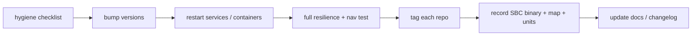

# Release Process

PatrolBot is a single-robot research platform, not a distributed package, so "release" means
**capturing a known-good, reproducible state of the whole robot** — the SBC and selected main Pi
runtime — and tagging it.
This page describes a lightweight, honest process for that.

## What a release is here

A release pins, together:

- The monorepo commit and immutable Pi 5 image revision containing `patrolbot_bridge`,
  `patrolbot_navigation`, and `patrolbot-launch`.
- The Pi 5 Compose configuration and image digest; record the Pi 4 rollback state separately.
- The SBC `patrolbot_server` source + the binary build date.
- The active map and the matching costmap resolution.
- The SBC systemd units and Pi 5 Compose state.

## Versioning

Package manifests currently read `0.0.0`/`0.0.1`. For a real release, bump them deliberately and
consistently:

| Package | Action |
|---|---|
| `patrolbot_bridge` | set a real version in `package.xml` + `setup.py` (currently `0.0.0`) |
| `patrolbot_navigation` | bump from `0.0.1` |
| `patrolbot-launch` | set from `0.0.0` |
| `patrolbot_hw_server` | tag the SBC repo / record the binary build date |

## Pre-release hygiene checklist

Several of these are open items in [Known Gaps](../known-gaps.md) — a release is the natural time to
close them:

- [ ] Fix scaffold-default package metadata and missing manifest dependencies
      (`ubuntu@todo.todo`/TODO values in the Python `setup.py` files and
      `joao@todo.todo`/TODO values in `rosaria2/package.xml`).
- [ ] Remove [dead launch experiments](../internals/legacy-components.md#known-dead-code--cleanup-candidates).
- [ ] Confirm current fixed facts are still true: `roll=π`, `second_map` at `0.075 m/px`, RPP
      controller, Pi 5 Docker deployment, and Pi 4 rollback status.
- [ ] Confirm the Pi 5 bringup container launches `ros2 launch patrolbot-launch bringup.xml`.
- [ ] `colcon test` clean; resilience matrix green.

## Cutting the release



1. Complete the hygiene checklist and bump versions.
2. Ensure the package build, service commands, and Docker image (if used) match the source being
   released.
3. Run the full [test set](../development/testing.md): lint, a real navigate-to-goal, and the
   freeze/resume resilience matrix.
4. **Tag** the monorepo release commit and record the deployed SBC source snapshot.
5. **Record the environment** that isn't in git: the SBC binary build date, the active map file +
   its resolution, the SBC unit contents, and the Pi 5 Compose/image state.
6. Update this site and any changelog.

## Capturing reproducible state

Because key runtime facts live outside git (the SBC binary, Docker image, active map, and service
units), a release note should explicitly capture them:

```text
Release vX.Y.Z
- Monorepo @ <commit>; Pi 5 image @ <tag/digest> with org.opencontainers.image.revision=<commit>
- Pi 5 bringup command: ros2 launch patrolbot-launch bringup.xml
- SBC patrolbot_server built <date> from <commit/snapshot>
- Active map: second_map.{pgm,yaml} @ 0.075 m/px; global_costmap resolution 0.2
- SBC systemd units: <list and state>
- Pi 5 Docker image / Compose state: <tag, digest, health>
- Pi 4 rollback services: <stopped or deliberate rollback state>
- Discovery server: disabled unless deliberately re-enabled
```

## Documentation releases

The docs site deploys continuously from `main` (see
[Pull Request Process](pull-request-process.md#merge-and-deploy)); there is no separate docs release
step. Keep the docs honest at all times rather than batching doc updates into a release — the whole
point of [Known Gaps](../known-gaps.md) is that the site states what is verified and what isn't.
