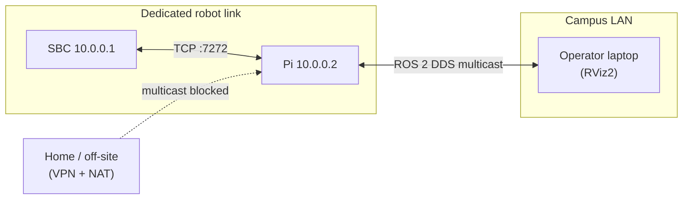

# Network Setup

PatrolBot has two distinct networking layers, and conflating them is the source of most "I can't
see the robot" confusion:

1. **SBC ↔ Pi:** a dedicated Ethernet link (`10.0.0.1/24` SBC,
   `10.0.0.2/24` Pi) carrying a single TCP socket on port 7272.
2. **Pi ↔ operator tools (RViz):** **ROS 2 / FastDDS**, which uses multicast discovery on the LAN.



## The SBC ↔ Pi link

| Property | Value |
|---|---|
| Transport | TCP |
| SBC endpoint | `10.0.0.1:7272` (server) |
| Pi role | client (the bridge) |
| Requirement | Pi can reach the SBC's IP:port on the LAN |

This link is documented in full on
[Communication Architecture](../architecture/communication-architecture.md). It is plaintext and
unauthenticated, so it assumes a **trusted robot network**.

## ROS 2 discovery (Pi-internal and to RViz)

| Setting | Value | Where |
|---|---|---|
| `ROS_DOMAIN_ID` | `0` | set in `bringup.launch.py`, `.bashrc`, `patrolbot-logs.sh` |
| Middleware | FastDDS | default |
| Discovery | `SUBNET` / multicast (`ROS_AUTOMATIC_DISCOVERY_RANGE=SUBNET`) | default |

On the **same subnet**, multicast discovery works and RViz needs no special configuration — start
RViz with `ROS_DOMAIN_ID=0` on the LAN and you'll see the robot's topics and TF.

```bash
# On the operator laptop, on the robot LAN:
export ROS_DOMAIN_ID=0
rviz2
```

## The VPN/NAT problem

Multicast discovery **does not cross** a VPN or NAT. From home (e.g. a VM behind VMware NAT + a
Cisco VPN), RViz sees *nothing* — no TF, no map, "Frame map does not exist". The robot's graph is
healthy; the client simply can't discover it. This is a **transport** problem, not a data problem.

The previous FastDDS Discovery Server experiment for VPN RViz was reverted on 2026-06-29. The unit
file and old XML profiles may still exist as backups, but they are **not the current runtime state**:

| Component | Status |
|---|---|
| `patrolbot-discovery.service` | on disk but disabled |
| `FASTRTPS_DEFAULT_PROFILES_FILE` in ROS 2 services | not set |
| Current discovery mode | default SIMPLE multicast on the LAN |

Treat VPN RViz as a future re-enable project, not as a configured feature.

## Firewall / ports summary

| Port | Machine | Purpose |
|---|---|---|
| 7000 | SBC | socat → base serial (localhost use by ARIA) |
| 7272 | SBC | telemetry server (Pi connects) |
| DDS multicast/UDP | LAN | default ROS 2 discovery on the subnet |

## Checklist

- [ ] Pi `eth0` has `10.0.0.2/24` and can reach `10.0.0.1:7272`.
- [ ] `ROS_DOMAIN_ID=0` everywhere (robot and any LAN operator tools).
- [ ] On the LAN, RViz works with no extra config.
- [ ] For off-site RViz, plan a fresh discovery-server or relay design; it is not active today.
