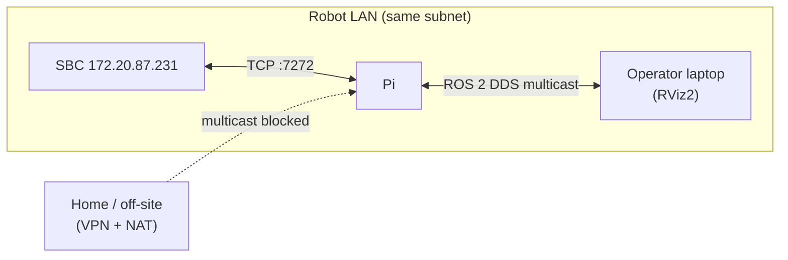

# Network Setup

PatrolBot has two distinct networking layers, and conflating them is the source of most "I can't
see the robot" confusion:

1. **SBC ↔ Pi:** a single **TCP socket** (the SBC server on :7272). This is *not* ROS — it's the
   custom protocol, and it works as long as the two machines can reach each other on the LAN.
2. **Pi ↔ operator tools (RViz):** **ROS 2 / FastDDS**, which uses multicast discovery on the LAN.



## The SBC ↔ Pi link

| Property | Value |
|---|---|
| Transport | TCP |
| SBC endpoint | `172.20.87.231:7272` (server) |
| Pi role | client (the bridge) |
| Requirement | Pi can reach the SBC's IP:port on the LAN |

This link is documented in full on
[Communication Architecture](../architecture/communication-architecture.md). It is plaintext and
unauthenticated, so it assumes a **trusted robot network**.

## ROS 2 discovery (Pi-internal and to RViz)

| Setting | Value | Where |
|---|---|---|
| `ROS_DOMAIN_ID` | `0` | set in `bringup.launch.py`, `.bashrc`, `patrolbot-logs.sh` |
| Middleware | FastDDS | default |
| Discovery | `SUBNET` / multicast (`ROS_AUTOMATIC_DISCOVERY_RANGE=SUBNET`) | default |

On the **same subnet**, multicast discovery works and RViz needs no special configuration — start
RViz with `ROS_DOMAIN_ID=0` on the LAN and you'll see the robot's topics and TF.

```bash
# On the operator laptop, on the robot LAN:
export ROS_DOMAIN_ID=0
rviz2
```

## The VPN/NAT problem

Multicast discovery **does not cross** a VPN or NAT. From home (e.g. a VM behind VMware NAT + a
Cisco VPN), RViz sees *nothing* — no TF, no map, "Frame map does not exist". The robot's graph is
healthy; the client simply can't discover it. This is a **transport** problem, not a data problem.

The prepared fix is a **FastDDS Discovery Server** (unicast, TCP transport, NAT-friendly):

| Component | Status |
|---|---|
| Pi-side profile `patrolbot_fastdds_pi.xml` (Pi nodes become discovery-server **clients**, TCP transport) | **validated** |
| Discovery server (`fastdds discovery -i 0 -t 0.0.0.0 -q 11811`, GUID prefix `44.53.00.5f...`) | **validated** |
| Wired into the production systemd services (`FASTRTPS_DEFAULT_PROFILES_FILE`) | **not yet** — deferred so it can't risk the live nav stack |

The full operator-side recipe is on [Remote Operation](remote-operation.md).

!!! warning "Discovery server is prepared, not active"
    The XML profile comments say it is "applied via `FASTRTPS_DEFAULT_PROFILES_FILE` in the systemd
    user services," but the live unit files do **not** set that variable yet. Treat the discovery
    server as a tested-but-not-deployed mechanism. Tracked in [Known Gaps](../known-gaps.md).

## Firewall / ports summary

| Port | Machine | Purpose |
|---|---|---|
| 7000 | SBC | socat → base serial (localhost use by ARIA) |
| 7272 | SBC | telemetry server (Pi connects) |
| 11811 | Pi | FastDDS discovery server (when enabled) — TCP |
| ephemeral TCP | Pi | per-participant DDS data ports (discovery-server mode) |
| DDS multicast/UDP | LAN | default ROS 2 discovery on the subnet |

## Checklist

- [ ] Pi and SBC on the same LAN; Pi can reach `172.20.87.231:7272`.
- [ ] `ROS_DOMAIN_ID=0` everywhere (robot and any LAN operator tools).
- [ ] On the LAN, RViz works with no extra config.
- [ ] For off-site, plan to enable the [discovery server](remote-operation.md) — it is not on by
      default.
