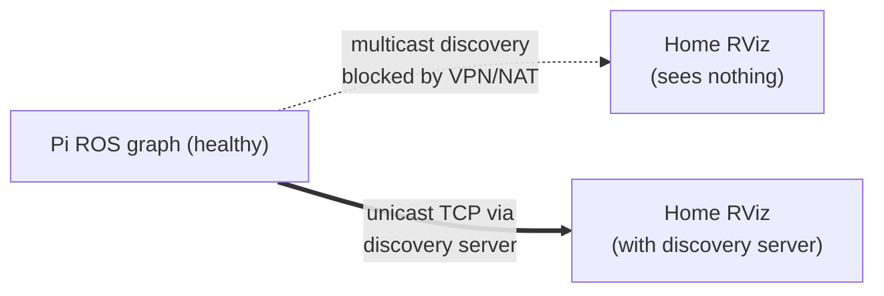

# Remote Operation

Operating PatrolBot on the **LAN** is straightforward; operating it **from home over a VPN** is the
hard case, because ROS 2's default multicast discovery does not survive VPN/NAT. This page covers
both, and the in-progress discovery-server fix.

## On the LAN (the easy path)

On the same subnet as the robot, multicast discovery works. From the operator laptop:

```bash
export ROS_DOMAIN_ID=0
rviz2                       # set Fixed Frame = map; use 2D Pose Estimate + Nav2 Goal
```

You should see `/map`, `/scan`, the TF tree, and be able to set an initial pose and goals. SSH
gives you the rest:

```bash
ssh robot-pi ./patrolbot-logs.sh status
ssh robot-pi ./patrolbot-logs.sh scan
```

## From home (VPN/NAT) — the problem

Running RViz from home (a VM behind VMware NAT + a Cisco VPN) shows **nothing**: no TF, no map,
"Frame map does not exist". The cause is **transport, not data**:

- The Pi uses FastDDS with `ROS_AUTOMATIC_DISCOVERY_RANGE=SUBNET` (multicast).
- **Multicast does not cross the VPN/NAT.** The robot's ROS graph is healthy; the remote client
  simply can't *discover* it.



## The fix: FastDDS Discovery Server (prepared, not yet wired in)

The plan replaces multicast discovery with a **unicast, TCP** discovery server — NAT-friendly,
because TCP is bidirectional once the client initiates the connection.

| Piece | Where | Status |
|---|---|---|
| Pi nodes become discovery-server **clients**, expose a TCP transport | `patrolbot_fastdds_pi.xml` | **validated** |
| Discovery server on the Pi | `fastdds discovery -i 0 -t 0.0.0.0 -q 11811` (GUID prefix `44.53.00.5f.45.50.52.4f.53.49.4d.41`, TCP :11811, ephemeral data ports) | **validated** |
| Applied to the production services via `FASTRTPS_DEFAULT_PROFILES_FILE` | the three systemd user units | **not yet** — deferred so it can't risk the live nav stack |

### Profile highlights (`patrolbot_fastdds_pi.xml`)

- A `TCPv4` transport with `listening_ports: 0` (OS-assigned ephemeral port per process — a fixed
  port can't be shared by the many Pi processes; each participant registers its real TCP locator
  with the discovery server).
- `discoveryProtocol: CLIENT`, pointing at the local discovery server at `127.0.0.1:11811`.
- Builtin SHM+UDP transports kept for fast intra-Pi traffic; TCP only for remote participants.

!!! warning "Not active by default"
    The live systemd units do **not** set `FASTRTPS_DEFAULT_PROFILES_FILE`, so the discovery server
    is **not** in effect today. Enabling it is a deliberate, separate step (it was intentionally left
    until last so it couldn't destabilize the production nav stack). Tracked in
    [Known Gaps](../known-gaps.md).

### Enabling it (when ready)

1. Start the discovery server on the Pi (or as its own service).
2. Set `FASTRTPS_DEFAULT_PROFILES_FILE=/home/ubuntu/patrolbot_fastdds_pi.xml` for the ROS nodes
   (the three user services).
3. On the remote client, point at the same discovery server (its reachable address over the VPN)
   and use a matching TCP client profile.
4. Verify TF/map appear in remote RViz.

## Remote RViz noise (harmless)

Even when remote viz works, expect client-side log noise that does not indicate a robot fault:

- `glsl120/indexed_8bit_image ... same texture image unit` — OGRE/Mesa Map-display shader bug.
- `Message Filter dropping message ... laser_frame ... queue is full` tagged `[rviz2]` — RViz's own
  scan-display TF queue.

## Safe remote operation

- Prefer SSH + `patrolbot-logs.sh` for *observing*; use RViz for *commanding* (pose/goal).
- The robot is resilient to losing the operator entirely — autonomy continues; the joystick is the
  local override. Losing RViz does not stop a running goal.
- Remember the [physical-reboot caveat](robot-deployment.md#operational-caveats): after an SBC
  power-cycle, re-set the pose.

See [Network Setup](network-setup.md) for the underlying topology and ports.
