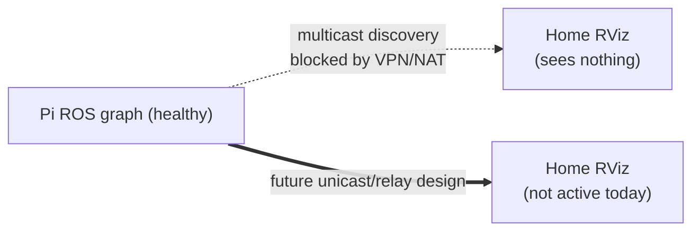

# Remote Operation

Operating PatrolBot on the **LAN** is straightforward; operating it **from home over a VPN** is not
currently supported for RViz, because ROS 2's default multicast discovery does not survive VPN/NAT.
The FastDDS Discovery Server experiment was reverted on 2026-06-29.

## On the LAN (the easy path)

On the same subnet as the robot, multicast discovery works. From the operator laptop:

```bash
export ROS_DOMAIN_ID=0
rviz2                       # set Fixed Frame = map; use 2D Pose Estimate + Nav2 Goal
```

You should see `/map`, `/scan`, the TF tree, and be able to set an initial pose and goals. SSH
gives you the rest:

```bash
ssh ubuntu@patrolbot-ros.qatar.cmu.edu ./patrolbot-logs.sh status
ssh ubuntu@patrolbot-ros.qatar.cmu.edu ./patrolbot-logs.sh scan
```

## From home (VPN/NAT) — the problem

Running RViz from home (a VM behind VMware NAT + a Cisco VPN) shows **nothing**: no TF, no map,
"Frame map does not exist". The cause is **transport, not data**:

- The Pi uses FastDDS with `ROS_AUTOMATIC_DISCOVERY_RANGE=SUBNET` (multicast).
- **Multicast does not cross the VPN/NAT.** The robot's ROS graph is healthy; the remote client
  simply can't *discover* it.



## Discovery Server Status

The robot is back on plain LAN multicast discovery:

| Piece | Where | Status |
|---|---|---|
| `patrolbot-discovery.service` | Pi user service directory | **disabled** |
| `FASTRTPS_DEFAULT_PROFILES_FILE` | three production ROS 2 services | **not set** |
| FastDDS XML profiles | backups / old files | **not runtime state** |

If VPN RViz is needed again, re-enable it as a deliberate project from backups, then verify LAN RViz,
on-Pi ROS CLI, TF, map QoS, and Nav2 goals before considering it production.

## Remote RViz noise (harmless)

Even when remote viz works, expect client-side log noise that does not indicate a robot fault:

- `glsl120/indexed_8bit_image ... same texture image unit` — OGRE/Mesa Map-display shader bug.
- `Message Filter dropping message ... laser_frame ... queue is full` tagged `[rviz2]` — RViz's own
  scan-display TF queue.

## Safe remote operation

- Prefer SSH + `patrolbot-logs.sh` for *observing*; use RViz for *commanding* (pose/goal).
- The robot is resilient to losing the operator entirely — autonomy continues; the joystick is the
  local override. Losing RViz does not stop a running goal.
- Remember the [physical-reboot caveat](robot-deployment.md#operational-caveats): after an SBC
  power-cycle, re-set the pose.

See [Network Setup](network-setup.md) for the underlying topology and ports.
