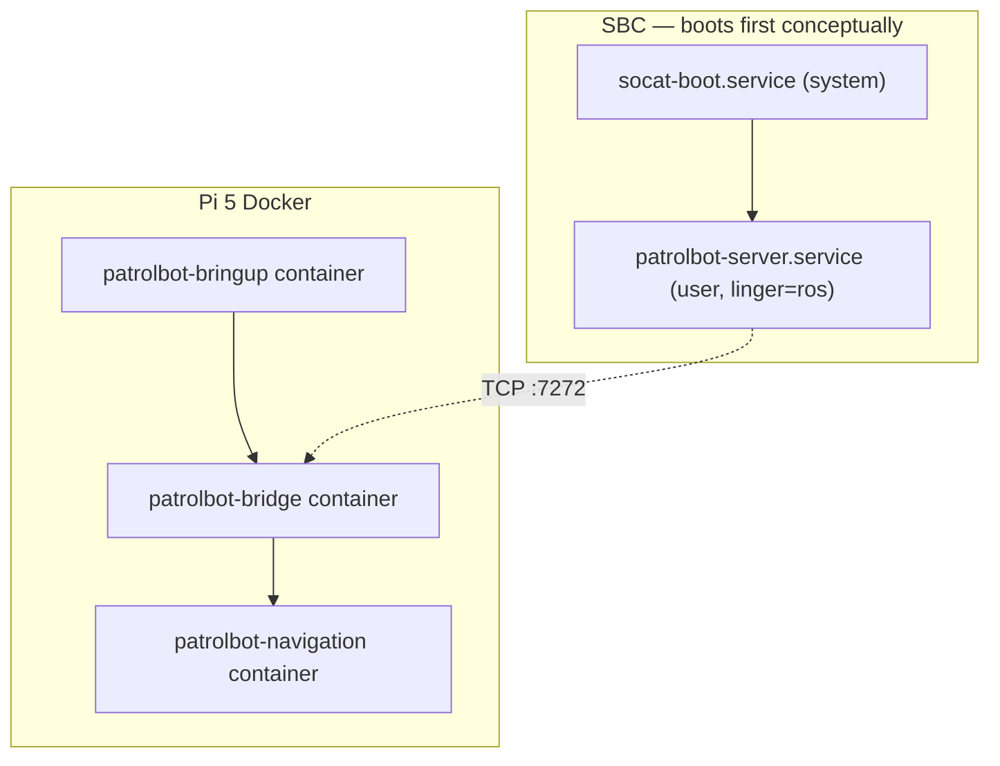

# Robot Deployment

The SBC uses systemd services. The Raspberry Pi 5 uses the Docker Compose deployment
documented in [Docker Deployment](docker.md). The former Raspberry Pi 4 systemd path
is retained as rollback.

## Deployment model



Docker starts the Pi containers at boot with `restart: unless-stopped`.

## SBC services

| Unit | Type | ExecStart | Purpose |
|---|---|---|---|
| `socat-boot.service` | system | `socat file:/dev/ttyS0,b9600,raw,echo=0 tcp4-listen:7000,reuseaddr` (via `socat_loop.sh`) | expose the base serial port as TCP:7000 |
| `patrolbot-server.service` | user (`ros`) | `patrolbot_server -rh 127.0.0.1 -rrtp 7000` | ARIA server, listens on :7272 |

**One-time setup:** `sudo loginctl enable-linger ros`. This is recorded as done in the SBC
architecture notes, so `patrolbot-server.service` starts at boot without a login session.

## Legacy Pi 4 services

All three are systemd **user** services in `~/.config/systemd/user/`, each `Restart=always`:

| Unit | After / Wants | ExecStart (under `ros2_ws/install/setup.bash`) | RestartSec |
|---|---|---|---|
| `patrolbot-bringup.service` | `network-online.target` | `ros2 launch patrolbot-launch bringup.xml` | 5 |
| `patrolbot-bridge.service` | After/Wants bringup | `ros2 run patrolbot_bridge bridge_node` | 3 |
| `patrolbot-navigation.service` | After bringup + bridge | `ros2 launch patrolbot_navigation bringup.launch.py` | 5 |

**One-time setup:** `loginctl enable-linger ubuntu` (already enabled per the latest notes).

!!! success "Mobile-base launch target cleaned up"
    `patrolbot-bringup.service` launches the installed package by name:
    `ros2 launch patrolbot-launch bringup.xml`. Older notes that point at
    `~/build_backup/patrolbot-launch/` are stale; that backup target was removed on 2026-06-28.

## Managing the services

```bash
# Status / health
systemctl --user status patrolbot-bridge.service
ssh ubuntu@patrolbot-ros.qatar.cmu.edu ./patrolbot-logs.sh status

# Restart a layer
systemctl --user restart patrolbot-navigation.service

# Logs
ssh ubuntu@patrolbot-ros.qatar.cmu.edu ./patrolbot-logs.sh nav
journalctl --user -u patrolbot-bridge.service -f
```

## Boot timing and readiness

- Localization (map + `map→odom`) is ready within seconds of `patrolbot-navigation.service`
  starting. After the network-wait fix, goal readiness is expected around ~70 s from power-on;
  older measured cold boots were around ~3 min.
- The bridge connects as soon as the SBC's :7272 is up; if the SBC is late, the bridge simply
  retries every 3 s.
- Order is enforced by `After`/`Wants`, but the system is resilient to out-of-order starts (the
  bridge reconnects, Nav2 stays active on a missing SBC).

## Operational caveats

| Caveat | Action |
|---|---|
| **Physical SBC reboot resets odometry** to 0,0,0 | After reconnect, re-set pose with *2D Pose Estimate* in RViz |
| Linger not enabled | services won't autostart — run the `enable-linger` command for that user |
| Map changed | keep `second_map.yaml` at the confirmed `0.075 m/px` scale unless a new operator-verified map replaces it |

## First-time deployment checklist

1. **SBC:** build `patrolbot_server` (`make`), install both units, `sudo loginctl enable-linger ros`,
   reboot, confirm :7272 is listening.
2. **Pi 4:** `colcon build --symlink-install`, install the three units, `loginctl enable-linger
   ubuntu`, reboot.
3. **Verify:** `./patrolbot-logs.sh status` shows all services active; `/odom` `/scan` flow; set an
   initial pose and a goal in RViz.

Do not start an overlapping bare-metal stack while Docker is active. Follow
[Docker Deployment](docker.md), which preserves a rollback path to the services above.

See [Network Setup](network-setup.md) for the LAN/DDS configuration and
[Remote Operation](remote-operation.md) for operating from off-site.
