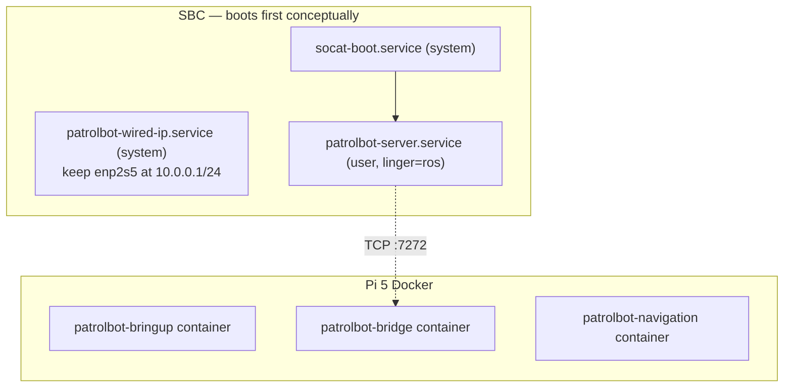

# Robot Deployment

The SBC uses systemd services. The main Raspberry Pi 5 uses the Docker Compose
deployment documented in [Docker Deployment](docker.md). The powered Raspberry Pi 4
retains the systemd rollback path, but its ROS services must stay stopped during
Pi 5 operation.

## Deployment model



Docker starts the Pi containers at boot with `restart: unless-stopped`.

## SBC services

| Unit | Type | ExecStart | Purpose |
|---|---|---|---|
| `patrolbot-wired-ip.service` | system | `/usr/local/bin/enp2s5-static-ip.sh` | keep `10.0.0.1/24` applied to `enp2s5`; `Restart=always` |
| `socat-boot.service` | system | `socat file:/dev/ttyS0,b9600,raw,echo=0 tcp4-listen:7000,reuseaddr` (via `socat_loop.sh`) | expose the base serial port as TCP:7000 |
| `patrolbot-server.service` | user (`ros`) | `patrolbot_server -rh 127.0.0.1 -rrtp 7000` | ARIA server, listens on :7272 |

**One-time setup:** `sudo loginctl enable-linger ros`. This is recorded as done in the SBC
architecture notes, so `patrolbot-server.service` starts at boot without a login session.

## Legacy Pi 4 services

All three are systemd **user** services in `~/.config/systemd/user/`, each `Restart=always`:

| Unit | After / Wants | ExecStart (under `ros2_ws/install/setup.bash`) | RestartSec |
|---|---|---|---|
| `patrolbot-bringup.service` | `network-online.target` | `ros2 launch patrolbot-launch bringup.xml` | 5 |
| `patrolbot-bridge.service` | After/Wants bringup | `ros2 run patrolbot_bridge bridge_node` | 3 |
| `patrolbot-navigation.service` | After bringup + bridge | `ros2 launch patrolbot_navigation bringup.launch.py` | 5 |

**One-time setup:** `loginctl enable-linger ubuntu` (already enabled per the latest notes).

!!! success "Mobile-base launch target cleaned up"
    `patrolbot-bringup.service` launches the installed package by name:
    `ros2 launch patrolbot-launch bringup.xml`. Older notes that point at
    `~/build_backup/patrolbot-launch/` are stale; that backup target was removed on 2026-06-28.

## Managing the Pi 5 runtime

```bash
# Status / readiness
ssh robot-pi2 'cd /home/ubuntu/patrolbot-repo && ./docker/status.sh'
ssh robot-pi2 'docker compose --env-file /home/ubuntu/patrolbot-repo/docker/.env \
  -f /home/ubuntu/patrolbot-repo/docker/docker-compose.yml ps'

# Restart a layer
ssh robot-pi2 'docker restart patrolbot-navigation'

# Logs
ssh robot-pi2 'docker logs -f patrolbot-navigation'
ssh robot-pi2 'docker logs -f patrolbot-bridge'
```

Use the systemd commands in the Pi 4 section only during intentional rollback.

## Boot timing and readiness

- Localization (map + `map→odom`) begins after the `patrolbot-navigation`
  container starts and live odometry/scan data is available.
- The bridge connects as soon as the SBC's :7272 is up; if the SBC is late, the bridge simply
  retries every 3 s.
- Compose does not impose a service order; the bridge reconnect loop and Nav2's
  long transform wait make out-of-order starts safe.

## Operational caveats

| Caveat | Action |
|---|---|
| **Physical SBC reboot resets odometry** to 0,0,0 | After reconnect, re-set pose with *2D Pose Estimate* in RViz |
| Linger not enabled on SBC/Pi 4 | their user services will not autostart; Pi 5 uses Docker instead |
| Pi 4 services active during Pi 5 operation | stop the three Pi 4 services to prevent duplicate ROS nodes and publishers |
| Map changed | keep `second_map.yaml` at the confirmed `0.075 m/px` scale unless a new operator-verified map replaces it |

## First-time deployment checklist

1. **SBC:** build `patrolbot_server` (`make`), install the two system units plus
   the user server unit, `sudo loginctl enable-linger ros`,
   reboot, confirm :7272 is listening.
2. **Pi 5:** configure `eth0` as `10.0.0.2/24`, build an immutable image revision,
   and start the three Compose services.
3. **Pi 4 rollback:** keep the built systemd deployment available, but stop its three
   ROS services during Pi 5 operation.
4. **Verify:** `docker/status.sh` reports ready; `/odom` and `/scan` flow; set an
   initial pose and a goal in RViz.

Do not start an overlapping bare-metal stack while Docker is active. Follow
[Docker Deployment](docker.md), which preserves a rollback path to the services above.

See [Network Setup](network-setup.md) for the LAN/DDS configuration and
[Remote Operation](remote-operation.md) for operating from off-site.
