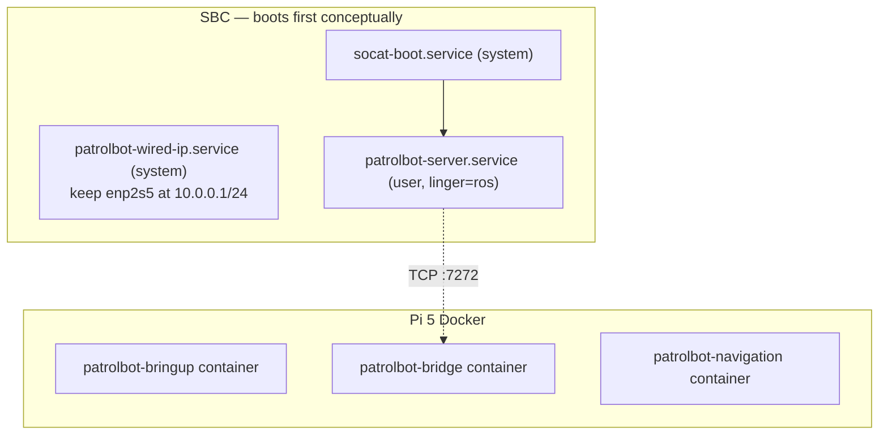

# Robot Deployment

The SBC uses systemd services. The main Raspberry Pi 5 uses the Docker Compose
deployment documented in [Docker Deployment](docker.md).

## Deployment model



Docker starts the Pi containers at boot with `restart: unless-stopped`.

## SBC services

| Unit | Type | ExecStart | Purpose |
|---|---|---|---|
| `patrolbot-wired-ip.service` | system | `/usr/local/bin/enp2s5-static-ip.sh` | keep `10.0.0.1/24` applied to `enp2s5`; `Restart=always` |
| `socat-boot.service` | system | `socat file:/dev/ttyS0,b9600,raw,echo=0 tcp4-listen:7000,reuseaddr` (via `socat_loop.sh`) | expose the base serial port as TCP:7000 |
| `patrolbot-server.service` | user (`ros`) | `patrolbot_server -rh 127.0.0.1 -rrtp 7000` | ARIA server, listens on :7272 |

**One-time setup:** `sudo loginctl enable-linger ros`. This is recorded as done in the SBC
architecture notes, so `patrolbot-server.service` starts at boot without a login session.

## Managing the Pi 5 runtime

```bash
# Status / readiness
ssh robot-pi2 'cd /home/ubuntu/patrolbot-repo && ./docker/status.sh'
ssh robot-pi2 'docker compose --env-file /home/ubuntu/patrolbot-repo/docker/.env \
  -f /home/ubuntu/patrolbot-repo/docker/docker-compose.yml ps'

# Restart a layer
ssh robot-pi2 'docker restart patrolbot-navigation'

# Logs
ssh robot-pi2 'docker logs -f patrolbot-navigation'
ssh robot-pi2 'docker logs -f patrolbot-bridge'
```

## Boot timing and readiness

- Localization (map + `map→odom`) begins after the `patrolbot-navigation`
  container starts and live odometry/scan data is available.
- The bridge connects as soon as the SBC's :7272 is up; if the SBC is late, the bridge simply
  retries every 3 s.
- Compose does not impose a service order; the bridge reconnect loop and Nav2's
  long transform wait make out-of-order starts safe.

## Operational caveats

| Caveat | Action |
|---|---|
| **Physical SBC reboot resets odometry** to 0,0,0 | After reconnect, re-set pose with *2D Pose Estimate* in RViz |
| Linger not enabled on the SBC | `patrolbot-server.service` will not autostart; Pi 5 uses Docker instead |
| Map changed | keep `second_map.yaml` at the confirmed `0.075 m/px` scale unless a new operator-verified map replaces it |

## First-time deployment checklist

1. **SBC:** build `patrolbot_server` (`make`), install the two system units plus
   the user server unit, `sudo loginctl enable-linger ros`,
   reboot, confirm :7272 is listening.
2. **Pi 5:** configure `eth0` as `10.0.0.2/24`, build an immutable image revision,
   and start the three Compose services.
3. **Verify:** `docker/status.sh` reports ready; `/odom` and `/scan` flow; set an
   initial pose and a goal in RViz.

Follow [Docker Deployment](docker.md) for image versioning, health checks, and rollback.

See [Network Setup](network-setup.md) for the LAN/DDS configuration and
[Remote Operation](remote-operation.md) for operating from off-site.
