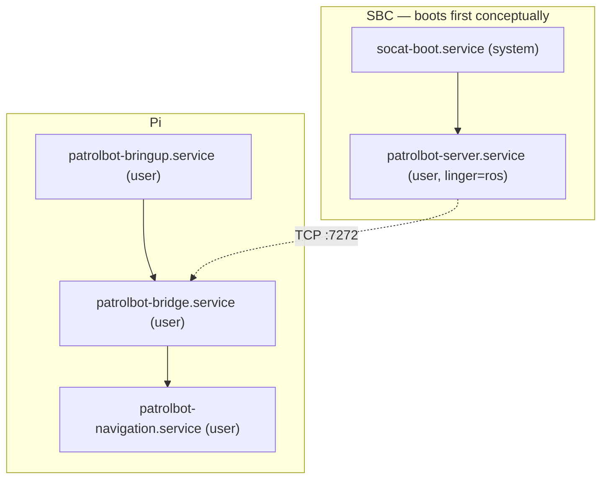

# Robot Deployment

PatrolBot deploys as a set of **systemd services** on each machine, so the robot comes up on power
without an operator. This page documents what is installed where, the boot ordering, and the
one-time setup each machine needs.

## Deployment model



Both machines use **systemd user services** with **linger** enabled, so services start at boot
without an interactive login.

## SBC services

| Unit | Type | ExecStart | Purpose |
|---|---|---|---|
| `socat-boot.service` | system | `socat file:/dev/ttyS0,b9600,raw,echo=0 tcp4-listen:7000,reuseaddr` (via `socat_loop.sh`) | expose the base serial port as TCP:7000 |
| `patrolbot-server.service` | user (`ros`) | `patrolbot_server -rh 127.0.0.1 -rrtp 7000` | ARIA server, listens on :7272 |

**One-time setup:** `sudo loginctl enable-linger ros` (requires an interactive terminal — cannot
be done over a BatchMode SSH). Whether this was actually run on the SBC is one of the
[unconfirmed items](../known-gaps.md).

## Pi services

All three are systemd **user** services in `~/.config/systemd/user/`, each `Restart=always`:

| Unit | After / Wants | ExecStart (under `ros2_ws/install/setup.bash`) | RestartSec |
|---|---|---|---|
| `patrolbot-bringup.service` | `network-online.target` | `ros2 launch ~/build_backup/patrolbot-launch/launch/bringup.xml` | 5 |
| `patrolbot-bridge.service` | After/Wants bringup | `ros2 run patrolbot_bridge bridge_node` | 3 |
| `patrolbot-navigation.service` | After bringup + bridge | `ros2 launch patrolbot_navigation bringup.launch.py` | 5 |

**One-time setup:** `loginctl enable-linger ubuntu` (already enabled per the latest notes).

!!! danger "Deployment target is `build_backup/`, not `src/`"
    `patrolbot-bringup.service` runs the mobile-base launch from **`~/build_backup/patrolbot-launch/`**.
    Deploying a mobile-base change means updating that copy, not just `ros2_ws/src`. See
    [Updates](updates.md) and [Repository Structure](../internals/repository-structure.md).

## Managing the services

```bash
# Status / health
systemctl --user status patrolbot-bridge.service
ssh robot-pi ./patrolbot-logs.sh status

# Restart a layer
systemctl --user restart patrolbot-navigation.service

# Logs
ssh robot-pi ./patrolbot-logs.sh nav
journalctl --user -u patrolbot-bridge.service -f
```

## Boot timing and readiness

- Localization (map + `map→odom`) is ready within seconds of `patrolbot-navigation.service`
  starting; the **full navigation stack takes ~2.5 min**.
- The bridge connects as soon as the SBC's :7272 is up; if the SBC is late, the bridge simply
  retries every 3 s.
- Order is enforced by `After`/`Wants`, but the system is resilient to out-of-order starts (the
  bridge reconnects, Nav2 stays active on a missing SBC).

## Operational caveats

| Caveat | Action |
|---|---|
| **Physical SBC reboot resets odometry** to 0,0,0 | After reconnect, re-set pose with *2D Pose Estimate* in RViz |
| Linger not enabled | services won't autostart — run the `enable-linger` command for that user |
| Map changed | global costmap resolution must match the map's; re-deploy both |

## First-time deployment checklist

1. **SBC:** build `patrolbot_server` (`make`), install both units, `sudo loginctl enable-linger ros`,
   reboot, confirm :7272 is listening.
2. **Pi:** `colcon build`, ensure the mobile-base copy is in `build_backup/`, install the three
   units, `loginctl enable-linger ubuntu`, reboot.
3. **Verify:** `./patrolbot-logs.sh status` shows all services active; `/odom` `/scan` flow; set an
   initial pose and a goal in RViz.

See [Network Setup](network-setup.md) for the LAN/DDS configuration and
[Remote Operation](remote-operation.md) for operating from off-site.
