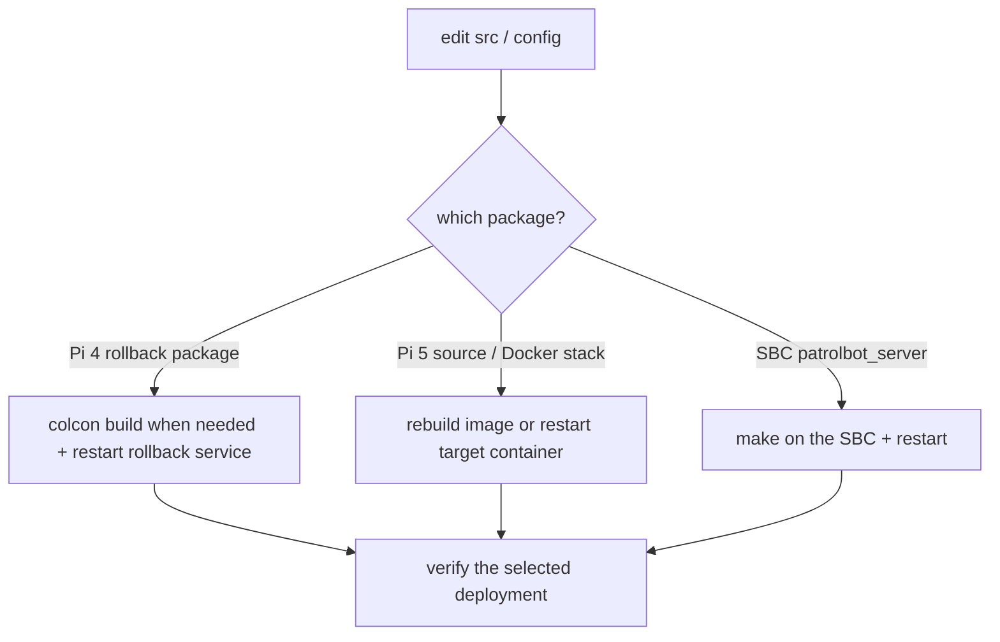

# Updates

Update the canonical monorepo first, validate it, then deploy that exact revision.
The Pi 5 path uses Docker Compose and is covered in [Docker Deployment](docker.md).

## Update map



## Updating a Pi 5 package

### patrolbot_bridge / patrolbot_navigation / patrolbot-launch

The deployed source is bind-mounted read-only into the three containers. Existing
files can be changed by deploying the exact monorepo revision and restarting the
owning container; adding files or changing package metadata requires a new image.

```bash
cd ~/patrolbot-repo/docker
docker compose build navigation
docker compose up -d
./patrolbot-status
```

For an existing bind-mounted file, restart only `bringup`, `bridge`, or
`navigation`. Never edit the deployed Pi tree as the canonical source.

### Pi 4 rollback package updates

The older colcon/systemd flow applies only when intentionally maintaining or
activating the rollback board:

```bash
cd ~/ros2_ws
colcon build --packages-select patrolbot_bridge
systemctl --user restart patrolbot-bridge.service
```

## Updating the SBC server

```bash
# On the SBC
cd ~/patrolbot_hw_server
# edit patrolbot_server.cpp
make
systemctl --user restart patrolbot-server.service
```

The Pi bridge will drop and reconnect automatically (3 s) during the restart — no Pi-side action
needed. If live source cannot be inspected, do not guess from stale runtime state;
use `SKILLS/sbc-architecture.md` as the architecture record.

## Updating the map

The active map scale is operator-confirmed and should not be changed casually:
`second_map.{yaml,pgm}` is `3192×2205 @ 0.075 m`, origin `[-1,-1,0]`. The global costmap remains
coarser at `0.2 m` for planning speed; the local costmap remains `0.1 m`.

```bash
# In the canonical monorepo, replace the active map and commit it.
cp new_map.pgm  ros2_ws/src/patrolbot_navigation/maps/second_map.pgm
cp new_map.yaml ros2_ws/src/patrolbot_navigation/maps/second_map.yaml
# Do not change map resolution/scale unless the new map is operator-verified
# Deploy that exact revision to Pi 5, then:
cd ~/patrolbot-repo/docker
docker compose restart navigation
```

After replacing a map, set a fresh *2D Pose Estimate* before sending goals. If the source map is a
CAD drawing, remove title blocks, border frames, and furniture/hatching artifacts that the laser
cannot see.

## Rolling back

| Change | Roll back by |
|---|---|
| Pi package | revert the monorepo commit, rebuild, and restart |
| Mobile base | `git` revert in `patrolbot-launch`, rebuild if needed, restart `patrolbot-bringup` |
| Map change | restore the previous `second_map.{pgm,yaml}` and restart `patrolbot-navigation` |
| Docker stack | deploy the previous immutable Pi 5 image/revision; use Pi 4 services only for an explicit board rollback |
| SBC server | rebuild the previous `patrolbot_server.cpp` + restart |

## Post-update verification

```bash
ssh robot-pi2 'cd /home/ubuntu/patrolbot-repo && ./docker/status.sh'
ssh robot-pi2 "docker exec patrolbot-navigation bash -lc \
  'source /opt/ros/\$ROS_DISTRO/setup.bash; ros2 topic hz /odom /scan /cmd_vel'"
# Set 2D Pose Estimate, then a Nav2 Goal — confirm the robot plans and moves
```

Re-run the [resilience tests](../development/testing.md#resilience-tests-the-important-ones) after
any change near the seam (bridge, SBC server, lifecycle/launch).

## Keep the docs in sync

After a structural change (new package, launch, service, Docker behavior, map fact, or laser TF),
update the package `README.md`, the source workspace `SKILLS/` file, and this site.
