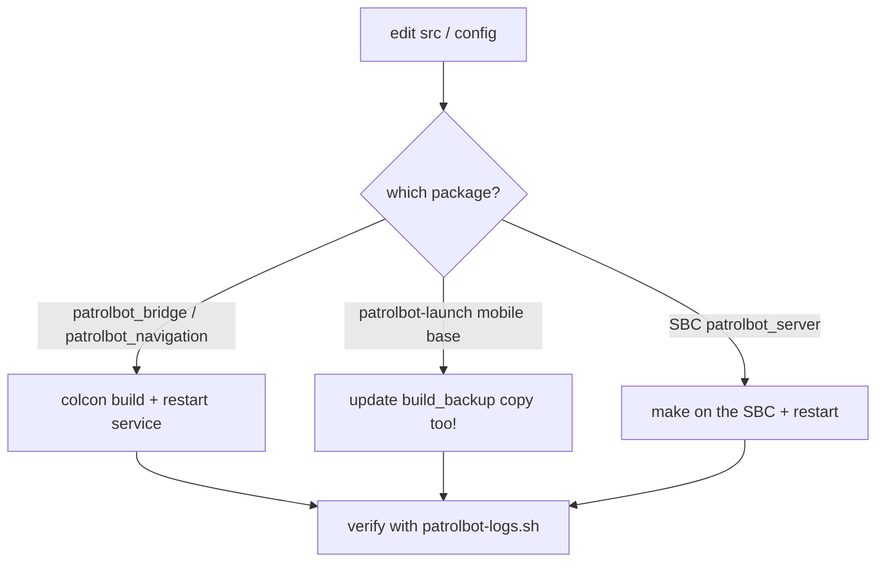

# Updates

Updating PatrolBot means changing code or config on a live robot. The golden rule is the
[`build_backup` deployment step](#the-mobile-base-deployment-step) for the mobile-base package;
everything else is conventional colcon/systemd.

## Update map



## Updating a Pi package

### patrolbot_bridge / patrolbot_navigation

These run from the colcon `install/`, so the normal flow works:

```bash
cd ~/ros2_ws
colcon build --packages-select patrolbot_bridge      # or patrolbot_navigation
source install/setup.bash
systemctl --user restart patrolbot-bridge.service    # or patrolbot-navigation.service
ssh ubuntu@patrolbot-ros.qatar.cmu.edu ./patrolbot-logs.sh status
```

### The mobile-base deployment step

!!! danger "patrolbot-launch runs from `build_backup/`"
    `patrolbot-bringup.service` launches `~/build_backup/patrolbot-launch/launch/bringup.xml`, **not**
    `ros2_ws/src` or `install/`. Editing `src` and rebuilding does **nothing** to the running mobile
    base. You must update the `build_backup` copy:

    ```bash
    # After editing ~/ros2_ws/src/patrolbot-launch/...
    cp -r ~/ros2_ws/src/patrolbot-launch/launch/*   ~/build_backup/patrolbot-launch/launch/
    cp -r ~/ros2_ws/src/patrolbot-launch/param/*     ~/build_backup/patrolbot-launch/param/
    cp ~/ros2_ws/src/patrolbot-launch/lifecycle_mgr.py ~/build_backup/patrolbot-launch/
    systemctl --user restart patrolbot-bringup.service
    ```

    Long term, fixing this means making the service launch from `install/` and treating `src` as the
    single source — see [Repository Structure](../internals/repository-structure.md).

## Updating the SBC server

```bash
# On the SBC
cd ~/patrolbot_hw_server
# edit patrolbot_server.cpp
make
systemctl --user restart patrolbot-server.service
```

The Pi bridge will drop and reconnect automatically (3 s) during the restart — no Pi-side action
needed. (The SBC is not reachable in this documentation's snapshot; verify steps against the live
machine.)

## Updating the map

The map and the global costmap resolution must agree.

```bash
# Replace the active map (keep the same name or update the launch reference)
cp new_map.pgm  ~/ros2_ws/src/patrolbot_navigation/maps/second_map.pgm
cp new_map.yaml ~/ros2_ws/src/patrolbot_navigation/maps/second_map.yaml
# Ensure global_costmap resolution in nav2_params.yaml matches the new map resolution
colcon build --packages-select patrolbot_navigation
systemctl --user restart patrolbot-navigation.service
```

Remember the trade: a finer map (0.1 m/px) means ~8 min startup and OOM risk; 0.2 m/px is the
tuned default. The pre-downsample originals are kept as `second_map_original_0.1.{pgm,yaml}.bak`.

## Rolling back

| Change | Roll back by |
|---|---|
| Pi package | `git` revert in the package's repo (note `patrolbot_navigation`/`rosaria2` have their own `.git/`), `colcon build`, restart |
| Mobile base | restore the previous `build_backup` copy + restart `patrolbot-bringup` |
| Map downsample | restore `second_map_original_0.1.{pgm,yaml}.bak`, set both costmap resolutions to 0.1 |
| SBC server | rebuild the previous `patrolbot_server.cpp` + restart |

## Post-update verification

```bash
ssh ubuntu@patrolbot-ros.qatar.cmu.edu ./patrolbot-logs.sh status     # all services active
ros2 topic hz /odom /scan /cmd_vel          # data + commands flow
# Set 2D Pose Estimate, then a Nav2 Goal — confirm the robot plans and moves
```

Re-run the [resilience tests](../development/testing.md#resilience-tests-the-important-ones) after
any change near the seam (bridge, SBC server, lifecycle/launch).

## Keep the docs in sync

After a structural change (new package, launch, service, or a changed fact like map resolution or
the laser TF), update the package `README.md`, the architecture notes, and this site — drift is the
reason [Known Gaps](../known-gaps.md) exists.
