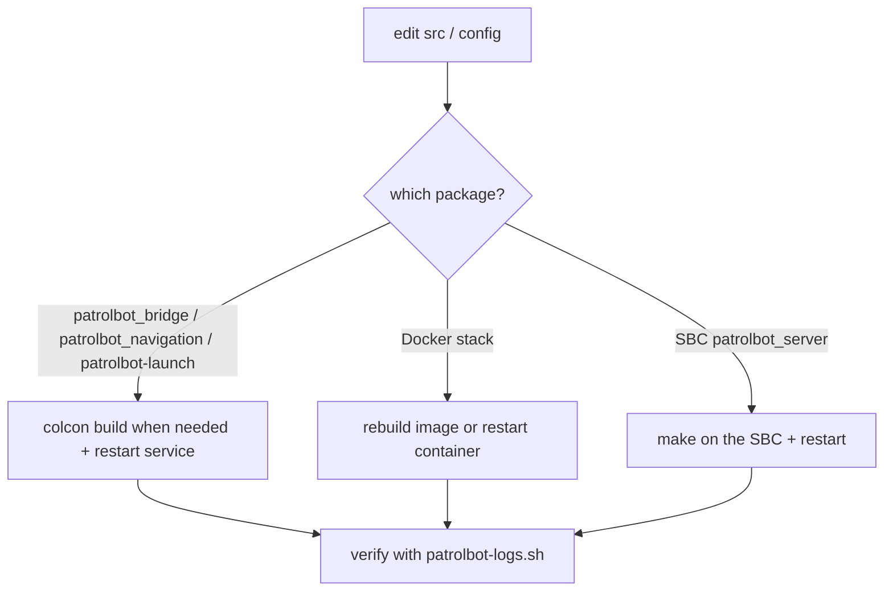

# Updates

Updating PatrolBot means changing code or config on a live robot. The production Pi 4 path is
conventional colcon/systemd; the Pi 5 migration path uses Docker Compose and is covered in
[Docker Deployment](docker.md).

## Update map



## Updating a Pi package

### patrolbot_bridge / patrolbot_navigation / patrolbot-launch

These run from the colcon `install/`, so the normal flow works:

```bash
cd ~/ros2_ws
colcon build --packages-select patrolbot_bridge      # or patrolbot_navigation / patrolbot-launch
source install/setup.bash
systemctl --user restart patrolbot-bridge.service    # or patrolbot-navigation.service
ssh ubuntu@patrolbot-ros.qatar.cmu.edu ./patrolbot-logs.sh status
```

For `patrolbot-launch`, restart `patrolbot-bringup.service`. The old
`~/build_backup/patrolbot-launch/` copy step was removed on 2026-06-28; the service now runs
`ros2 launch patrolbot-launch bringup.xml`.

## Updating the SBC server

```bash
# On the SBC
cd ~/patrolbot_hw_server
# edit patrolbot_server.cpp
make
systemctl --user restart patrolbot-server.service
```

The Pi bridge will drop and reconnect automatically (3 s) during the restart — no Pi-side action
needed. If the SBC is down, do not guess from stale runtime state; use `SKILLS/sbc-architecture.md`
as the documented truth source until live SSH is back.

## Updating the map

The active map scale is operator-confirmed and should not be changed casually:
`second_map.{yaml,pgm}` is `3192×2205 @ 0.075 m`, origin `[-1,-1,0]`. The global costmap remains
coarser at `0.2 m` for planning speed; the local costmap remains `0.1 m`.

```bash
# Replace the active map (keep the same name or update the launch reference)
cp new_map.pgm  ~/ros2_ws/src/patrolbot_navigation/maps/second_map.pgm
cp new_map.yaml ~/ros2_ws/src/patrolbot_navigation/maps/second_map.yaml
# Do not change map resolution/scale unless the new map is operator-verified
colcon build --packages-select patrolbot_navigation
systemctl --user restart patrolbot-navigation.service
```

After replacing a map, set a fresh *2D Pose Estimate* before sending goals. If the source map is a
CAD drawing, remove title blocks, border frames, and furniture/hatching artifacts that the laser
cannot see.

## Updating the Docker stack

For the Pi 5 migration target:

```bash
cd ~/docker
docker buildx build --load -f Dockerfile -t patrolbot:jazzy "$PATROLBOT_WS/src"
docker compose restart
docker compose ps
```

If the change only edits existing bind-mounted launch, params, maps, or scripts, a targeted
`docker compose restart <service>` is usually enough. Adding files requires rebuilding the image.

## Rolling back

| Change | Roll back by |
|---|---|
| Pi package | `git` revert in the package's repo (note `patrolbot_navigation`/`rosaria2` have their own `.git/`), `colcon build`, restart |
| Mobile base | `git` revert in `patrolbot-launch`, rebuild if needed, restart `patrolbot-bringup` |
| Map change | restore the previous `second_map.{pgm,yaml}` and restart `patrolbot-navigation` |
| Docker stack | `docker compose down`, then re-enable the bare-metal systemd services |
| SBC server | rebuild the previous `patrolbot_server.cpp` + restart |

## Post-update verification

```bash
ssh ubuntu@patrolbot-ros.qatar.cmu.edu ./patrolbot-logs.sh status     # all services active
ros2 topic hz /odom /scan /cmd_vel          # data + commands flow
# Set 2D Pose Estimate, then a Nav2 Goal — confirm the robot plans and moves
```

Re-run the [resilience tests](../development/testing.md#resilience-tests-the-important-ones) after
any change near the seam (bridge, SBC server, lifecycle/launch).

## Keep the docs in sync

After a structural change (new package, launch, service, Docker behavior, map fact, or laser TF),
update the package `README.md`, the source workspace `SKILLS/` file, and this site.
