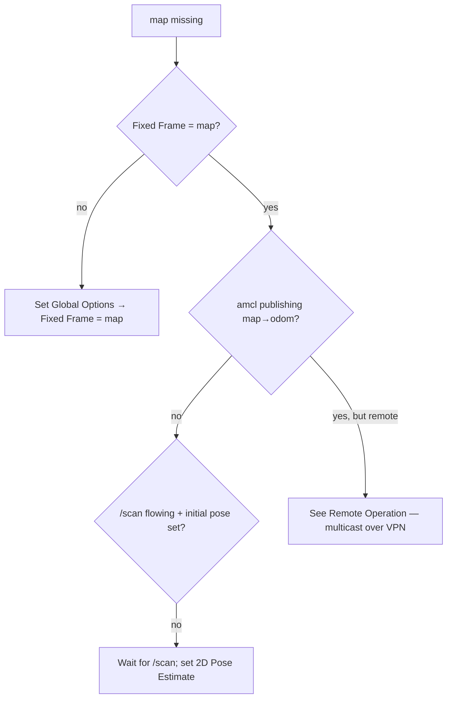

# Debugging

This is a symptom-first guide. Find your symptom, follow the check, fix it where it lives. The
single most useful tool is `patrolbot-logs.sh` on the Pi.

## The Swiss-army tool: `patrolbot-logs.sh`

```bash
ssh robot-pi ./patrolbot-logs.sh            # follow all three services
ssh robot-pi ./patrolbot-logs.sh status     # service health + last 5 min of errors
ssh robot-pi ./patrolbot-logs.sh bridge     # bridge only (SBC link)
ssh robot-pi ./patrolbot-logs.sh nav        # Nav2 only
ssh robot-pi ./patrolbot-logs.sh topics     # /odom /scan /cmd_vel /map rates
ssh robot-pi ./patrolbot-logs.sh tf         # current TF tree
ssh robot-pi ./patrolbot-logs.sh scan       # live front/left/right laser distances
```

`scan` is especially handy: it prints nearest obstacle to the right/front/left and the global
nearest, and tells you when the robot looks "boxed in" (front < 0.25 m).

## Symptom → cause → fix

### "Frame map does not exist" / blank map in RViz



- Set **Fixed Frame = `map`** (the most common cause).
- `amcl` needs `/scan` flowing **and** an initial pose. Set *2D Pose Estimate*.
- Verify: `ros2 topic echo /tf | grep -A1 'frame_id: map'`.
- If you're remote (VPN) and see *nothing*, it's a transport problem, not data — see
  [Remote Operation](../deployment/remote-operation.md).

### Nav2 Goal aborts: "No valid trajectories" / "Costmap timed out"

- Root cause historically: `local_costmap update_frequency` (1 Hz) below DWB's 5 Hz. Already fixed
  to 5.0 — if it recurs, re-check `local_costmap update_frequency: 5.0` and `publish_frequency: 2.0`
  in `nav2_params.yaml`.
- Confirm the robot isn't boxed in: `./patrolbot-logs.sh scan`.

### Robot won't move under navigation, but localization is fine

Walk the [`cmd_vel` chain](../architecture/software-architecture.md#the-cmd_vel-arbitration-chain):

```bash
ros2 lifecycle get /teleop_velocity_smoother   # must be 'active'
ros2 topic hz cmd_vel_smoothed                 # collision_monitor input
ros2 topic hz /cmd_vel                          # bridge input — the final command
```

- If `/teleop_velocity_smoother` isn't active, `lifecycle_mgr.py` didn't run — restart
  `patrolbot-bringup.service`.
- If `collision_monitor` reads the wrong topic, no command flows (the historical `cmd_vel_raw`
  bug). It must read `cmd_vel_smoothed`.
- A held joystick (or a stuck deadman) overrides nav — check `/joy`.

### Scan appears mirrored / walls on the wrong side

This is the unresolved **laser orientation** issue. The live launch uses `roll=π` to un-mirror;
older notes say `yaw=π`. Do a visual RViz check (scan dots on real walls) and lock in whichever is
correct. See [Sensors](../devices/sensors.md#sick-lms-200-laser) and
[Known Gaps](../known-gaps.md#laser-transform-orientation).

### `/odom` and `/scan` stopped

- The SBC link is down. `./patrolbot-logs.sh bridge` will show "SBC telemetry timed out.
  Reconnecting…". The bridge retries every 3 s; data resumes when the SBC returns.
- If the SBC was **physically rebooted**, odometry reset to 0,0,0 — re-set the pose with *2D Pose
  Estimate* after reconnect.

### Whole Nav2 stack restarted itself

- Expected behavior when `nav2_container` dies: the launch tears down and systemd restarts a fresh
  stack (a respawn would come back empty). Check for a preceding crash in `./patrolbot-logs.sh nav`.
- If it crash-loops on reconnect, verify `base_shift_correction: False` is still set.

## Useful raw commands

```bash
ros2 node list
ros2 topic list && ros2 topic hz /scan
ros2 topic echo /diagnostics            # base flags / stall / fault
ros2 run tf2_ros tf2_echo map base_link
systemctl --user status patrolbot-bridge.service
journalctl --user -u patrolbot-navigation.service --since "10 min ago"
```

## Client-side RViz noise (harmless)

These come from RViz on the operator laptop, not the robot:

- `glsl120/indexed_8bit_image ... same texture image unit` — an OGRE/Mesa Map-display shader bug;
  the map usually still renders.
- `Message Filter dropping message ... laser_frame ... queue is full` tagged `[rviz2]` — RViz's
  own scan-display TF queue. (The same message from a Nav2 node is also usually benign under TF
  timing pressure.)

See [Known Gaps](../known-gaps.md) for issues that are tracked but not yet resolved, and
[Profiling](profiling.md) for performance investigation.
