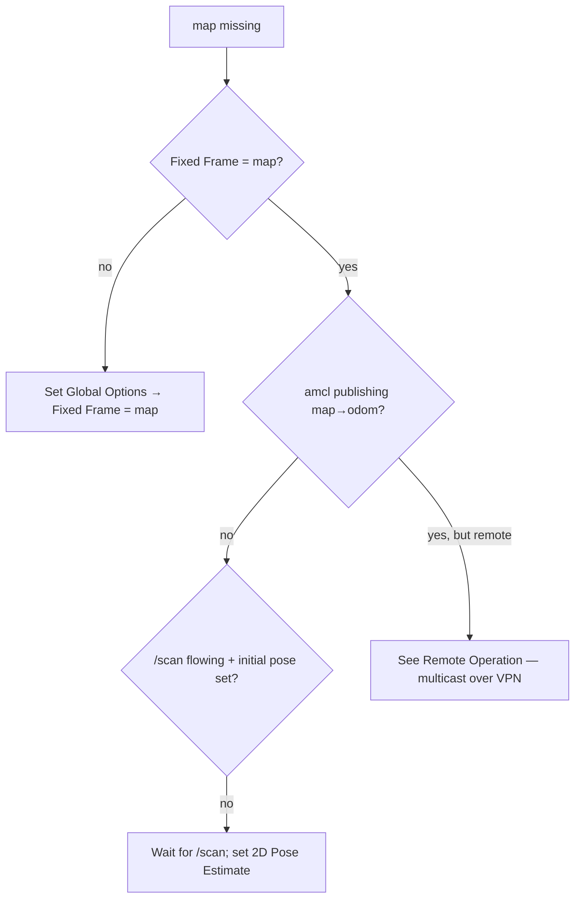

# Debugging

This is a symptom-first guide. Find your symptom, follow the check, and fix it
where it lives. The main runtime is the Pi 5 Docker stack.

## Pi 5 status and logs

```bash
ssh robot-pi2 'cd /home/ubuntu/patrolbot-repo && ./docker/status.sh'
ssh robot-pi2 'docker ps --format "{{.Names}} {{.Status}} {{.Image}}"'
ssh robot-pi2 'docker logs --tail 100 patrolbot-bridge'
ssh robot-pi2 'docker logs --tail 100 patrolbot-navigation'
ssh robot-pi2 'docker logs --tail 100 patrolbot-bringup'
```

For ROS CLI inspection, execute inside a container and bypass a possibly stale
ROS daemon cache when checking the graph:

```bash
ssh robot-pi2 "docker exec patrolbot-navigation bash -lc \
  'source /opt/ros/\$ROS_DISTRO/setup.bash; ros2 node list --no-daemon --spin-time 5'"
```

## Symptom → cause → fix

### "Frame map does not exist" / blank map in RViz { #frame-map-does-not-exist--blank-map-in-rviz }



- Set **Fixed Frame = `map`** (the most common cause).
- `amcl` needs `/scan` flowing **and** an initial pose. Set *2D Pose Estimate*.
- Verify: `ros2 topic echo /tf | grep -A1 'frame_id: map'`.
- If you're remote (VPN) and see *nothing*, it's a transport problem, not data — see
  [Remote Operation](../deployment/remote-operation.md).

### Nav2 Goal aborts: "No valid trajectories" / "Costmap timed out"

- Root cause historically: `local_costmap update_frequency` (1 Hz) below the controller's 5 Hz.
  Already fixed to 5.0 — if it recurs, re-check `local_costmap update_frequency: 5.0` and
  `publish_frequency: 2.0` in `nav2_params.yaml`.
- Confirm the robot is not boxed in by inspecting `/scan` or the local costmap.

### Robot won't move under navigation, but localization is fine

Walk the [`cmd_vel` chain](../architecture/software-architecture.md#the-cmd_vel-arbitration-chain):

```bash
ros2 service call /teleop_velocity_smoother/get_state lifecycle_msgs/srv/GetState '{}'
ros2 service call /controller_server/get_state lifecycle_msgs/srv/GetState '{}'
ros2 topic hz cmd_vel_smoothed                 # collision_monitor input
ros2 topic hz /cmd_vel                          # bridge input — the final command
```

Run those commands inside the owning Pi 5 container as shown at the top of this
page. Both lifecycle responses must contain `label='active'`. Direct `GetState`
calls are useful for one-shot diagnostics because they avoid waiting for the ROS
CLI lifecycle command's graph discovery.

- If `/teleop_velocity_smoother` is not active, inspect `patrolbot-bringup` logs
  and restart that container.
- If `collision_monitor` reads the wrong topic, no command flows (the historical `cmd_vel_raw`
  bug). It must read `cmd_vel_smoothed`.
- A held joystick (or a stuck deadman) overrides nav — check `/joy`.

### Scan appears mirrored / walls on the wrong side

The current truth is `roll=π`, confirmed against live TF and `LaserFlipped=true` in the ARIA
hardware profile. If scan dots do not align with real walls, verify `LaserFlipped` and the static
transform. See [Sensors](../devices/sensors.md#sick-lms-200-laser).

### `/odom` and `/scan` stopped

- The SBC link is unavailable. Bridge logs will show "SBC telemetry timed out.
  Reconnecting…". The bridge retries every 3 s; data resumes when the SBC returns.
- If the SBC was **physically rebooted**, odometry reset to 0,0,0 — re-set the pose with *2D Pose
  Estimate* after reconnect.

### Whole Nav2 stack restarted itself

- Expected behavior when `nav2_container` dies: the launch tears down and Docker
  restarts a fresh Pi 5 service container. Check the preceding output with
  `docker logs patrolbot-navigation`.
- If it crash-loops on reconnect, verify `base_shift_correction: False` is still set.

## Useful raw commands

Run ROS commands inside `patrolbot-navigation` or `patrolbot-bridge`; run Docker
commands on the Pi 5 host.

```bash
ros2 node list
ros2 topic list && ros2 topic hz /scan
ros2 topic echo /diagnostics            # base flags / stall / fault
ros2 run tf2_ros tf2_echo map base_link
docker inspect patrolbot-bridge patrolbot-navigation --format \
  '{{.Name}} status={{.State.Status}} health={{.State.Health.Status}} restarts={{.RestartCount}}'
docker logs --since 10m patrolbot-navigation
```

## Client-side RViz noise (harmless)

These come from RViz on the operator laptop, not the robot:

- `glsl120/indexed_8bit_image ... same texture image unit` — an OGRE/Mesa Map-display shader bug;
  the map usually still renders.
- `Message Filter dropping message ... laser_frame ... queue is full` tagged `[rviz2]` — RViz's
  own scan-display TF queue. (The same message from a Nav2 node is also usually benign under TF
  timing pressure.)

See [Known Gaps](../known-gaps.md) for issues that are tracked but not yet resolved, and
[Profiling](profiling.md) for performance investigation.
