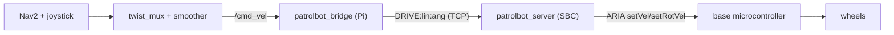

# Actuators

PatrolBot has one actuator system: the **Pioneer PatrolBot-SH** differential-drive base. There
are no arms, grippers, or pan-tilt actuators in the active stack (the `patrolbot-sh.p` profile
mentions a PTZ VCC4 camera, but it is not integrated — see
[Interfaces](interfaces.md#ptz-vcc4-camera-not-integrated)).

## Pioneer PatrolBot-SH drive base

| Field | Value |
|---|---|
| **Hardware** | Pioneer PatrolBot-SH, differential drive (two driven wheels + casters) |
| **Host machine** | **SBC** |
| **Connection** | base microcontroller on `/dev/ttyS0` @ 9600 baud, bridged to `TCP:7000` by a boot-time `socat`; ARIA connects over that socket (`-rh 127.0.0.1 -rrtp 7000`) |
| **Command protocol (from ROS)** | `/cmd_vel` → bridge → `DRIVE:linear:angular` text line → ARIA `setVel`/`setRotVel` |
| **ROS interface** | subscribes the final `/cmd_vel` (`geometry_msgs/Twist`) |
| **Footprint** | ~425 mm wide; modeled as `robot_radius = 0.22 m` |
| **Speed cap** | `max_vel_x = 0.26 m/s`, `max_vel_theta = 1.0 rad/s` (DWB) |

### How a command reaches the wheels

The full arbitration that produces `/cmd_vel` is the [`cmd_vel`
chain](../architecture/software-architecture.md#the-cmd_vel-arbitration-chain). By the time a
command reaches the bridge it has already passed through DWB → smoother → collision-monitor
stop-box → twist_mux → teleop smoother, so the bridge forwards a single, already-safe velocity.

### Motors and enabling

Motors are enabled **on the SBC**, inside `patrolbot_server` at startup (ARIA `enableMotors()`),
not via a ROS service. (The legacy [`rosaria2`](../packages/rosaria2.md) path exposed
`enable_motors`/`disable_motors` services, but it is not used.)

### Calibration

- **Odometry** is produced by the base's wheel encoders and integrated by ARIA on the SBC; the
  bridge republishes it verbatim as `/odom` and TF `odom→base_link`. There is no odometry
  calibration on the Pi side.
- **Velocity limits** are enforced in software at three layers: DWB (`max_vel_x`), the Nav2
  velocity smoother, and the teleop velocity smoother. The base's own firmware is the final limit.

## Failure conditions

| Condition | Behavior |
|---|---|
| `/cmd_vel` stops arriving | The base's command **watchdog** stops the wheels (the legacy driver used a 600 ms watchdog; the base firmware also halts on command starvation). The robot does not run away on a dead link. |
| Bridge can't send `DRIVE` (socket down) | Send is best-effort and dropped silently; no command reaches the base → watchdog stop. |
| Motor stall / fault | Reported on `/diagnostics` as `ERROR` ("motor stall / fault"); see [Controllers](controllers.md). |
| `collision_monitor` stop-box triggered | Velocity gated to zero before it reaches the bridge; robot holds position. |
| **Physical SBC reboot** | Wheel odometry resets to `0,0,0`; the robot keeps reconnecting but AMCL's pose is now wrong — re-set it with *2D Pose Estimate*. This is an inherent caveat of odometry living on the SBC, not a fault. |

## Scalability / tuning notes { #scalability--tuning-notes }

- The 0.26 m/s cap is an indoor-patrol safety choice, not a hardware limit. Raising it requires
  re-tuning DWB acceleration limits and re-checking the `collision_monitor` stop-box and the
  `base_shift_correction: False` assumption (which is "safe because motion per scan is ~1 cm at
  0.26 m/s").
- All velocity shaping is software-side on the Pi; the SBC simply executes the last `DRIVE`
  command. This keeps the actuator path simple and the tuning all in one place (`nav2_params.yaml`
  + `smoother.yaml`).
