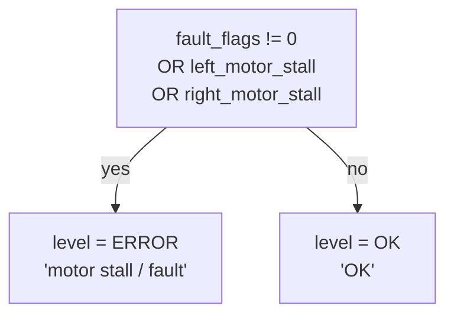

# Controllers & Base Status

This page covers the **base microcontroller's status channel** — the flags, faults, and stall
data the Pioneer base reports — and how PatrolBot surfaces them as ROS diagnostics. The drive
side of the same controller is on [Actuators](actuators.md).

## Base status source

| Field | Value |
|---|---|
| **Hardware** | Pioneer base microcontroller |
| **Host machine** | **SBC** (read by ARIA under `robot.lock()`) |
| **Connection** | base bus → ARIA → `AUX:FLAGS=flags,faultFlags,stallValue,motorsEnabled` |
| **ROS topic** | `/diagnostics` (`diagnostic_msgs/DiagnosticArray`) |
| **Update rate** | ~4–5 Hz |
| **Diagnostic name / hardware_id** | `patrolbot/base` / `pioneer_patrolbot` |

## What the bridge reports

The bridge decodes the four `FLAGS` integers and publishes a single `DiagnosticStatus`:

| KeyValue | Source | Meaning |
|---|---|---|
| `motors_enabled` | `areMotorsEnabled()` | are the drive motors on |
| `flags` | `getFlags()` | raw base flags |
| `fault_flags` | `getFaultFlags()` | raw fault flags |
| `stall_value` | `getStallValue()` | raw 16-bit stall word |
| `left_motor_stall` | `stall & 0x0100` | **reliable** left motor stall |
| `right_motor_stall` | `stall & 0x0001` | **reliable** right motor stall |
| `left_bumper_bits_raw` | `(stall >> 9) & 0x7F` | reference only (see note) |
| `right_bumper_bits_raw` | `(stall >> 1) & 0x7F` | reference only (see note) |

### Diagnostic level logic



The alarm level is driven **only** by well-defined signals: fault flags and motor stalls. The
bumper bit-fields are reported raw but do **not** affect the level.

!!! note "Why bumpers are reference-only"
    The ARIA stall value packs motor-stall bits (bit 0 of each byte, reliable) together with bits
    that nominally carry bumper segments. On this PatrolBot-SH a reserved/unwired bit reads high
    even when the robot is idle and healthy, so trusting the bumper bits would raise false alarms.
    They are exposed for diagnostics but excluded from the alarm logic. If real bumpers are wired in
    later, this is where to revisit the decoding.

## Stall word layout

```
stall_value (16-bit):
  high byte = LEFT wheel       low byte = RIGHT wheel
  bit 0 of each byte = motor stall      (reliable → drives ERROR)
  bits 1..7 of each byte = bumper segs  (raw, reference only)
```

## Failure conditions

| Condition | Symptom | Handling |
|---|---|---|
| Motor stall | `/diagnostics` level ERROR, `left/right_motor_stall = True` | base also halts; clear the obstruction, re-enable if needed |
| Base fault | `/diagnostics` level ERROR, `fault_flags != 0` | inspect on `rqt_robot_monitor` |
| Malformed `FLAGS` section | no `/diagnostics` update that cycle | dropped in isolation; nav data unaffected |
| Motors disabled unexpectedly | `motors_enabled = False` | re-enable on the SBC (ARIA), not via ROS |

## Where the controller setpoints come from

The *commands* this controller executes are produced entirely on the Pi by the
[`cmd_vel` chain](../architecture/software-architecture.md#the-cmd_vel-arbitration-chain) and
forwarded as `DRIVE` lines (see [Actuators](actuators.md)). The base controller is otherwise a
black box configured by the ARIA parameter file `patrolbot-sh.p`.

!!! warning "SBC-side detail is a snapshot"
    The exact ARIA calls and the `patrolbot_server` decode of these fields are documented from the
    last sync, not a live read. See [Known Gaps](../known-gaps.md).
