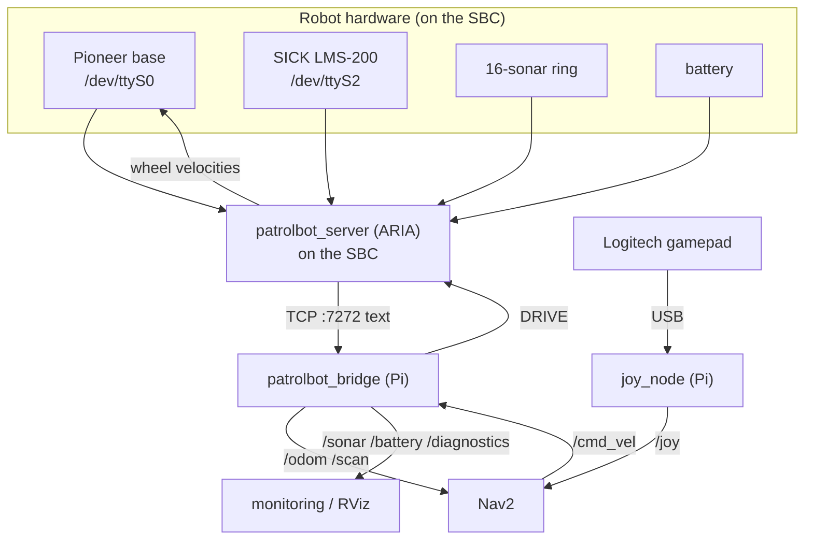

# Device Overview

PatrolBot's devices are split between the two machines by a single rule:

> **Everything the robot senses or drives is wired to the SBC, except the gamepad, which is on
> the Pi. The Pi reaches all robot hardware only through the SBC's TCP stream.**

This is the device-level consequence of the [two-machine
architecture](../architecture/hardware-architecture.md). The Pi has no serial connection to any
robot hardware.

## Device inventory

| Device | Class | Host | Connection | Reaches ROS via | Page |
|---|---|---|---|---|---|
| Pioneer PatrolBot-SH base | Actuator | **SBC** | `/dev/ttyS0` @ 9600 (via socat→TCP:7000) | `/cmd_vel` → bridge → `DRIVE` → ARIA | [Actuators](actuators.md) |
| SICK LMS-200 laser | Sensor | **SBC** | `/dev/ttyS2` @ 38400 | bridge → `/scan` | [Sensors](sensors.md) |
| 16-sonar ring | Sensor | **SBC** (via base) | base bus, ARIA | bridge → `/sonar` | [Sensors](sensors.md#sonar-ring) |
| Battery / charge | Sensor | **SBC** (via base) | base bus, ARIA | bridge → `/battery` | [Sensors](sensors.md#battery) |
| Base flags / stall / fault | Status | **SBC** (via base) | base bus, ARIA | bridge → `/diagnostics` | [Controllers](controllers.md) |
| Logitech gamepad | Input | **Pi** | USB (Xinput) | `joy_node` → `/joy` | [Interfaces](interfaces.md) |
| PTZ VCC4 camera | Sensor | (in `patrolbot-sh.p`) | — | **not integrated** | [Interfaces](interfaces.md#ptz-vcc4-camera-not-integrated) |

## Device communication flow

## What "host machine" means for each field

Throughout the device pages, the **Host machine** field tells you where to look when a device
misbehaves:

- **Host = SBC:** the device, its serial port, its ARIA driver, and the telemetry that carries it
  all live on the SBC. If `/scan` or `/odom` is missing on the Pi but the bridge is connected,
  the problem is upstream on the SBC — but **the SBC is not remotely diagnosable in this
  documentation's snapshot** (see [Known Gaps](../known-gaps.md)).
- **Host = Pi:** the gamepad is the only device you can inspect directly on the Pi
  (`/dev/input/js*`, `ros2 topic echo /joy`).

## Calibration and mounting summary

| Item | Where defined | Note |
|---|---|---|
| Robot radius | `nav2_params.yaml` (`robot_radius: 0.22`) | drives costmap footprint |
| Laser mount offset | `laser_static_tf` (`x=0.037, z=0.2`) | from ARIA `LaserX` |
| Laser orientation | `laser_static_tf` (`roll=π`) | un-mirror; **unverified**, see [Sensors](sensors.md#sick-lms-200-laser) |
| Laser self-occlusion cutoff | `bridge_node.py` (`SCAN_RANGE_MIN=0.2`) | drops returns inside the footprint |
| Sonar geometry | ARIA `patrolbot-sh.p` | 16-transducer layout, reported in `base_link` |
| Base hardware profile | `patrolbot-sh.p` | dimensions, sonar, laser port, PTZ camera |
