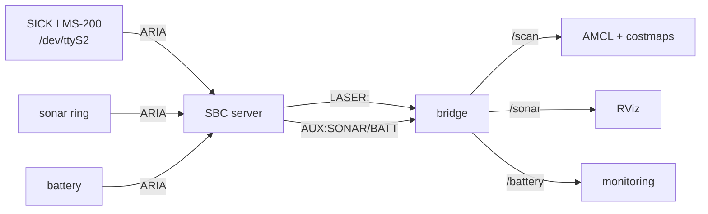

# Sensors

All sensing hardware is wired to the **SBC** and reaches ROS 2 only through the bridge's TCP
stream (see [Communication Architecture](../architecture/communication-architecture.md)). Each
sensor below lists its host, connection, ROS interface, rate, calibration, and failure modes.

## SICK LMS-200 laser

The primary perception sensor: localization and obstacle avoidance both depend on it.

| Field | Value |
|---|---|
| **Hardware** | SICK LMS-200 planar laser scanner |
| **Host machine** | **SBC** |
| **Connection** | `/dev/ttyS2` @ 38400 baud, read by ARIA `ArLaserConnector` |
| **Protocol (to ROS)** | SBC parses ARIA ranges → `LASER:r1,...,rN` text line → bridge → `/scan` |
| **ROS topic** | `/scan` (`sensor_msgs/LaserScan`), frame `laser_frame` |
| **Field of view** | 180° forward: `angle_min = -π/2`, `angle_max = +π/2` |
| **Range** | `range_min = 0.2 m`, `range_max = 8.0 m` |
| **Update rate** | ~20 Hz |

### Calibration / mounting

- **Position:** `base_link → laser_frame` static TF at `x = 0.037 m` (ARIA `LaserX`), `z = 0.2 m`.
- **Orientation:** the SICK is mounted **flipped** (`LaserFlipped=true` in `patrolbot-sh.p`) and
  ARIA returns readings in flipped order, so the scan arrives mirrored left↔right. The live launch
  corrects this with **`roll = π`** about the forward axis (front stays front; left/right swap is
  undone).
- **Self-occlusion cutoff:** the bridge forces any return `< 0.2 m` to `+inf`. The SICK grazes the
  robot's own frame near one edge of the fan (~0.15 m), which would otherwise paint a permanent
  phantom obstacle inside the 0.22 m footprint and freeze Nav2.

!!! danger "Orientation is unverified"
    Three claims exist in the project's history: `roll = π` (live launch, "un-mirror"), `yaw = π`
    (older notes, "facing rearward"), and identity (an even-earlier note). The live launch is what
    runs, but the *correct* rotation is still pending a visual RViz check — align scan dots to real
    walls, then lock it in. Tracked in [Known Gaps](../known-gaps.md#laser-transform-orientation).

### Failure conditions

| Condition | Symptom | Handling |
|---|---|---|
| Laser unplugged / SBC can't open `/dev/ttyS2` | `LASER:` field empty or absent | bridge publishes no/short `/scan`; costmaps clear, AMCL can't update → `map→odom` stops |
| SBC down | no `/scan` at all | bridge reconnects every 3 s; resumes on return |
| Scan appears mirrored in RViz | walls on wrong side | orientation issue — see the danger box above |
| Phantom obstacle hugging the robot | nav refuses to move | check `SCAN_RANGE_MIN`; run `./patrolbot-logs.sh scan` |

## Sonar ring

| Field | Value |
|---|---|
| **Hardware** | 16-transducer sonar ring on the Pioneer base |
| **Host machine** | **SBC** (read by ARIA; enabled at startup via `robot.enableSonar()`) |
| **Connection** | base bus → ARIA → `AUX:SONAR=x,y;...` text line |
| **ROS topic** | `/sonar` (`sensor_msgs/PointCloud2`), frame `base_link` |
| **Update rate** | ~4–5 Hz (every 5th nav frame) |
| **Calibration** | geometry from ARIA `patrolbot-sh.p`; ARIA reports each return's local X/Y in the robot frame (meters) |

The sonar feeds **visualization/monitoring**, not the costmaps — obstacle avoidance is laser-based.
The 16 points are useful as a secondary close-range awareness layer in RViz.

**Failure conditions:** a malformed `SONAR` section is dropped in isolation (the `AUX` line is
parsed section-by-section), so a sonar glitch never disturbs `/scan` or `/odom`. If the base does
not report sonar, `/sonar` simply stops; nothing else is affected.

## Battery

| Field | Value |
|---|---|
| **Hardware** | Pioneer base battery (no true state-of-charge sensor) |
| **Host machine** | **SBC** (ARIA battery readings) |
| **Connection** | base bus → ARIA → `AUX:BATT=volt,soc,chargeState,temp` |
| **ROS topic** | `/battery` (`sensor_msgs/BatteryState`) |
| **Update rate** | ~4–5 Hz |

Field mapping in the bridge:

- `voltage` — `getRealBatteryVoltageNow()`; **the meaningful field.**
- `percentage` — `NaN` if the base reports no state-of-charge (`soc = -1`), which is the case here.
- `power_supply_status` — `CHARGING` if ARIA charge state > 0 (on dock), else `DISCHARGING`.
- `temperature` — `NaN` if unavailable.

**Failure conditions:** treat `percentage` as unavailable on this base — monitor `voltage`. A
malformed `BATT` section drops only `/battery`.

## Sensor data path (summary)

See [Controllers](controllers.md) for the base status/diagnostics path and
[Actuators](actuators.md) for the drive side.
