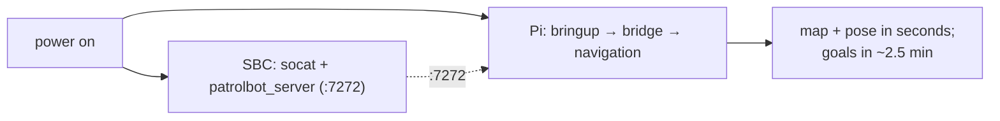

# Quickstart

The fastest path from power-on to a moving robot. It assumes both machines are
[built](building.md) and [deployed](../deployment/robot-deployment.md) (systemd services
installed). If you're starting cold, skim [Installation](installation.md) first.

## 1. Power on — the robot starts itself

Both machines autostart their services at boot (systemd user services with linger). You do **not**
need to launch anything by hand in normal operation.



## 2. Confirm health

```bash
ssh ubuntu@patrolbot-ros.qatar.cmu.edu ./patrolbot-logs.sh status
# Expect: patrolbot-bringup / -bridge / -navigation all "active"

ssh ubuntu@patrolbot-ros.qatar.cmu.edu ./patrolbot-logs.sh topics
# Expect: /odom and /scan around 20 Hz (means the SBC link is up)
```

If `/odom` and `/scan` aren't flowing, the SBC link is down — the bridge will keep retrying every
3 s. See [Debugging](../development/debugging.md).

## 3. Open RViz (on the LAN)

```bash
export ROS_DOMAIN_ID=0
rviz2
```

- Set **Global Options → Fixed Frame = `map`**.
- You should see the map within seconds of the navigation service starting. If you see "Frame map
  does not exist," the most common cause is the Fixed Frame — then a missing initial pose.

!!! note "From home (VPN)?"
    Default discovery doesn't cross a VPN, so remote RViz sees nothing until the discovery server is
    enabled. See [Remote Operation](../deployment/remote-operation.md).

## 4. Set the initial pose

AMCL needs to know where the robot starts.

1. Click **2D Pose Estimate** in RViz.
2. Click the robot's real location on the map and drag in its facing direction.
3. The map and robot should snap into alignment; `map → odom` starts publishing.

This works **almost immediately** after boot (localization activates in seconds) — it does **not**
require the full navigation stack.

## 5. Send a navigation goal

Once the navigation half is active (~2.5 min after boot):

1. Click **Nav2 Goal** in RViz.
2. Click a destination and drag for the final heading.
3. The robot plans a path and drives to it, avoiding obstacles.

```bash
# Equivalent from the command line:
ros2 action send_goal /navigate_to_pose nav2_msgs/action/NavigateToPose \
  "{pose: {header: {frame_id: map}, pose: {position: {x: 2.0, y: 1.0}, orientation: {w: 1.0}}}}"
```

If a goal is **rejected immediately**, the navigation half isn't active yet — wait and retry. See
[Actions](../ros2/actions.md).

## 6. Drive manually (gamepad)

The Logitech gamepad (USB on the Pi, switch on **X** for Xinput) overrides autonomy at any time:

- **Hold RB** (deadman) + **left stick** = forward/reverse.
- **Right stick** = turn.
- Release the sticks and navigation resumes after ~1 s.

Max 0.4 m/s / 0.8 rad/s under teleop. See [Interfaces](../devices/interfaces.md#logitech-gamepad-manual-override).

## If something's wrong

| Symptom | Go to |
|---|---|
| RViz shows nothing | [Debugging](../development/debugging.md#frame-map-does-not-exist--blank-map-in-rviz) |
| Goal rejected / aborts | [Actions](../ros2/actions.md#failure-modes) |
| Robot localizes but won't drive | [Debugging](../development/debugging.md#robot-wont-move-under-navigation-but-localization-is-fine) |
| Scan looks mirrored | [Known Gaps](../known-gaps.md#laser-transform-orientation) |
| A change didn't take effect | [Updates](../deployment/updates.md#the-mobile-base-deployment-step) |

## After a physical SBC reboot

A physical SBC power-cycle resets wheel odometry to `0,0,0`. The robot reconnects automatically, but
AMCL's pose is now wrong — **re-do step 4 (2D Pose Estimate)**.
