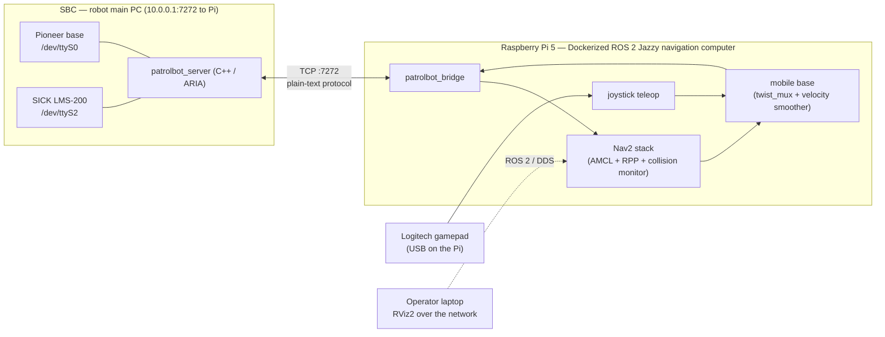

# PatrolBot

PatrolBot is an autonomous indoor **patrol robot** built on a Pioneer **PatrolBot-SH**
differential-drive base. It localizes against a known map, plans and follows paths with
[Nav2](https://docs.nav2.org/), avoids obstacles using a laser scanner, reports rear-sonar
detections for monitoring, and accepts manual joystick override at any time.

The single most important thing to understand before reading anything else: **PatrolBot is
not one computer.**

## The two-machine reality

| | **SBC** (main PC) | **Raspberry Pi** |
|---|---|---|
| **Role** | Hardware data bridge only | The entire ROS 2 navigation stack |
| **Talks to** | Pioneer base + SICK laser (serial) | The SBC (TCP), the operator (DDS) |
| **Software** | One C++ ARIA server (`patrolbot_server`) | ROS 2 Jazzy: bridge, Nav2, mobile base |
| **Runs ROS 2?** | **No** | Yes |

The main driver is the **Raspberry Pi 5** (hostname `patrolbot-rpi5`, Ubuntu
24.04.4 LTS, aarch64). Its Dockerized software stack is running and documented in
[Docker Deployment](deployment/docker.md). The SBC and Pi 4 are also powered. The Pi 4
is the bare-metal rollback board and must be isolated from the active ROS graph while
the Pi 5 drives the robot.

The SBC reads odometry and laser ranges from the hardware and **streams them over a single
TCP socket** as plain text. The Pi turns that stream into native ROS 2 messages (`/odom`,
`/scan`, TF), runs Nav2 on top, and sends the resulting velocity commands back to the SBC.
There is no shared ROS graph across the two machines — they meet only at the socket. The
[Communication Architecture](architecture/communication-architecture.md) page documents that
seam in detail.

## What the system does

1. **Localizes** against a pre-built occupancy map using AMCL and the laser scan.
2. **Plans** a global path (NavFn) and **follows** it (RPP controller) toward an operator goal.
3. **Avoids collisions** with a `collision_monitor` stop-box and costmap obstacle layers fed
   by the laser.
4. **Reports** sonar, battery, and base diagnostics for monitoring.
5. **Accepts manual override** from a gamepad at any time; releasing the sticks hands control
   back to autonomy.

## Where to go next

| If you want to… | Read |
|---|---|
| Understand the design at a glance | [Architecture Overview](architecture/overview.md) |
| Understand how the SBC and Pi talk | [Communication (SBC ↔ Pi)](architecture/communication-architecture.md) |
| Bring the robot up | [Quickstart](getting-started/quickstart.md) |
| Understand the Pi 5 runtime | [Docker Deployment](deployment/docker.md) |
| Look up a node, topic, or parameter | [ROS 2 Reference](ros2/nodes.md) |
| Understand the sensors and the base | [Devices](devices/device-overview.md) |
| Diagnose a problem | [Debugging](development/debugging.md) |
| Know what's unverified | [Known Gaps](known-gaps.md) |

!!! tip "Documentation status — live-audited 2026-07-15"
    All three computers were reachable during this audit. The SBC services and live
    `ODOM|LASER` stream were verified, and the Pi 5 containers were healthy at revision
    `fa14b9b5cedfd56beaffca746e1c37256d67d1f0`. Pi 5 `eth0` was live at
    `10.0.0.2/24`; the SBC socket, `/odom`, `/scan`, both lifecycle nodes, and both
    required TF links were verified. No motion test was performed. See
    [Known Gaps](known-gaps.md).
