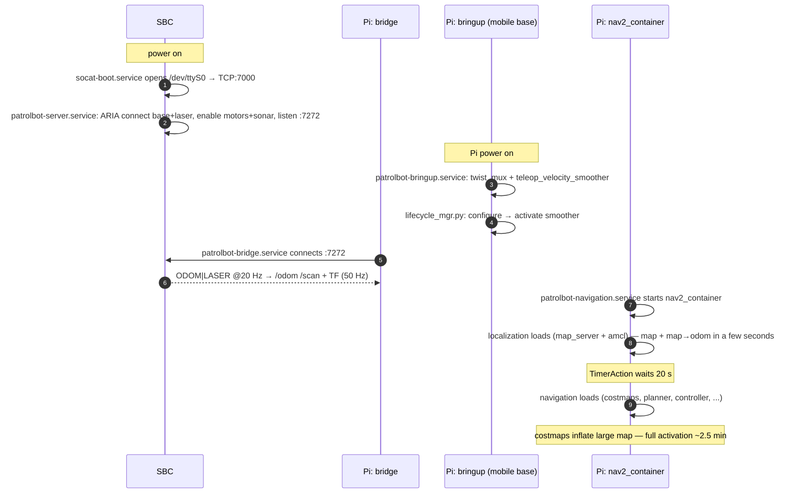

# Startup Sequence

This is the fine-grained companion to [Execution Flow](../architecture/execution-flow.md): the
actual order of events and timings from power-on to a navigable robot.

## Timeline

## Stage-by-stage

### Stage 0 — SBC (before/independent of the Pi)

1. `socat-boot.service` (system) opens `/dev/ttyS0` and exposes it as `TCP:7000`.
2. `patrolbot-server.service` (user) runs `patrolbot_server -rh 127.0.0.1 -rrtp 7000`: ARIA
   connects to the base (via socat) and the SICK laser, enables motors and sonar, and listens on
   `:7272`.

If the SBC isn't up when the Pi starts, nothing breaks — the bridge just retries every 3 s.

### Stage 1 — Pi mobile base (`patrolbot-bringup.service`)

1. `mobile_base.xml` starts a `component_container` and `twist_mux` (`cmd_vel_mux`).
2. `smoother.xml` starts `teleop_velocity_smoother` (with the cmd_vel remaps) and `lifecycle_mgr.py`.
3. `lifecycle_mgr.py` calls `configure` then `activate` on the smoother. **Until this completes,
   `/cmd_vel` is not published** and navigation output can't reach the bridge.

### Stage 2 — Pi bridge (`patrolbot-bridge.service`)

1. Connects to the SBC at `:7272`.
2. Begins publishing `/odom`, `/scan` (~20 Hz), `/sonar`/`/battery`/`/diagnostics` (~5 Hz), and TF
   `odom→base_link` (50 Hz).

### Stage 3 — Pi Nav2 (`patrolbot-navigation.service`)

1. Sets env (`ROS_DOMAIN_ID=0`, `MAGICK_THREAD_LIMIT=1`, `OMP_NUM_THREADS=1`).
2. Starts `nav2_container` and registers the `OnProcessExit → Shutdown` handler.
3. **Localization loads immediately** — `map_server` + `amcl`. The map and `map→odom` are ready in
   a few seconds; *2D Pose Estimate* works almost immediately.
4. **A 20 s `TimerAction` delays navigation** so costmap inflation doesn't starve localization
   during the container's sequential composable-node loading.
5. Navigation loads — costmaps, planner, controller, behaviors, collision monitor. Full activation
   takes **~2.5 min** (was ~8 min before the map downsample). *Nav2 Goal* becomes available here.
6. `joy_node`, `p3dxJoyTeleop`, and `laser_static_tf` also start under this service.

## Readiness checkpoints

| You can… | As soon as… |
|---|---|
| See `/odom`, `/scan` | the bridge connects (Stage 2) |
| See the map, set *2D Pose Estimate* | localization activates (Stage 3.3, seconds) |
| Drive with the joystick | the mobile base + bridge are up (Stages 1–2) |
| Send a *Nav2 Goal* | navigation fully activates (Stage 3.5, ~2.5 min) |

## Why the ordering matters

- **Smoother activation before goals:** an unactivated `teleop_velocity_smoother` silently drops
  navigation output — the robot localizes but won't drive. `lifecycle_mgr.py` exists to prevent
  this.
- **TF before scans:** the bridge's 50 Hz TF timer guarantees `odom→base_link` is buffered before
  any scan reaches a costmap message filter, avoiding dropped-message churn at startup.
- **Localization before navigation:** staging lets `map→odom` lock in fast, then loads the heavy
  half — the difference between a usable map in seconds and a CPU-starved cold start.

The lifecycle transitions each Nav2 node goes through are on [State Machines](state-machines.md).
