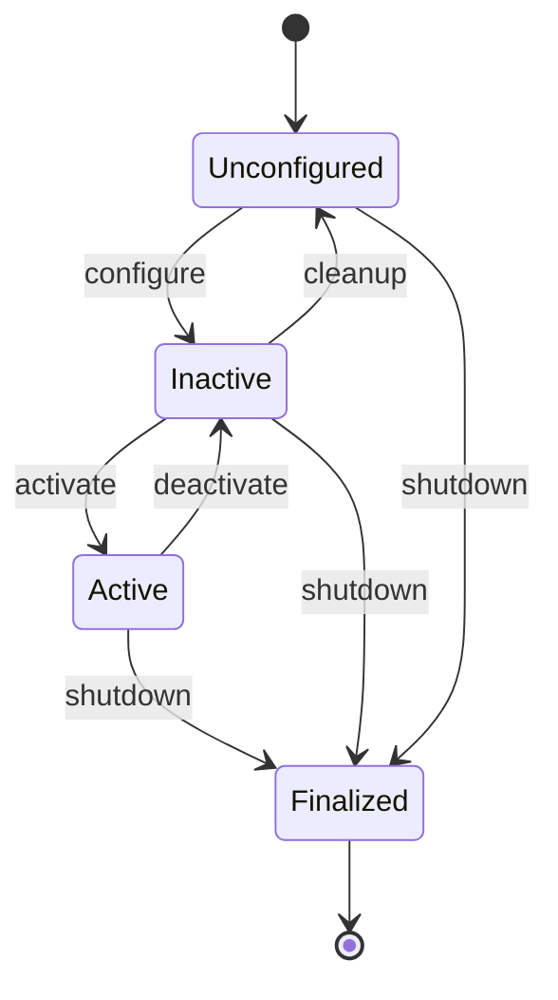
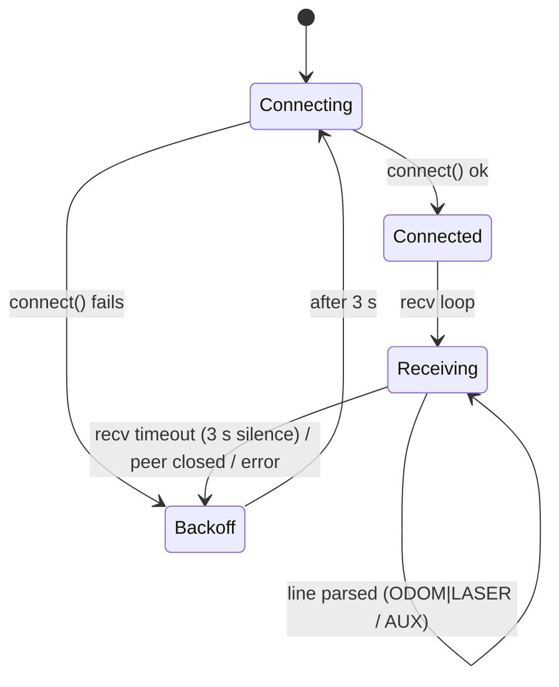
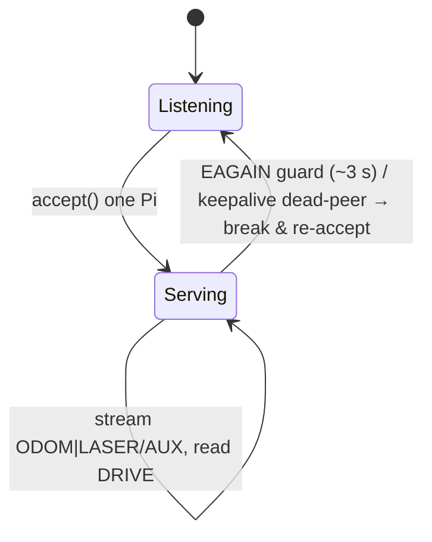
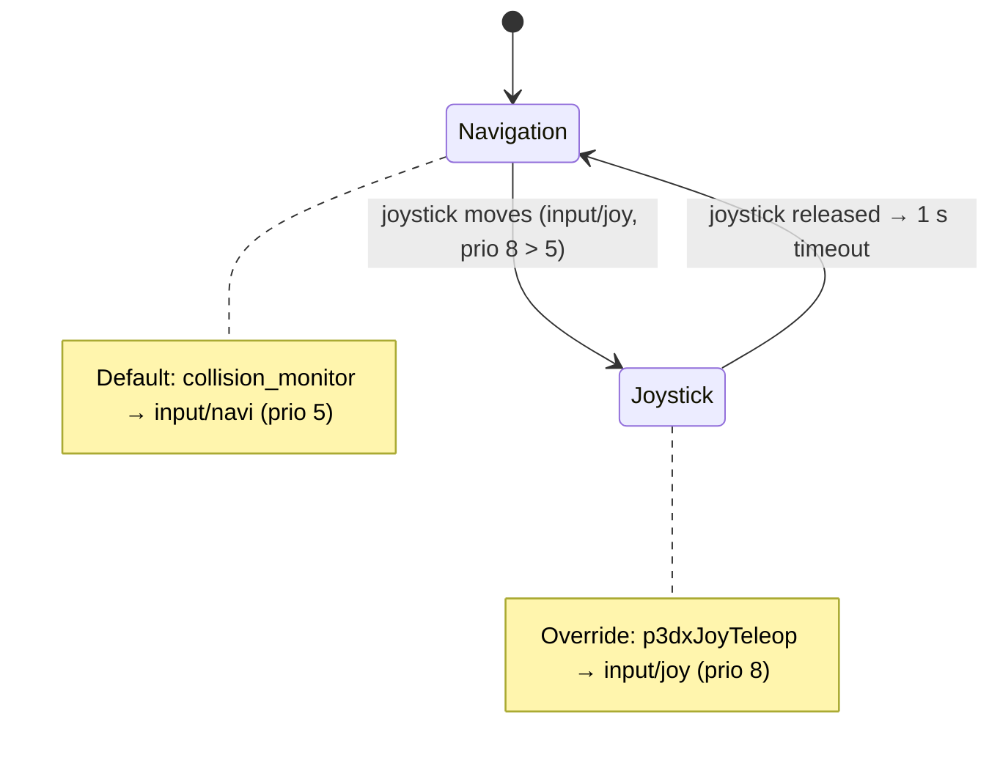
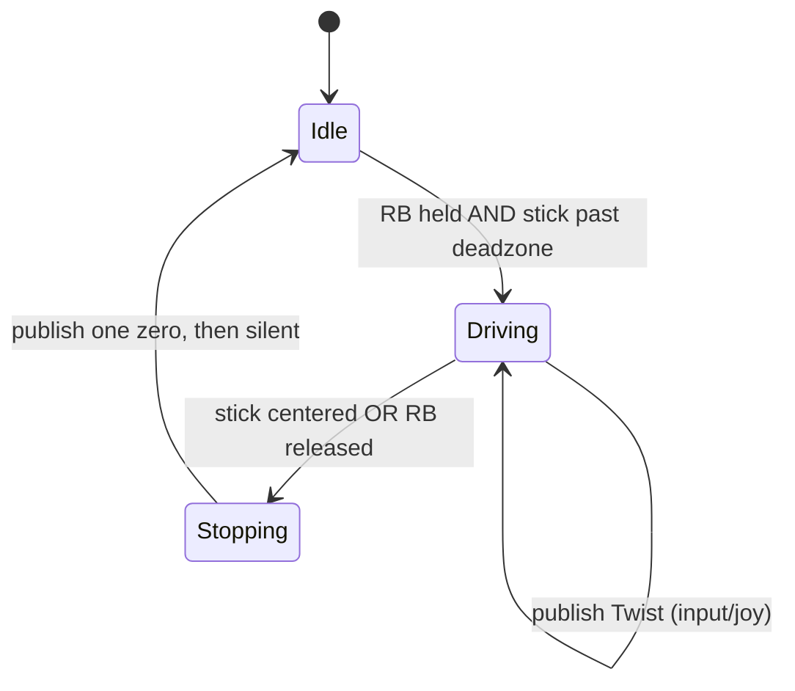

# State Machines

Several parts of PatrolBot are best understood as state machines. This page collects them: the
Nav2 lifecycle, the bridge's connection logic, the twist_mux arbitration, and the joystick
interlock.

## Nav2 lifecycle node

Every node in `nav2_container` is a **managed lifecycle node**. The lifecycle managers (patched
with `bond_timeout: 0.0`) drive them with `autostart: True`, and `lifecycle_mgr.py` drives the
mobile-base `teleop_velocity_smoother` the same way.

- **autostart** walks every managed node `Unconfigured → Inactive → Active` at launch.
- **`bond_timeout: 0.0`** disables the bond watchdog that would otherwise abort a node whose
  configure/activate takes too long — necessary because inflating the large map is slow. See
  [Software Architecture](../architecture/software-architecture.md#the-large-map-problem).
- Drive a transition by hand with `ros2 lifecycle set /<node> activate` or the `change_state`
  service ([Services](../ros2/services.md)).

## Bridge connection state machine

- **Connecting:** open socket, set `SO_KEEPALIVE` + `RECV_TIMEOUT = 3 s`.
- **Receiving:** accumulate bytes, split on `\n`, dispatch each line.
- **Backoff → Connecting:** 3 s of silence (timeout), a closed peer, or any error closes the socket
  and retries after 3 s.

This is what makes the SBC link self-healing without operator action — detailed on
[Communication Architecture](../architecture/communication-architecture.md#self-healing-hardened-on-both-ends).

## SBC server accept state machine

The server is single-client: an outer `while(robot.isRunning())` loop wraps `accept()`, so a gone
Pi is detected (sustained `EAGAIN` + TCP keepalive/`TCP_USER_TIMEOUT`) and the server returns to
`Listening` for the next connection.

## `cmd_vel` arbitration (twist_mux)

Not a classic FSM, but a priority selection that behaves like one over time:

The joystick (priority 8) preempts navigation (priority 5) the instant a stick moves; on release
the teleop goes silent and twist_mux times the joy input out after 1 s, handing control back to
navigation. Configured-but-unused inputs (safety 10, teleop 8, switch 6) would slot into this
ordering if a publisher appeared.

## Joystick interlock (deadman)

The teleop publishes **only** while commanded, so an idle-but-connected controller never blocks
autonomy. The single explicit zero on release ensures the robot stops promptly rather than coasting
on a stale command; then silence lets the twist_mux timeout return control to navigation. See
[Nodes → patrolbot_joy_teleop](../ros2/nodes.md#patrolbot_joy_teleop).
