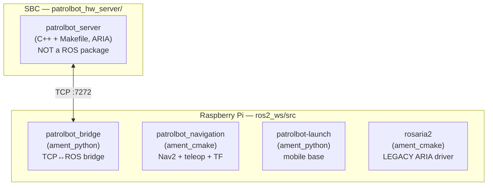

# Package Overview

PatrolBot's code is organized into **four ROS 2 packages on the Pi** plus **one standalone C++
program on the SBC**. Only three of the Pi packages are active; the fourth is a superseded legacy
driver kept as a fallback.

## The packages

| Package | Build type | Machine | Status | Page |
|---|---|---|---|---|
| `patrolbot_bridge` | ament_python | Pi | **Active** — the SBC's only ROS-side presence | [→](patrolbot_bridge.md) |
| `patrolbot_navigation` | ament_cmake | Pi | **Active** — Nav2 bringup, maps, params, joystick teleop, laser TF | [→](patrolbot_navigation.md) |
| `patrolbot-launch` | ament_python | Pi | **Active** — mobile base: twist_mux + velocity smoother | [→](patrolbot-launch.md) |
| `rosaria2` | ament_cmake | Pi | **Legacy** — direct ARIA driver, not launched | [→](rosaria2.md) |
| `patrolbot_hw_server` | Makefile (C++) | SBC | **Active** — the ARIA TCP server; *not* a ROS package | [→](patrolbot_hw_server.md) |

## How they fit together

- **`patrolbot_hw_server`** (SBC) is the data source. It speaks ARIA to the hardware and a text
  protocol to the Pi.
- **`patrolbot_bridge`** (Pi) is the translator — the only package that knows the SBC exists.
- **`patrolbot_navigation`** (Pi) is the autonomy — Nav2, the maps, the joystick, the laser TF.
- **`patrolbot-launch`** (Pi) is the base controller — velocity arbitration and smoothing between
  the bridge and the autonomy.
- **`rosaria2`** (Pi) is the road not taken — the original direct-to-hardware driver, replaced by
  the SBC server + bridge split, kept only as a documented fallback.

## A note on build artifacts

Two facts about this workspace routinely surprise people:

1. **The active `patrolbot-launch` runs from `build_backup/`, not `install/` or `src/`.** The
   systemd service launches `~/build_backup/patrolbot-launch/launch/bringup.xml`. The `src` copy is
   the source of truth; editing it does nothing until re-installed. See
   [Repository Structure](../internals/repository-structure.md).
2. **`patrolbot_navigation` has its own `.git/`.** It is version-controlled separately from the
   rest of the workspace (as is `rosaria2`).

## Per-package conventions

Each package page documents: **purpose**, **deployment machine**, **dependencies**, **public
interfaces** (topics/services/actions), **internal architecture**, and **example usage**. The
ROS-interface tables there cross-reference the [ROS 2 reference](../ros2/nodes.md).

## Metadata caveat

Several packages still carry scaffold-default manifest metadata (`maintainer: ubuntu@todo.todo`,
`description: TODO`, `license: TODO` in `patrolbot_bridge` and `patrolbot-launch`; `joao@todo.todo`
in `rosaria2`). This is cosmetic but worth cleaning up before any public release — see
[Release Process](../contributing/release-process.md) and
[Known Gaps](../known-gaps.md#code-hygiene-observations).
