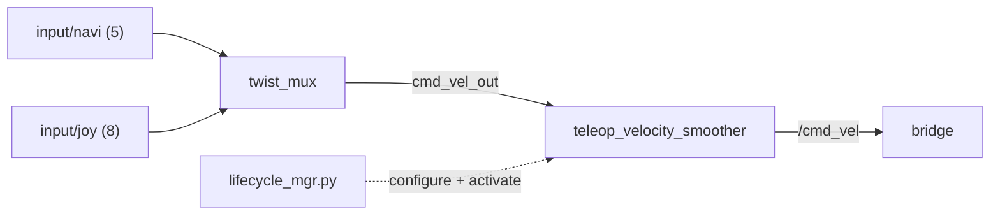

# patrolbot-launch

The mobile-base layer between the bridge and the autonomy: it arbitrates who controls the robot
(`twist_mux`) and shapes the winning command (`teleop_velocity_smoother`) before it reaches the
bridge.

| | |
|---|---|
| **Deploys to** | **Raspberry Pi** |
| **Build type** | `ament_python` |
| **Entry launch** | `bringup.xml` (`ros2 launch patrolbot-launch bringup.xml`) |
| **Source** | `ros2_ws/src/patrolbot-launch/` |
| **Runtime source** | installed package; symlink-install points back to `src/` |

## Purpose

Provide the `cmd_vel` arbitration and final smoothing stage. Navigation and the joystick both
produce velocity commands; this package decides which wins (joystick overrides), smooths it, and
hands a single `/cmd_vel` to the bridge.

## Dependencies

`twist_mux`, `nav2_velocity_smoother`, `rclpy`, `ros2launch`. (Python package metadata carries
scaffold-default maintainer/description/license values, while the package manifest declares only
`ros2launch`; see [Known Gaps](../known-gaps.md#code-hygiene).)

## Package layout (active files)

| Path | Role |
|---|---|
| `launch/bringup.xml` | includes `mobile_base.xml` + `smoother.xml` |
| `launch/mobile_base.xml` | `component_container` + `twist_mux` (name `cmd_vel_mux`, loads `mux.yaml`) |
| `launch/smoother.xml` | `teleop_velocity_smoother` (with remaps) + `lifecycle_mgr.py` |
| `param/defaults/mux.yaml` | twist_mux input priorities |
| `param/defaults/smoother.yaml` | velocity smoother limits |
| `lifecycle_mgr.py` | persistent manager: configure/activate the smoother and recover respawns |
| `patrolbot-sh.p` | ARIA hardware profile (carried here too) |

Superseded experiments (`rosaria2*.xml`, `teleop-key*.xml`, `readlidar.py`,
`rosaria2.py`, and `launch_teleop_keyboard.bash`) are
[legacy/dead](../internals/legacy-components.md).

## Public interfaces

| Node | Subscribes | Publishes |
|---|---|---|
| `twist_mux` (`cmd_vel_mux`) | `input/joy` (8), `input/navi` (5), + unused 10/8/6 | `cmd_vel_out` |
| `teleop_velocity_smoother` | `/cmd_vel_out` (remapped in) | `/cmd_vel` (remapped out) |
| `lifecycle_manager_script` | — | client of `/teleop_velocity_smoother/change_state` |

## Internal architecture — the remaps that matter



`smoother.xml` remaps the `nav2_velocity_smoother` so it consumes the mux output and emits the real
`/cmd_vel`:

```xml
<remap from="/cmd_vel" to="/cmd_vel_out"/>      <!-- input  -->
<remap from="cmd_vel_smoothed" to="cmd_vel"/>   <!-- output -->
```

Because `nav2_velocity_smoother` is a lifecycle node, `lifecycle_mgr.py` calls `change_state`
(configure → activate) at startup; without it the smoother never publishes and the robot won't
move under navigation. See [Services](../ros2/services.md#velocity-smoother-lifecycle-transition).

!!! success "No `build_backup` runtime copy"
    The Pi 5 `patrolbot-bringup` container and the Pi 4 rollback service launch the
    package by name: `ros2 launch patrolbot-launch bringup.xml`. The old
    `~/build_backup/patrolbot-launch/` target was removed on 2026-06-28.

## Example usage

```bash
ros2 launch patrolbot-launch bringup.xml
ssh robot-pi2 'docker logs --tail 100 patrolbot-bringup'

# Confirm the smoother activated and /cmd_vel is flowing
ros2 lifecycle get /teleop_velocity_smoother
ros2 topic hz /cmd_vel
```

## Where to read more

- The full chain it sits in: [Software Architecture → cmd_vel chain](../architecture/software-architecture.md#the-cmd_vel-arbitration-chain).
- Launch detail: [ROS 2 → Launch System → Mobile-base launch](../ros2/launch-system.md#mobile-base-launch).
