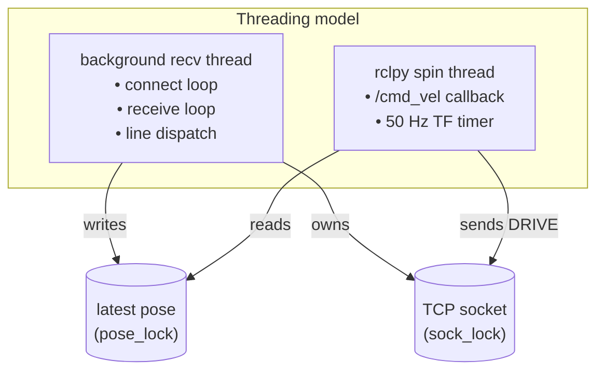

# patrolbot_bridge

The translation layer between the SBC's TCP text stream and the Pi's ROS 2 graph. It is the
**only** package that knows the SBC exists; everything above it is hardware-agnostic ROS 2.

| | |
|---|---|
| **Deploys to** | **Raspberry Pi** |
| **Build type** | `ament_python` |
| **Executable** | `bridge_node` (`ros2 run patrolbot_bridge bridge_node`) |
| **Node** | `patrolbot_bridge` |
| **Source** | `ros2_ws/src/patrolbot_bridge/patrolbot_bridge/bridge_node.py` |

## Purpose

Connect to the SBC at `10.0.0.1:7272`, parse its telemetry line types into ROS 2
messages + TF, and forward `/cmd_vel` back to the SBC as `DRIVE` commands — all while surviving
an abrupt loss of the SBC without operator action.

## Dependencies

`rclpy`, `sensor_msgs`, `geometry_msgs`, `nav_msgs`, `std_msgs`, `diagnostic_msgs`, `tf2_ros`.
(Python package metadata still carries scaffold-default maintainer/description/license values, and
the package manifest omits `nav_msgs`; see
[Known Gaps](../known-gaps.md#code-hygiene).)

## Public interfaces

| Direction | Interface | Type |
|---|---|---|
| Publish | `/odom` | `nav_msgs/Odometry` |
| Publish | `/scan` | `sensor_msgs/LaserScan` |
| Publish | `/sonar` | `sensor_msgs/PointCloud2` |
| Publish | `/battery` | `sensor_msgs/BatteryState` |
| Publish | `/diagnostics` | `diagnostic_msgs/DiagnosticArray` |
| Publish | TF `odom→base_link` | `tf2` (50 Hz) |
| Subscribe | `/cmd_vel` | `geometry_msgs/Twist` |

## Internal architecture



Three concerns, cleanly separated by two locks:

1. **Connection thread** (`_connect_loop`): opens the socket, sets `SO_KEEPALIVE` and a
   `RECV_TIMEOUT = 3.0 s` read timeout, then runs `_receive_loop`. On any error it closes and
   retries every 3 s.
2. **Receive loop** (`_receive_loop`): reads bytes, accumulates a buffer, splits on `\n`, and
   dispatches each line — `AUX:`-prefixed lines to `_parse_aux`, everything else to
   `_parse_telemetry`.
3. **TF timer** (50 Hz, on the spin thread): publishes `odom→base_link` from the latest pose,
   **decoupled** from scan arrival so TF is always buffered before a scan reaches a costmap message
   filter.

### Parsing

- `_parse_telemetry`: splits `ODOM:...|LASER:...`, builds `/odom` and `/scan`. The scan is
  180° forward (`±π/2`), `range_min 0.25`, `range_max 8.0`, with sub-0.25 m returns forced to
  `+inf` (footprint-clearance filter).
- `_parse_aux`: splits `AUX:SONAR=..|BATT=..|FLAGS=..` (the fifth FLAGS value is e-stop state) and publishes `/sonar`, `/battery`,
  `/diagnostics` **each in isolation** — a malformed section skips only its own topic.

Every parse path swallows exceptions, so corrupt input degrades gracefully instead of crashing the
node.

### Self-healing

The reason for the read timeout: silent link loss may send no TCP FIN/RST, so a blocking
`recv()` would hang forever and the reconnect loop would never run. With `RECV_TIMEOUT`, 3 s of
silence raises `socket.timeout`, the receive loop breaks, and the connect loop reconnects. See
[Communication Architecture](../architecture/communication-architecture.md#self-healing-hardened-on-both-ends).

## Example usage

```bash
# Run directly
ros2 run patrolbot_bridge bridge_node

# As deployed on the main Pi 5
ssh robot-pi2 'docker logs --tail 100 patrolbot-bridge'

# Verify it is publishing
ssh robot-pi2 "docker exec patrolbot-bridge bash -lc \
  'source /opt/ros/\$ROS_DISTRO/setup.bash; ros2 topic hz /odom /scan'"
```

## Where to read more

- The wire protocol it speaks: [Communication Architecture](../architecture/communication-architecture.md).
- Its place in the graph: [Software Architecture](../architecture/software-architecture.md).
- Node-level reference: [Nodes → patrolbot_bridge](../ros2/nodes.md#patrolbot_bridge).
- The SBC end it talks to: [`patrolbot_hw_server`](patrolbot_hw_server.md).
