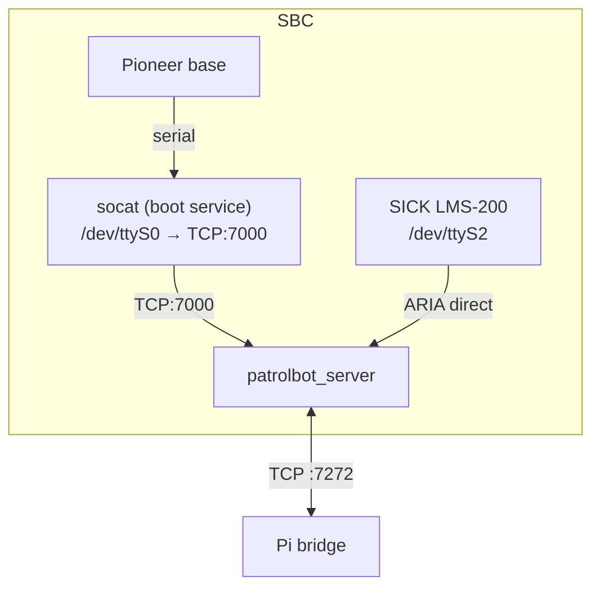

# patrolbot_hw_server (SBC)

The SBC's entire robot software: one C++ program, `patrolbot_server`, that speaks ARIA to the
hardware and a plain-text protocol to the Pi. It is **not a ROS package** — just a `Makefile`
project linked against ARIA.

!!! warning "Documented from a snapshot"
    The SBC was **not reachable** when this was written. Everything here comes from the last
    knowledge sync (2026-06-24) — file names, flags, and behavior — not a live read of the source.
    See [Known Gaps](../known-gaps.md).

| | |
|---|---|
| **Deploys to** | **SBC** (robot main PC, `172.20.87.231`) |
| **Build** | `Makefile` (`g++ -I/usr/local/Aria/include -lAria -lArNetworking -lpthread`) |
| **Binary** | `patrolbot_server` (last built 2026-06-18, ~19 KB) |
| **Source** | `patrolbot_hw_server/patrolbot_server.cpp` (on the SBC) |
| **Runs ROS 2?** | **No** |

## Purpose

Be the robot's hardware data source. Connect ARIA to the Pioneer base and the SICK laser, enable
motors and sonar, then stream telemetry to the Pi and accept drive commands back. Nothing on the
SBC participates in navigation — that all lives on the Pi.

## Interfaces

This program's "public interface" is the [TCP wire
protocol](../architecture/communication-architecture.md), not ROS:

| Direction | Line | Rate |
|---|---|---|
| SBC → Pi | `ODOM:x,y,th,vx,vth|LASER:r1,...,rN` | ~20 Hz |
| SBC → Pi | `AUX:SONAR=..|BATT=..|FLAGS=..` | ~4–5 Hz (every 5th nav frame) |
| Pi → SBC | `DRIVE:linear:angular` | on demand |

Units are converted from ARIA's mm/deg to m/rad **before** sending.

## Internal architecture



- **ARIA connections:** `ArRobotConnector` to the base (routed through the socat TCP bridge with
  `-rh 127.0.0.1 -rrtp 7000`), `ArLaserConnector` to the SICK on `/dev/ttyS2`. Motors and sonar are
  enabled at startup.
- **Telemetry build:** each section is assembled defensively under `robot.lock()`. The `AUX` line
  is emitted as a **separate, independent** line every 5th nav frame so an AUX build/parse problem
  can never disturb the navigation-critical `ODOM|LASER` line.
- **Server loop:** single-client. An outer `while (robot.isRunning())` loop wraps `accept()`, so
  the server re-accepts automatically after each Pi disconnect.
- **Self-healing:** a consecutive-`EAGAIN` guard (~3 s) plus `SO_KEEPALIVE` + `TCP_USER_TIMEOUT
  = 5000 ms` detect a silently-gone Pi and break to re-`accept()` promptly (instead of spinning on
  a full send buffer for minutes).

## Why the serial bridge (`socat`)?

The base and the ARIA server both wanted `/dev/ttyS0`, which is a single-holder device. A boot-time
`socat-boot.service` opens `/dev/ttyS0` once and exposes it as `TCP:7000`; the ARIA server then
reaches the base over that socket (`-rrtp 7000`) rather than contending for the serial device. This
resolves the serial conflict cleanly.

## Deployment

| Service | Type | Role |
|---|---|---|
| `socat-boot.service` | systemd **system** | bridge `/dev/ttyS0` → TCP:7000 at boot |
| `patrolbot-server.service` | systemd **user** | run `patrolbot_server -rh 127.0.0.1 -rrtp 7000` at boot |

The user service needs `loginctl enable-linger ros` (once, interactively) to start without a
login. See [Robot Deployment](../deployment/robot-deployment.md) and
[Known Gaps](../known-gaps.md) — whether the linger was actually enabled on the SBC is one of the
unconfirmed items.

## Building (on the SBC)

```bash
cd ~/patrolbot_hw_server
make                       # g++ ... -lAria -lArNetworking -lpthread
./patrolbot_server -rh 127.0.0.1 -rrtp 7000
```

## Where to read more

- The protocol in full: [Communication Architecture](../architecture/communication-architecture.md).
- The Pi end: [`patrolbot_bridge`](patrolbot_bridge.md).
- What's unverified about the SBC: [Known Gaps](../known-gaps.md).
