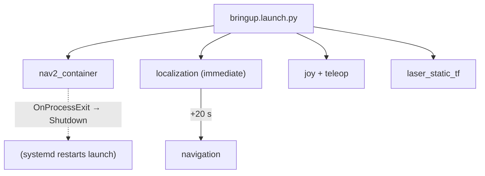

# patrolbot_navigation

The autonomy package: Nav2 bringup, the occupancy maps, the full Nav2 parameter set, the joystick
teleop node, and the laser static transform.

| | |
|---|---|
| **Deploys to** | **Raspberry Pi** |
| **Build type** | `ament_cmake` |
| **Maintainer** | Yousef Hussein (`yousefh@andrew.cmu.edu`), MIT license |
| **Entry launch** | `bringup.launch.py` (`ros2 launch patrolbot_navigation bringup.launch.py`) |
| **Note** | has its **own `.git/`**, version-controlled separately |

## Purpose

Stand up the complete Nav2 stack tuned for this Pi and this base — localization against a known
map, global planning, local control, obstacle avoidance — plus the manual-override joystick path
and the laser frame transform.

## Dependencies

`nav2_bringup`, `nav2_msgs`, `slam_toolbox`, `joy`, `teleop_twist_joy`, `twist_mux`, `rclpy`,
`geometry_msgs`, `sensor_msgs`, `launch`, `launch_ros`.

## Package layout

| Path | Role |
|---|---|
| `launch/bringup.launch.py` | Top-level launch — container, staged localization/navigation, joy, laser TF |
| `launch/patrolbot_localization_launch.py` | Patched nav2_bringup localization (`bond_timeout: 0.0`) |
| `launch/patrolbot_navigation_launch.py` | Patched nav2_bringup navigation (`bond_timeout: 0.0`) |
| `config/nav2_params.yaml` | Full Nav2 parameter set ([Parameters](../ros2/parameters.md)) |
| `maps/second_map.{yaml,pgm}` | **Active** map — 3192×2205 @ 0.075 m/px, origin `[-1,-1,0]` |
| `maps/second_map_original_0.1.{pgm,yaml}.bak` | historical backup, not the active scale |
| `maps/cmuq_1st_floor.{yaml,pgm}` | Older CMU-Q map — not loaded |
| `scripts/patrolbot_joy_teleop.py` | Xinput joystick teleop node |
| `scripts/lms200_sanitizer.py` | `/bad_scan → /good_scan` header fixer — **not in active launch** |
| `scripts/twist_mux.yaml` | reference priority config — twist_mux runs from `patrolbot-launch` |
| `rviz/patrolbot_nav.rviz` | operator RViz layout |

## Public interfaces

Launches the Nav2 nodes (see [Nodes → Nav2](../ros2/nodes.md#nav2-composed-in-nav2_container)) plus:

| Node | Interface |
|---|---|
| `joy_node` | pub `/joy` |
| `p3dxJoyTeleop` | sub `/joy`; pub `/cmd_vel_joy → input/joy` |
| `laser_static_tf` | TF `base_link→laser_frame` (`roll=π`) |

## Internal architecture

The launch is hand-built rather than delegating to `nav2_bringup` so it can apply three Pi-specific
necessities — single-container composition, `bond_timeout: 0.0`, and staged startup. The reasoning
is detailed on [Software Architecture](../architecture/software-architecture.md#the-composed-nav2_container-and-why-composition-is-mandatory)
and [Launch System](../ros2/launch-system.md#navigation-launch-patrolbot_navigationlaunchbringuplaunchpy).



### The map and the large-map decisions

The active `second_map` is **3192×2205 @ 0.075 m/px** with origin `[-1,-1,0]`. Its scale was
operator-confirmed against the laser overlay and should not be changed casually. To make the large
map work on the Pi:

- `global_costmap resolution` stays at 0.2 for planning speed; `local_costmap` stays at 0.1 for fine
  close-range avoidance.
- `MAGICK_THREAD_LIMIT=1`, `OMP_NUM_THREADS=1` to avoid OOM on image decode.
- `bond_timeout: 0.0` so map inflation doesn't starve the lifecycle bond.

If replacing the map, preserve the confirmed scale unless the new map is operator-verified against
real walls in RViz.

## Example usage

```bash
ros2 launch patrolbot_navigation bringup.launch.py
ssh ubuntu@patrolbot-ros.qatar.cmu.edu ./patrolbot-logs.sh nav        # follow Nav2 logs

# Tune teleop limits at runtime
ros2 run patrolbot_navigation patrolbot_joy_teleop.py --ros-args -p max_linear:=0.3
```

!!! warning "Known source comments"
    A stale trailing comment in `nav2_params.yaml` still mentions `use_composition:=False`; the live
    launch uses composition and patched lifecycle managers with `bond_timeout: 0.0`. Trust the launch
    files.

## Where to read more

- Parameters: [ROS 2 → Parameters](../ros2/parameters.md)
- Launch internals: [ROS 2 → Launch System](../ros2/launch-system.md)
- Startup timeline: [Internals → Startup Sequence](../internals/startup-sequence.md)
