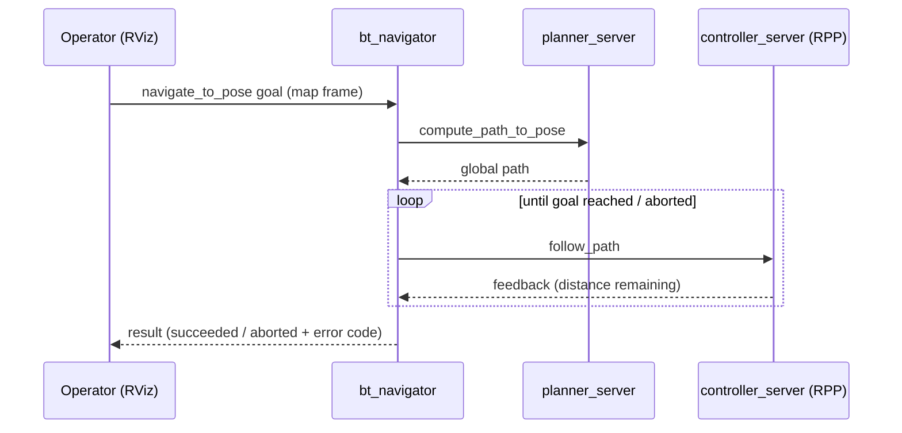

# ROS 2 Actions

PatrolBot defines **no custom actions**. All actions in the graph are the standard
[Nav2](https://docs.nav2.org/) action servers, exposed by the lifecycle nodes composed into
`nav2_container`. They are listed here because they are the operator-facing entry points into
autonomy — an RViz *Nav2 Goal* is a `navigate_to_pose` action goal under the hood.

## Primary navigation actions

| Action | Type | Server | Triggered by |
|---|---|---|---|
| `navigate_to_pose` | `nav2_msgs/action/NavigateToPose` | `bt_navigator` | RViz *Nav2 Goal*, or any client |
| `navigate_through_poses` | `nav2_msgs/action/NavigateThroughPoses` | `bt_navigator` | multi-pose runs |
| `follow_waypoints` | `nav2_msgs/action/FollowWaypoints` | `waypoint_follower` | patrol-style waypoint lists |



## Sub-actions used by the behavior tree

These are invoked by the behavior tree inside `bt_navigator`, not usually by an operator directly:

| Action | Type | Server | Role |
|---|---|---|---|
| `compute_path_to_pose` | `nav2_msgs/action/ComputePathToPose` | `planner_server` | global plan (NavFn) |
| `follow_path` | `nav2_msgs/action/FollowPath` | `controller_server` | local control (RPP) |
| `smooth_path` | `nav2_msgs/action/SmoothPath` | `smoother_server` | path smoothing |
| `spin` | `nav2_msgs/action/Spin` | `behavior_server` | recovery |
| `backup` | `nav2_msgs/action/BackUp` | `behavior_server` | recovery |
| `drive_on_heading` | `nav2_msgs/action/DriveOnHeading` | `behavior_server` | recovery |
| `wait` | `nav2_msgs/action/Wait` | `behavior_server` | recovery |
| `dock_robot` / `undock_robot` | `nav2_msgs/action/DockRobot` | `docking_server` | optional/niche docking |

## Sending a goal

```bash
# Equivalent to RViz "Nav2 Goal"
ros2 action send_goal /navigate_to_pose nav2_msgs/action/NavigateToPose \
  "{pose: {header: {frame_id: map}, pose: {position: {x: 2.0, y: 1.0}, orientation: {w: 1.0}}}}"
```

!!! warning "Goals require the navigation half to be active"
    Localization activates within seconds, but the navigation half (costmaps, planner, controller)
    is delayed ~20 s and becomes available after staged activation. A `navigate_to_pose` goal
    sent before then is rejected. Setting an initial pose (*2D Pose Estimate*) does **not** require
    the navigation half. See [Execution Flow](../architecture/execution-flow.md#nav2-staged-activation).

## Failure modes

- **"No valid trajectories" / goal aborts.** Historically caused by `local_costmap` updating at
  1 Hz while the controller ran at 5 Hz → "Costmap timed out waiting for update". Fixed by raising
  `local_costmap update_frequency` to 5.0. See [Debugging](../development/debugging.md).
- **Goal rejected immediately.** Navigation half not yet active (see warning above).
- **Robot "boxed in".** Laser shows obstacles within the footprint; the `collision_monitor`
  stop-box halts motion. Inspect `/scan` from the Pi 5 `patrolbot-bridge` container.
