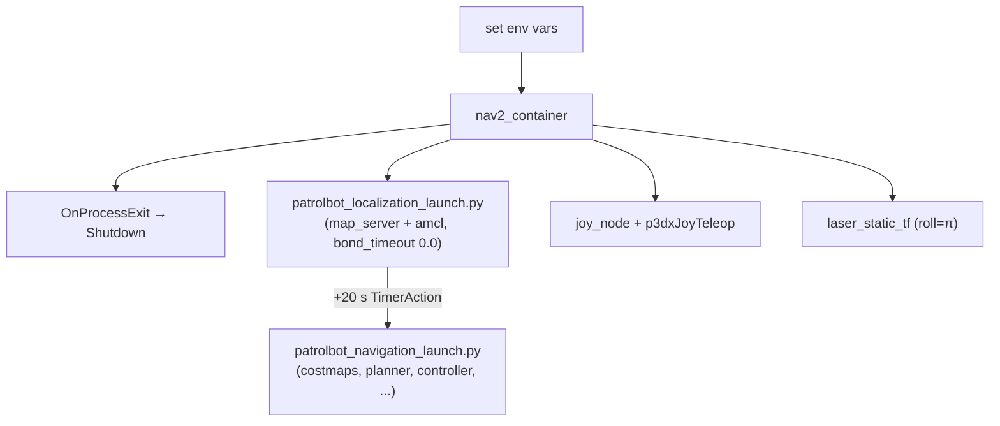

# Launch System

PatrolBot's Pi stack is brought up by **three launch entry points**, one per systemd service.
This page explains what each launches, the non-obvious remaps that wire the `cmd_vel` chain
together, and the patched Nav2 launch files that make the large map work. Boot ordering is on
[Execution Flow](../architecture/execution-flow.md); per-node detail on [Nodes](nodes.md).

## The three entry points

| Launch | Service | Package | Brings up |
|---|---|---|---|
| `bringup.xml` | `patrolbot-bringup.service` | `patrolbot-launch` (from `build_backup/`) | mobile base: `twist_mux` + `teleop_velocity_smoother` + `lifecycle_mgr.py` |
| `bridge_node` (run, not launch) | `patrolbot-bridge.service` | `patrolbot_bridge` | the TCP bridge |
| `bringup.launch.py` | `patrolbot-navigation.service` | `patrolbot_navigation` | Nav2 (composed) + `joy_node` + `p3dxJoyTeleop` + `laser_static_tf` |

## Mobile-base launch (`patrolbot-launch/launch/bringup.xml`)

```xml
<launch>
  <include file=".../mobile_base.xml"/>   <!-- twist_mux -->
  <include file=".../smoother.xml"/>       <!-- velocity smoother + lifecycle mgr -->
  <!-- rosaria2.xml and joy.xml are commented out -->
</launch>
```

- **`mobile_base.xml`** starts a `component_container` (`mobile_base_nodelet_manager`) and the
  `twist_mux` node (name `cmd_vel_mux`) loading `mux.yaml`.
- **`smoother.xml`** starts `nav2_velocity_smoother` as `teleop_velocity_smoother` **with two
  remaps**, then `lifecycle_mgr.py`:

  ```xml
  <remap from="/cmd_vel" to="/cmd_vel_out"/>      <!-- input: read twist_mux output -->
  <remap from="cmd_vel_smoothed" to="cmd_vel"/>   <!-- output: publish the real /cmd_vel -->
  ```

These two remaps are the crux of the [`cmd_vel`
chain](../architecture/software-architecture.md#the-cmd_vel-arbitration-chain): they make the
mobile-base smoother consume `twist_mux`'s `cmd_vel_out` and emit the final `/cmd_vel` the bridge
forwards to the SBC. `lifecycle_mgr.py` then `configure`s + `activate`s the smoother so it actually
publishes.

!!! danger "The `build_backup/` gotcha"
    `patrolbot-bringup.service` launches this from **`~/build_backup/patrolbot-launch/launch/`**,
    not from `ros2_ws/src`. The `src` copy is the source of truth, but editing it changes nothing at
    runtime until you re-install (copy to `build_backup` / rebuild). See
    [Repository Structure](../internals/repository-structure.md).

## Navigation launch (`patrolbot_navigation/launch/bringup.launch.py`)

This is a hand-built launch — it deliberately does **not** call `nav2_bringup`'s
`bringup_launch.py`. It:

1. Sets env vars (`ROS_DOMAIN_ID=0`, `MAGICK_THREAD_LIMIT=1`, `OMP_NUM_THREADS=1`).
2. Starts one `nav2_container` (`component_container_isolated`) with `autostart: True`.
3. Registers an `OnProcessExit` handler on the container: if it dies, emit launch `Shutdown` (so
   systemd restarts a fresh, fully-populated stack — a respawned container comes back empty).
4. Includes the patched **localization** launch immediately.
5. Includes the patched **navigation** launch after a 20 s `TimerAction`.
6. Starts `joy_node`, `p3dxJoyTeleop` (remap `/cmd_vel_joy → /input/joy`), and `laser_static_tf`.



### Why local copies of the Nav2 launches

`patrolbot_localization_launch.py` and `patrolbot_navigation_launch.py` are copies of the
`nav2_bringup` launches with one critical change: **`bond_timeout: 0.0`** added to the lifecycle
managers (both the composed and non-composed code paths). Upstream hard-codes `bond_timeout: 4.0`
and never reads our params file, so inflating the large map starves `map_server`'s bond past 4 s
and the lifecycle manager aborts → no AMCL → blank map. With `bond_timeout: 0.0`, the slow
large-map inflation cannot trip the bond watchdog.

These launches are invoked with `use_composition: 'True'` and `container_name: 'nav2_container'`,
so every lifecycle node loads into the single shared container. (This is the value the stale
`nav2_params.yaml` comment contradicts — see [Parameters](parameters.md#nav2-confignav2_paramsyaml).)

## The laser static TF

```python
# x  y  z   yaw pitch roll
['0.037','0','0.2','0','0','3.14159', 'base_link', 'laser_frame']
```

`roll = π` un-mirrors the flipped SICK scan. **Orientation is unverified** — older notes say
`yaw = π`; the live launch is authoritative but a visual RViz check is still pending. See
[Known Gaps](../known-gaps.md#laser-transform-orientation).

## Commented-out / non-active launch fragments

Present in the `patrolbot-launch` package but not part of the active stack:

| File | What it would do | Status |
|---|---|---|
| `rosaria2.xml` | start the legacy `rosaria2_debug` driver | not included ("NOT NEEDED IF PATROLBOT LIDAR SERVER IS RAN") |
| `joy.xml` | a standalone joy teleop | not included (joy is started by the nav launch) |
| `teleop-key*.xml`, `readlidar.py`, editor temp files (`*~`, `#joy.xml#`) | dev experiments | [legacy / dead](../internals/legacy-components.md) |

## Manual launch (development)

```bash
cd ~/build_backup/patrolbot-launch/launch && ros2 launch bringup.xml   # mobile base
ros2 run patrolbot_bridge bridge_node                                   # bridge
ros2 launch patrolbot_navigation bringup.launch.py                     # Nav2
```
