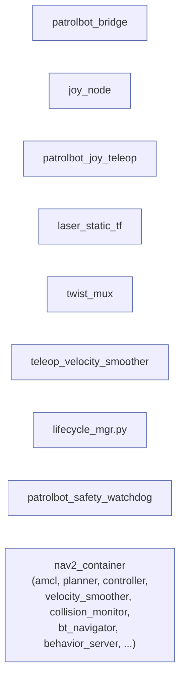

# ROS 2 Nodes

Every active node, with its **host machine**, package, interfaces, and failure behavior. All
ROS 2 nodes run on the **Pi**; the SBC runs no ROS 2 (its `patrolbot_server` is a plain C++
program — see [`patrolbot_hw_server`](../packages/patrolbot_hw_server.md)).

Legend: nodes are grouped as **bridge**, **mobile base**, **teleop/TF**, and the composed
**Nav2** nodes. Topic details are cross-referenced on [Topics](topics.md); parameters on
[Parameters](parameters.md).



---

## Bridge

### patrolbot_bridge

| Field | Value |
|---|---|
| **Host** | Raspberry Pi |
| **Package** | [`patrolbot_bridge`](../packages/patrolbot_bridge.md) (ament_python) |
| **Executable** | `bridge_node` (`ros2 run patrolbot_bridge bridge_node`) |
| **Node name** | `patrolbot_bridge` |
| **Purpose** | Sole link to the SBC. Translates the TCP text stream into ROS 2 topics + TF and forwards `/cmd_vel` as `DRIVE` commands. |

**Publishers:** `/odom` (`nav_msgs/Odometry`), `/scan` (`sensor_msgs/LaserScan`), `/sonar`
(`sensor_msgs/PointCloud2`), `/battery` (`sensor_msgs/BatteryState`), `/diagnostics`
(`diagnostic_msgs/DiagnosticArray`), TF `odom→base_link` (50 Hz).
**Subscribers:** `/cmd_vel` (`geometry_msgs/Twist`).
**Services / actions:** none.
**Parameters:** none declared; the SBC endpoint (`172.20.87.231:7272`), `RECV_TIMEOUT=3.0`, and
`SCAN_RANGE_MIN=0.25` are module constants.
**Lifecycle:** plain (non-lifecycle) node. A background thread owns the socket; a 50 Hz timer
publishes TF; the main thread spins callbacks.

**Failure modes**

- *SBC silent/dead:* `recv()` times out after 3 s → logs "SBC telemetry timed out. Reconnecting…"
  → reconnects every 3 s.
- *SBC closes/refused:* logs and retries every 3 s.
- *Malformed line:* swallowed; the affected message is skipped, the node keeps running.
- *Process crash:* `patrolbot-bridge.service` (`Restart=always`) restarts it.

**Example invocation**

```bash
ros2 run patrolbot_bridge bridge_node
# or via systemd:
systemctl --user status patrolbot-bridge.service
```

---

## Mobile base ([`patrolbot-launch`](../packages/patrolbot-launch.md))

### twist_mux

| Field | Value |
|---|---|
| **Host** | Raspberry Pi |
| **Executable** | `twist_mux` (package `twist_mux`), launched as node name `cmd_vel_mux` |
| **Purpose** | Single velocity arbiter. Selects the highest-priority active input and republishes it. |

**Subscribers:** `input/safety_controller` (prio 10), `input/joy` (prio 8), `input/navi` (prio 5),
plus configured-but-unused `input/teleop` (8), `input/switch` (6).
**Publishers:** `cmd_vel_out`.
**Parameters:** from `param/defaults/mux.yaml` (see [Parameters](parameters.md#twist_mux-muxyaml)).
**Failure modes:** if an input goes silent past its `timeout`, twist_mux drops it and the next
priority wins; if *all* inputs are silent, it publishes nothing and the robot coasts to the
base watchdog stop.

### teleop_velocity_smoother

| Field | Value |
|---|---|
| **Host** | Raspberry Pi |
| **Executable** | `velocity_smoother` (package `nav2_velocity_smoother`), node name `teleop_velocity_smoother` |
| **Purpose** | Final velocity shaping before the bridge. Limits acceleration/speed of the muxed command. |

**Subscribers:** `/cmd_vel_out` (remapped from the smoother's input `/cmd_vel`).
**Publishers:** `/cmd_vel` (remapped from `cmd_vel_smoothed`) — the topic the bridge consumes.
**Parameters:** `param/defaults/smoother.yaml`.
**Lifecycle:** managed lifecycle node; configured + activated by `lifecycle_mgr.py` at startup.
**Failure mode:** if it is never activated, `/cmd_vel` is never published and the robot will not
move under navigation — which is exactly what `lifecycle_mgr.py` exists to prevent.

### lifecycle_mgr.py

| Field | Value |
|---|---|
| **Host** | Raspberry Pi |
| **Executable** | `lifecycle_mgr.py` (package `patrolbot-launch`), node name `lifecycle_manager_script` |
| **Purpose** | Keeps `/teleop_velocity_smoother` configured and active, including after smoother respawn. |

**Clients:** `/teleop_velocity_smoother/change_state` (`lifecycle_msgs/ChangeState`).
**Failure mode:** waits for the service in a 1 s loop; if the smoother never appears it logs and
keeps waiting. If the smoother respawns unconfigured, it re-applies configure/activate.

---

## Teleop and TF ([`patrolbot_navigation`](../packages/patrolbot_navigation.md))

### joy_node

| Field | Value |
|---|---|
| **Host** | Raspberry Pi (gamepad on the Pi's USB) |
| **Executable** | `joy_node` (package `joy`) |
| **Purpose** | Reads `/dev/input/js*` and publishes raw gamepad state. |

**Publishers:** `/joy` (`sensor_msgs/Joy`).
**Failure mode:** no `/dev/input/js*` (controller unplugged) ⇒ no `/joy` ⇒ teleop simply has
nothing to act on; navigation is unaffected.

### patrolbot_joy_teleop

| Field | Value |
|---|---|
| **Host** | Raspberry Pi |
| **Executable** | `patrolbot_joy_teleop.py` (package `patrolbot_navigation`), node name `p3dxJoyTeleop` |
| **Purpose** | Converts gamepad sticks (Xinput) into a `Twist`, publishing **only while commanded**, so manual input overrides nav on demand without ever blocking it when idle. |

**Subscribers:** `/joy` (`sensor_msgs/Joy`).
**Publishers:** `/cmd_vel_joy` → remapped to `/input/joy` by the launch (twist_mux priority 8).
**Parameters:** `max_linear` (0.4 m/s), `max_angular` (0.8 rad/s), `deadzone` (0.12),
`axis_linear` (1 = left-stick Y), `axis_angular` (3 = right-stick X), `deadman_button` (5 = RB;
`-1` disables the interlock).
**Controls:** hold **RB** (deadman) + left-stick Y to drive, right-stick X to turn.
**Failure mode:** on release it emits a single zero `Twist`, then stays silent so twist_mux times
the joy input out (1 s) and navigation resumes.

### laser_static_tf

| Field | Value |
|---|---|
| **Host** | Raspberry Pi |
| **Executable** | `static_transform_publisher` (package `tf2_ros`), node name `laser_static_tf` |
| **Purpose** | Publishes the static `base_link → laser_frame` transform. |

**Arguments:** `x=0.037, y=0, z=0.2, yaw=0, pitch=0, roll=3.14159`. The `roll=π` un-mirrors the
flipped SICK scan (see [Sensors](../devices/sensors.md#sick-lms-200-laser)).

`roll=π` is confirmed by live TF and the ARIA `LaserFlipped=true` hardware profile. Older notes that
say `yaw=π` are stale.

### patrolbot_safety_watchdog

| Field | Value |
|---|---|
| **Host** | Raspberry Pi |
| **Executable** | `patrolbot_safety_watchdog.py` (package `patrolbot_navigation`) |
| **Purpose** | Holds the robot if `/scan` or `/odom` goes stale. |

**Subscribers:** `/scan`, `/odom`.
**Publishers:** `/input/safety_controller` (`geometry_msgs/Twist`, zero command, twist_mux priority
10).
**Failure mode:** launched with `respawn=True`; if the script is not executable the navigation
launch restart-loops, so executable permissions are safety-relevant.

---

## Nav2 (composed in `nav2_container`)

All of the following are **lifecycle** nodes loaded as composable nodes into a single
`component_container_isolated` named `nav2_container`, with `autostart: True`. Parameters come
from `config/nav2_params.yaml` ([Parameters](parameters.md)). They are managed by Nav2 lifecycle
managers patched with `bond_timeout: 0.0`.

| Node | Plugin / role | Key interfaces |
|---|---|---|
| `map_server` | Serves the occupancy grid | Pub `/map`; the large map flows to costmaps intra-process |
| `amcl` | Adaptive Monte-Carlo localization (differential model) | Sub `/scan`, `/odom`; pub TF `map→odom`; `set_initial_pose: true` |
| `planner_server` | Global planner `GridBased` = NavFn | Action `compute_path_to_pose`; uses global costmap |
| `controller_server` | Local controller RPP @ 5 Hz, `desired_linear_vel` 0.22 | Action `follow_path`; pub `cmd_vel` |
| `velocity_smoother` | Smooths RPP output | Sub `cmd_vel`; pub `cmd_vel_smoothed` |
| `collision_monitor` | Stop-box 0.6×0.6 m safety gate, `base_shift_correction: False` | Sub `cmd_vel_smoothed`, `/scan`; pub `input/navi` |
| `bt_navigator` | Behavior-tree orchestration | Actions `navigate_to_pose`, `navigate_through_poses` |
| `behavior_server` | Recovery behaviors: spin, backup, drive_on_heading, wait | Action servers per behavior |
| `waypoint_follower` | Multi-waypoint following | Action `follow_waypoints` |
| `smoother_server` | Path smoothing (`simple_smoother`) | Action `smooth_path` |
| `docking_server` | Opennav docking (`SimpleChargingDock`) — niche/optional | Action `dock_robot`, `undock_robot` |
| `lifecycle_manager_*` | Bring the above through configure/activate | Service `*/change_state`, `bond_timeout: 0.0` |

**Lifecycle:** see [State Machines](../internals/state-machines.md) for the lifecycle transition
diagram. **Failure mode:** because all share one process, an uncaught exception in any one
SIGABRTs the container; the launch's `OnProcessExit` handler then tears the launch down so systemd
restarts a fresh, fully-populated stack (a respawned container would come back empty). This is the
direct reason `collision_monitor` runs with `base_shift_correction: False`. See
[Software Architecture](../architecture/software-architecture.md#crash-handling-tear-down-dont-respawn).

---

## Node host summary

| Node | Host |
|---|---|
| `patrolbot_server` (not a ROS node) | **SBC** |
| `patrolbot_bridge` | Pi |
| `twist_mux` (`cmd_vel_mux`) | Pi |
| `teleop_velocity_smoother` | Pi |
| `lifecycle_manager_script` | Pi |
| `joy_node` | Pi |
| `p3dxJoyTeleop` | Pi |
| `patrolbot_safety_watchdog` | Pi |
| `laser_static_tf` | Pi |
| all `nav2_container` nodes | Pi |
