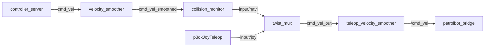

# ROS 2 Topics

All topics live on the **Pi**'s ROS graph (`ROS_DOMAIN_ID=0`). The SBC publishes nothing — its
data only becomes topics after [`patrolbot_bridge`](../packages/patrolbot_bridge.md) republishes
it. The full graph is on [Software Architecture](../architecture/software-architecture.md#the-ros-2-graph).

## Active topics

| Topic | Type | Publisher | Subscriber(s) | Rate |
|---|---|---|---|---|
| `/odom` | `nav_msgs/Odometry` | `patrolbot_bridge` | AMCL, bt_navigator, controller_server | ~20 Hz |
| `/scan` | `sensor_msgs/LaserScan` | `patrolbot_bridge` | AMCL, costmaps, collision_monitor | ~20 Hz |
| `/sonar` | `sensor_msgs/PointCloud2` | `patrolbot_bridge` (from `AUX`) | RViz / obstacle viz | ~5 Hz |
| `/battery` | `sensor_msgs/BatteryState` | `patrolbot_bridge` (from `AUX`) | monitoring | ~5 Hz |
| `/diagnostics` | `diagnostic_msgs/DiagnosticArray` | `patrolbot_bridge` (from `AUX`) | `rqt_robot_monitor` | ~5 Hz |
| `/joy` | `sensor_msgs/Joy` | `joy_node` | `p3dxJoyTeleop` | event-driven |
| `/cmd_vel_joy` → `/input/joy` | `geometry_msgs/Twist` | `p3dxJoyTeleop` | `twist_mux` (prio 8) | only while commanded |
| `cmd_vel` | `geometry_msgs/Twist` | `controller_server` (DWB) | `velocity_smoother` | 5 Hz |
| `cmd_vel_smoothed` | `geometry_msgs/Twist` | `velocity_smoother` | `collision_monitor` | 20 Hz |
| `input/navi` | `geometry_msgs/Twist` | `collision_monitor` | `twist_mux` (prio 5) | 5 Hz |
| `cmd_vel_out` | `geometry_msgs/Twist` | `twist_mux` | `teleop_velocity_smoother` | 20 Hz |
| `/cmd_vel` | `geometry_msgs/Twist` | `teleop_velocity_smoother` | `patrolbot_bridge` | 20 Hz |
| `/map` | `nav_msgs/OccupancyGrid` | `map_server` | costmaps (intra-process), RViz | latched |

### TF frames

| Transform | Publisher | Rate | Notes |
|---|---|---|---|
| `map → odom` | `amcl` | on update | needs `/scan` + initial pose |
| `odom → base_link` | `patrolbot_bridge` | 50 Hz | decoupled from scan delivery |
| `base_link → laser_frame` | `laser_static_tf` | static | `x=0.037, z=0.2, roll=π` (orientation unverified) |

!!! note "Two topics named `cmd_vel`"
    There is a **namespaced** `cmd_vel` (DWB output inside `nav2_container`) and the **global**
    `/cmd_vel` (the mobile-base `teleop_velocity_smoother` output that the bridge reads). They are
    different topics. The remaps that produce this are explained on
    [Launch System](launch-system.md#mobile-base-launch) and
    [Software Architecture](../architecture/software-architecture.md#the-cmd_vel-arbitration-chain).

## The `cmd_vel` chain at a glance



## Configured but unused mux inputs

`mux.yaml` reserves three more priorities with **no current publisher**. They are valid topics if
a future source is added, but nothing writes them today:

| Topic | Priority | Intended source |
|---|---|---|
| `input/safety_controller` | 10 | an external e-stop / safety node |
| `input/teleop` | 8 | keyboard / external teleop |
| `input/switch` | 6 | a mode switch |

## Inactive topics (legacy `rosaria2` path only)

These appear **only** if the legacy [`rosaria2`](../packages/rosaria2.md) driver is run, which it is
not in the production stack. Running it alongside the bridge causes TF and `cmd_vel` conflicts.

| Topic | Type | Publisher |
|---|---|---|
| `pose` | `nav_msgs/Odometry` | `rosaria2_node` |
| `bumper_state` | `rosaria2/BumperState` | `rosaria2_node` |
| `sonar` | `sensor_msgs/PointCloud` | `rosaria2_node` |
| `battery_voltage` | `std_msgs/Float64` | `rosaria2_node` |
| `/bad_scan` → `/good_scan` | `sensor_msgs/LaserScan` | `lms200_sanitizer` (if launched; no `/bad_scan` publisher exists in the current stack) |

## Inspecting topics live

```bash
ssh ubuntu@patrolbot-ros.qatar.cmu.edu ./patrolbot-logs.sh topics   # list + Hz for /odom /scan /cmd_vel /map
ros2 topic hz /scan
ros2 topic echo /diagnostics
```
